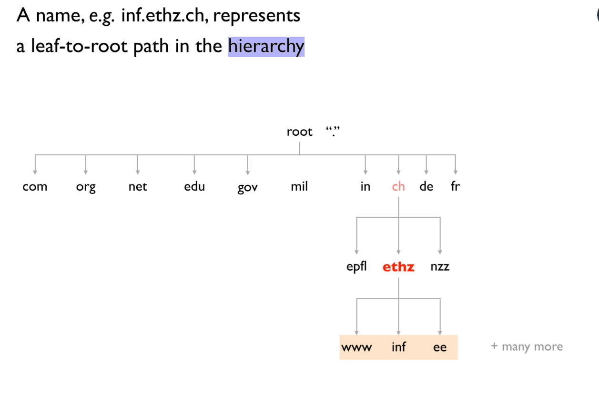

# Important stuff
## Internet

- Internet connects End Systems/ Hosts by a system of communications links and package switches
- Pakets: data segment and header
- IP (Internet Protoco): Specifies the format for packets sent among routers and end systems
- DSL (digital subscriber line): broadband residential access
- FDM (Frequency-division multiplexing): link dedicates a frequency band on the band to a communication for the duration of connection. The width of this band is called bandwidth.
- TDM (time-division multiplexing): time is divided into frames of fixes size, and each frame is split into a fixed amount of slots. These slots are dedicated to one connection

## Delays
- **nodal processing delay:** 
    - Time used to decode the header, determine which output needs to be used, bit level checking etc.
    - nedligible in comparison to other delays, little room for improvement here
    
- **queuing delay:** 
    - Time that the packet has to wait in the queue until the desired output will be free
    - better load balancing (i.e. via routing), reduce queue size

- **transmission delay:** 
    - Time after the packet gets out of queue until its on the output line; let L be the length of the packet, R the transmission rate from router A to B, then the transmission delay is L/R.
    - increase the link capacity
- **propagation delay:** 
    - Time, the package takes to propagate through the physical medium (e.g. at light speed with radio waves), i.e. it takes on the way from router A to B
    - if possible, use data replication to shorten the client-server distance. Improving routing or physical transmission media also helps

## Layers
|Layers|
|-|
|Aplication|
|Transport|
|Network|
|Link|
|Physical|

- **Application Layer:** Application protocols and layers reside here. The internet includes many protocols here, as HTTP (provides Web document requests and responses), SMTP (for e-mail transfer) and FTP (file transfer from host to host). The DNS is also an application layer protocol. Packet of information at this layer is called message

- **Transport Layer:** Transports application layer messages between application endpoints. In the internet, there’s TCP and UDP. E.g. longer messages are split into shorter segment. Packets in this layer are called segments.(TCP & UDP) or Datagram (UDP).

- **Network Layer:** The layer is responsible for moving datagrams from host to host. It receives a segment and an address. This layer includes the IP, which defines the fields in a datagram and how to work on those fields. Packets in this layer are called datagrams / packet. 

- **Link Layer:** The network layer brings a datagram from one node to another, but to move a packet from one specific node to another, it relies on the link layer. It delivers the packet to the next node. E.g. Ethernet or WiFi. Link layer protocols are called frames.

- **Physical layer:** The job of the link layer is to move whole frames from one node to another; however, the job of the physical layer is to move individual bits. Many protocols exist, depending on the physical medium; e.g. Ethernet has different protocols for different cable types.

## DNS servers
### Resource Records (RRs)
- **Type=A:** Name refers to a hostname, Value refers to the corresponding IP address. Hence, this type provides a standard hostname to IP mapping.
- **Type=NS:** Name is a domain (e.g. foo.com) and Value is the hostname of an authoritative DNS server who can how to obtain the IP address of the query.
- **Type=CNAME:** Value is the canonical host name for the alias host name Name.
- **Type=MX:** Value is the canonical name of a mail server
with alias Name.

## Congestion signals
Signals that warn about congestion:
- **Packet loss**: 
    - Advantage: can be detected easily (doesn't require in-network feature support) by using timers. 
    - Disadvantage: only considers binary feedbaack (i.e., packet either arrives at sender or not)
    - Disadvantage: loss can also be caused by other factors (i.e. cosmic radiation in a satellite link), careful parametrization is needed

- **Packet latency**:
    - Advantage: can be detected easily (doesn't require innetwork feature support). 
    - Advantage: relatively quick feedback of a continuous signal
    - Disadvantage: many factors in the network can affect latency, not only congestion, careful parametrization is needed.

- **In-network marking (i.e. ECN- Explicit Congestionn Notifictation)**
    - Indicate congestion through setting a bit in packet
    - Advantage: early signal of congestion
    - Disadvantage: requires support in the network by i.e. the routers/switches

## Reliable transport protocol:
### Undesirable effects when sending packets:
- Packet loss
- Reordering
- Delay
- Duplication
- Corruption

### Goals of reliable tranfer
- Correctness: ensure data is delivered, in order, and untouched
- Fairness: play well with concurrent communications
- Timeliness: minimize time until data is transferred
- Efficiency: optimal use of bandwidth
- Cannot guarante 100% correct packet order and packet integrity but corruption can often be detected using checksums and the correct oder can be reconstructed through the equence numbers in packet headers. Note that a packet, and thus its content, checksum, and sequence number, could be corrupted in such a way that it still looks like a valid packet. However, in practice and assuming that there is no malicious entity in the nework, this is highly unlikely to happen.

### Advantages of using unreliable transport protocol?
- Better performance/less overhead
- Lightweight implementation
No connection setup $\rightarrow$ start sending data immediately

## IPv4
Built up by:
- checksum
- used transport protocol
- TTL
- (Sequence number is only contained inside of the transport header but not the IP header)
- (There is no checksum in the IPv6 header)

## Random
- slow start threshold (ssthresh):
    - function of congestion
    - timout, we set sstresh = cwnd/2
    - initially cwnd is infinity
    - slow start until a timeout occurs
    - slow sart until timeout or we reach ssthresh -> we switch to AIMD

- A socket is a software abstraction by which an application process exchanges network messages with the (transport layer in the) operating system
- The ideal congestion window size is the Bandwidth delay product. $$W = bandwidth * delay$$
- The ideal congestion window size is the bandwidth deay product: $W = bandwidth * dely$
- Transmission delay per segment: $\frac{packet_size}{bandwidt}$

## Go-back-N
- You have a window size with segments. When you send a packet, the ACK is sent after the propagation delay + transmission delay. If the packet gets lost, the ACK always sends the last valid ACK. E.G. packet 2 is lost and packets 0, 1, 3, 4 are successfully sent and received, you only get ACK for packet 0, 1. 1 is the highest number to receive 

## Quic
- Operate in Application and Transport layer
- combines connection and TLS handshake $\rightarrow$ reducing the connection setup time by one RTT
- enables Zero-RTT communication if the hosts have communicated before (improved handshake)
- Connection hand-over is possible by identifying connection with a connection ID instead of the 5(/4)-tuple (even with changing IP addresses e.g. when chaning neworks with a mobile device)
- resoles head-of-line blocking by the logical abstraction of streams (contrary to TCP, which required you to open multiple parallel TCP connections)
- Middleboxes and NAT routers are known to drop unfamiliar transport layer protocols. Quic uses UDP to give interperability with existing hardware.

## Timeout-Value
- Exponential averaging of RTT
- Estimated RTT is calculated by $$EstimatedRTT = \alpha * EstimatedRTT + (1 - \alpha) *Sample RTT$$
- $\alpha$ decides how much weight we want to give to new sample values. For small $\alpha$, we weigh our new samples stronger. If SampleRTT always stays the same, the EstimatedRTT will converge to SampleRTT.
- Sample RTT $$SampleRTT = AckRcvdTime - SendPacketTime$$

## NAT

**Advantages of middleboxes**
- A possible rapid deplyment path when there is no other option
- Control over many hosts

**Disadvantages of middleboxes**
- Breaking layering interferes with connectivit; strange side effects
- Poor vantage point for many tasks
- Cause Internet ossification: almost impossible to deploy new transport protocols
How to deploy publicly accessible services wih NAT?
- Manually configure entries in NAT table - "port forwardin"

**NAT Downsides**
- Connectifity has been broken
    - Can only receive incoming packets after an outgoing connection is set up
    - Difficult to run servers at home - requires explicit "port-forwarding" rules
-Additional issues when there are no connections (UDP apps)
    - often solved with regula "keep-alive" messages to keep table entries

**NAT Upsides**
- Relieves much IP address pressure 
    - Many (most) home hosts behind NATs
- Easy to deploy 
    - Rapidly, and by you alone – Very flexible in terms of address space
- Useful functionality – Firewall
    - Hides internal network structure and configuration ($\rightarrow$ privacy)

**How does client access server (get destination address)?**
- Contact server through its ublic IP address
- NAT tranlate source address to NAT's public address
- choose new port number from a pool of available ports and kep mapping between selected port number and interal host information.

**Stores**
- port from client
- address from client
- IP address of server
- port number from server

## Quiz
- **The Maximum Segment Size(MSS) of TCP is equal to:**
MSS = MTU - header(IP) - headeer(TCP)

- UDP sockets type is SOCK_DGRAM while TCP sockets type is SOCK_STREAM
- For a SOCK_STREAM, an operating system stores both local and remote port
- Given a directed graph G(V, E) with |V| and |E| being the numbers of vertices and edges, how many variables do you need for the max-flow LP formulation discussed in class?
- There is no connectio establishment in UDP
- The objective of flow control is not to overwhelm the hosts
- The objective of congestion control is to not ovewhelm the network
- During congestion avoidance in TCP, the successful acknowledgement of a segment results in the sender congestion window growin by one segment per RTT.
- TCP (SOCK_STREAM) is a connection-based protocol. The connection is established and the two parties have a conversation until the connection is terminated by one of the parties or by a network error.
- UDP (SOCK_DGRAM) is a datagram-based protocol. You send one datagram and get one reply and then the connection terminates.
- Given a directed graph G(V,E), with |V| and |E| being the numbers of vertices and edges, how many variables do you need for the max-flow LP formulation discussed in
class?: O(|E|)
- QUIC can handle switching from WiFi to a cellular network without having to reestablsih the connection:
    - uses connection IDs independent of the IP address istead of a 4-tuple like TCP to identify connections.
    - This way packets using the connection ID are still valid, even if the source IP address changes.

- If we create our simple query (dig @a.root-servers.net www.ethz.ch)
and send it to the first root-server, we don’t get an www.ethz.ch IP in
return. Why is this?
- Root server does not support recursive resolution
    - If we request the domain from a root srver, we don't get back a result because of the hierachical structure of the DNS system. The root server just refers us to the next lower level DNS server, the one for the ch TLD. Note that the "dig @server name" command just sends a query to this single stated server while the "dig name" command issues multiple requests down in the DNS hierarchy in order to iteratively resove the domain name. This would be the first step of an iterative resolution.
    

## TCP Congestion Control
### Slow Start
- Multiplicative increase of the congestion window
- Every packet is ACK'ed, the size of the cogestion window grows by one packet.
- This leads to a doubling of the window size, every RTT. Slow start operates when the *cwnd* is lower than the *ssthresh*

### Congestion avoidance - additive increase
- For every RTT, the congestion windwo size grows with a single packet unlsess packet losses are inferred, in which case, the congestion window reduces by half. The connection has already experienced congestion before, and as such, it "knows" that exponential growth (slow start algorithm) will be too aggressive. Congestion avoidance is operating when the *cwnd* is higher than or equal to the *sstresh*

### Fast retransmission and fast recovery
- When three duplicate ACKs are received by the sender, it will (fast) retransmit the apparent data packet that got lost. The fast recovery mechanism halves the *cwnd* and sets $sstresh = cwnd$. It does not return to the slow start (by setting $cwnd = 1$) as would be done upon a timeout. The main intuition is that a timeout, and the resulting significant reduction in throughput, should only occur if no packets can be transmitted anymore (in the client-server direction, in the server-client direction, or in both directions). Three duplicate ACKs indicate less severe congestioin (i.e., some packets sill arrive), which can be solved by halving the congestion window.
