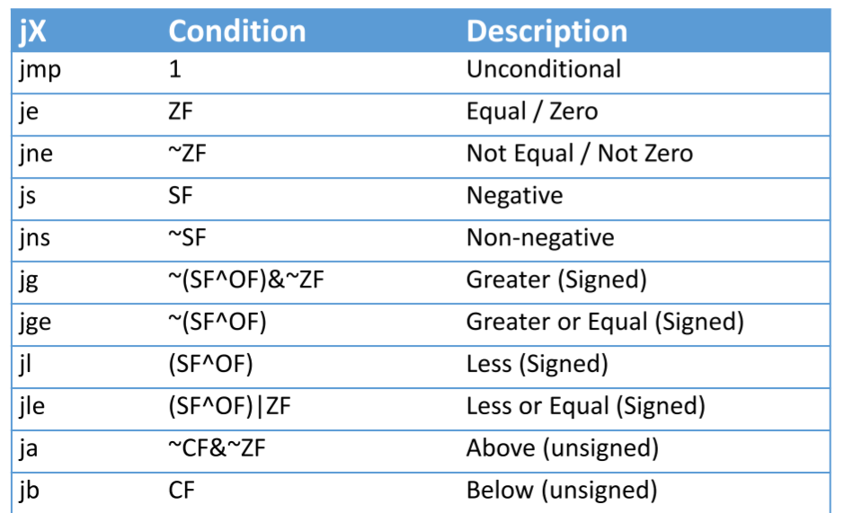

# Important to remember
## Calculations
### Nested Array Row

```c
arr[N][M]

arr[i][j] = arr + (i * M + j)
```


### IEEE
*Exp = 000 ... 0* -> -Bias + 1, leading 0.

### Cache 
Each page table entry PTE contains only the PPN and the metadata

**With multilevel decoding, from virtual address to physical address** virtual address space - page offset = bits to be encoded. Bits to be encoded / levels

**Minimum size of each PTE in bytes**
Physical address space - Pagesize + Flags(Metadata)

**Size of processors page table**
Virtual address space - pagesize + PTE size

**False Sharing** Poor performance when on different processors -> flush whole cache eventough they didn't need the same location. Good performance when on same processor

**Number of misses** Two arrays map to the same cache line, if address % cachesize is the same. Then you would have 100% cache misses

## Parallel Programming
### Solving ABA problem
- Harard Pointers
   - Threads keep track of questioned pointers in a shared data structure. In this way, each thread knows that the object on the given memory address defined by the pointer might have been modified by another thread
- Immutability
    - The usage of immutable objects solves this problem, as we don't reuse objects across the application
- Double Compare and Swap
    - Keep track of one more variable, which is the version number


## Architecture
*Section header table* Offsets and sizes of each section

*symtab.*   S  ymbol table, procedure and static variable names, section names and locations

*.rel.text* relocation info for .text section instructions for modifying

#.debug* Info for symbolic debugging (gcc. -g)

It exists 1 virtual address space per process

**Metadata bits in PTE**
- D: Dirty
- A: Accessed
- P: page is present in physical memory (1) or not(0)
- Avail: availabel for system programmers

### Memory

performance is *not unifrom*!
- cache and virtual memory effects can greatly affect program performance.

*typed*
- different kinds of memory behave differentyl

*not unbounded*
- It must be allocated and managed

**Non-Uniform Memory Access (NUMA)** Removes bottleneck
- Multiple, independent memory banks
- Processors have independent paths to memory
- Canpt snoop on the bus anymore -> it's not a bus! Use a message-passing interconnect

Solution1:
Bus emulation

- similar to snooping but without a shared bus
- Each node sends a message to all other nodes (e.g. read exclusive)
- Waits for a repyl from all nodes before proceeding (e.g. acknowledge)
- *AMD coherent HyperTransport*

Solution2: cache Directory
- Augemnt each node's local memory with a cache directory

**Directory-based Cache Coherence**
- Home node maintains set of nodes that may have line
Large multiprocessors

More efficient when:
- Lines are not widely shared
- Lots of NUMA nodes
    - Avoid broadcast/incast
    Reduces interconnect traffic, load at each node
    Requires lots of fast memory

### Locks
**MCS locks**
- Problem: cache line containing lock is a *hot spot*
    - continuously invalidated as every processor tries to acquire it
    - dominates interconnect traffic
- Solution: When acquiring, a processor enqueues itself on a list of waiting processors, and spins on its *own entry* in the list
- when releasing, only the next processor is awakened
````c
struct qnode {
    struct qnode *next;
    int locked;
};
typedef struct qnode *lock_t;

void acquire (lock_t *lock, struct qnode *local) {
    local -> next = NULL;
    struct qnode *prev = XCHG(lock, local);
    if (prev) { //queue was non empty
        local-> locked = 1;
        prev -> next = local;
        while (local -> locked); //spin
    }
}

void release(lock_t *lock, struct qnode *local) {
    if (local->next == NULL) {
        if (CAS(lock, local, NULL)) {
            return;
        }
        while(local->next ==NULL); //spin
    }
    local -> next -> locked = 0;
}
````

lock -> last element of a queue is spinning process
1. add ourselves to the end of this queue using XCHG
2. if the queue was empty, we have the lockè
3. if not, point the previous tail at us, and spin

1. we have the lock. is someone after us waiting?
2. if yes, tell them, and they will do the rest (see acquire())
3. if no, set the lock to NULL unselss someone appears in the meantime
4. if they do, wait for them to enqueue, and then go to (2).

**Flags**


**Synonym** 
- Only in virtual part 
- different VAs map to same PA
- VV with keys remove homonyms but creates synonyms

**Homonym**
- Same name for different data
- same VA refers to different PAs
- flush cache on context swithc
- force non-overlapping address-space
- tag VA with address-space
### Jumps
*Longjmp* If retval = 0, longjmp returns 1

*Setjumpt* saves current calling environment
- program counter (not nececcessary)
- stack pointer
- general purpose register

Or as it was mentioned in the exam:
- current stack pointer
- The current program counter (%rip)
- Calle-save processor registers
- Frame pointer register §rbp

### MESI
- Dirty data always written through memory
- No cache cache transfer
- Good if latency of memory << latency of remote cache

### Program order
Order in which a program on a processor appears to issue reads and writes. Refers only to **local** reads/writes

### Visibility Order
Order which all reads and writes are seen by one or more processors. Refers to all operations in the machine
### Sequential Consistency
Think of PPROG -> Order important but you can move instructions horizontally
1) Operations from a processor appear (to all others) in program order
2) Every processor's visibility order is the interleaving of all the program orders

*Requieremts:* 
- Each processor issues memory ops in program order
- Memory operations are atomic


## Dependence
**Anti-dependence** write after read, can avoid hazard with register renaming

**Output-dependence** write after write, can avoid hazard with register renaming

**True-dependence** read after write

### Order on stack
Extra args

Return address

saved base pointer

local variables
## Exceptions
**Processor Exception** changes the control flow exceptionally and most of the time context swithces to the OS for further instructions how the given exception should be handled. Exeptions are associated with an exception code that at the same time are an index into an exception table defined by the OS. In contrast to for example java exceptions, processor exceptions are not always bad; a system call is often hadndled as an exception too.

**Asynchronous exception** caused by events outside of processor --> ctr-c (interrupt)

**Synchronous exception** caused by an instruction of the processor
### Abort
- Nonrecoverable error
- Sync
- unintentional
- machine check
- **Aborts current program**
### Fault
- potentially recoverable errer
- sync
- unintentional
- page fault, protection fault
- **Either re-executes faulting instruction or abort**
### Trap
- intentional 
- sync
- system calls, breakpoint trap
- **returns control to "next" instruciton**

## Linker
- Resolving symbol references from other files
- Merging different object files sections


## Toolchain
*How C code turns into an executable file*
C source - Preprocessor - Compiler - Assembler - Linker - Executable

*GNU gcc Toolchain*

CPP (Macro subsitution include header files) - CC1 (compile each C file into assembly language) - as (Assemble each file into object code) - Id (link object files into program binary) - Executable

## Debugger
**Valgrind** helpful for memory-related errors

**GDB** conventional debugger, good for finding bad pointer dereferences, hard to detect the other memory bugs

**Objdump** Useful tool for examinibg object code, analyzes bit pattern of series of instructions

## Random
\\\ is an escape. 


*PIC, Programmable Interrupt Controller*
- Map physical interrupt pins to interrupt vectors
- Buffer simultanous interrupts -> Won't lose some devices interrupt
- Prioritize interrupts
- Selectievly mask any individual device's interrupts useful for high interrupt rate

How many BxB blocks fint into a cache and how many blocks do you need? -> $X B^2 < C$ where X is mostly 3 and C the Cache size


Reading string of length 10 in buffer
````c
fgets(buf, 10, stdin);
fscanf(stdin, "%9s", buf);
````

````c
NULL = (void *) 0
````
````c
strncpy(char *dest, const cahr *source, size)
````


DRAM as cache: Fully associative, sophisticated replacement policy, writeback


````c
void print_integers(unsigned num_ints, char *msg, ...) {
    va_list ap; // Variable which keeps track of which argument we're currently looking at, a bit like an iterator
    va_start(ap, msg); // Initialize the iterator based on the last fixed argument;
    for (int i = 0; i < num_ints; i++>) {
        int j = va_arg(ap, int);//return the next argument, cast to an int
        printf("int %d = %d\n", i, j);
    }
    va_end(ap) //free up the iterator
}


````