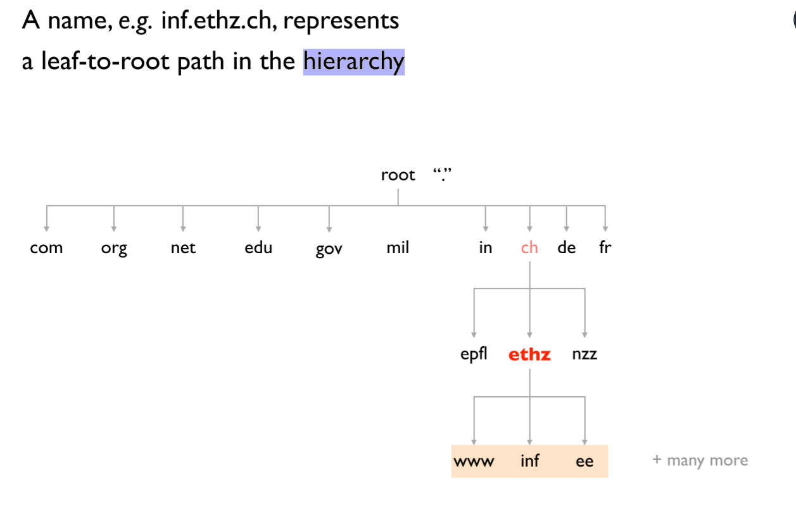
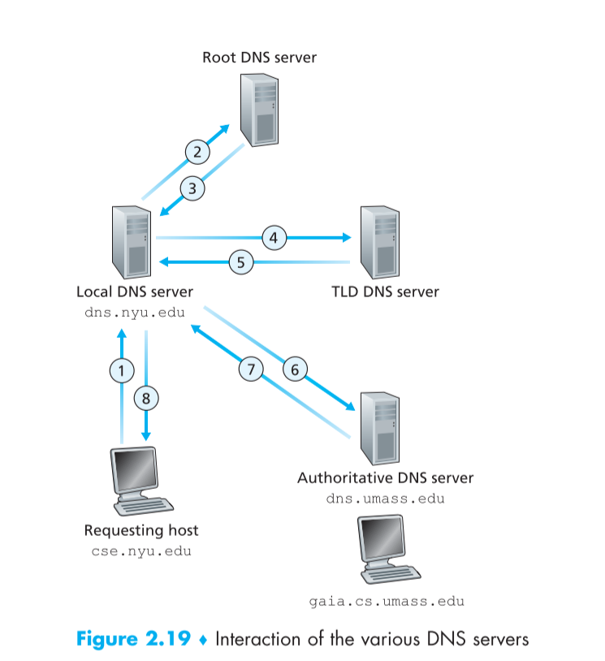
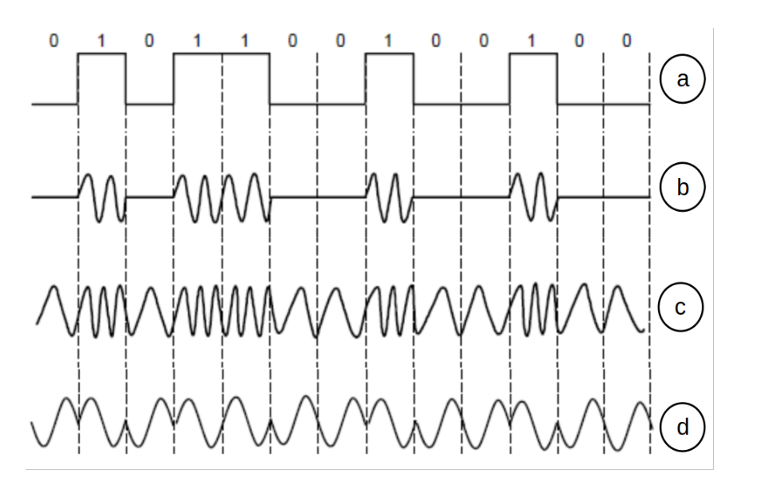
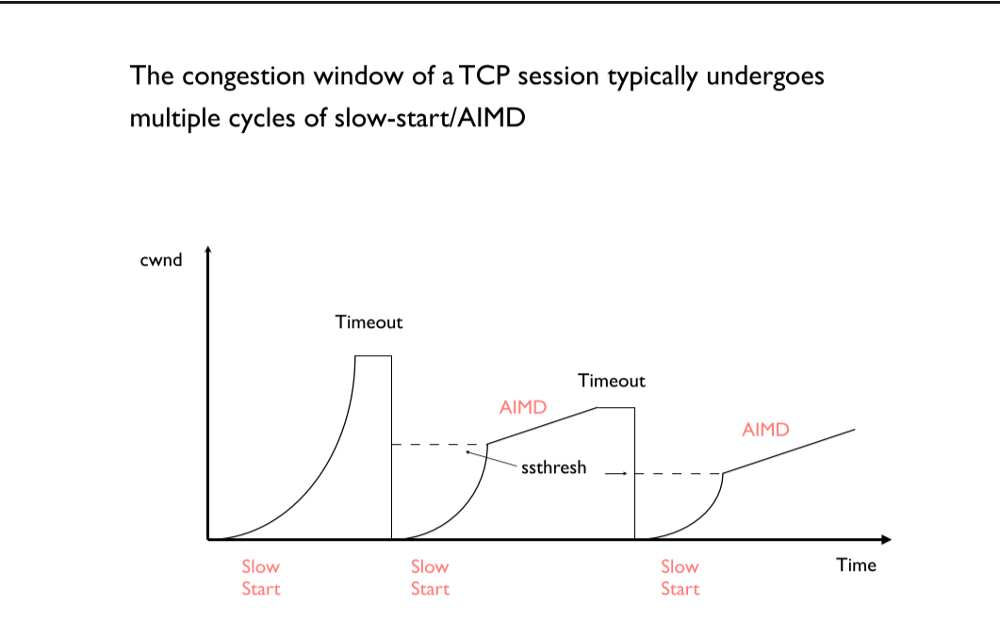
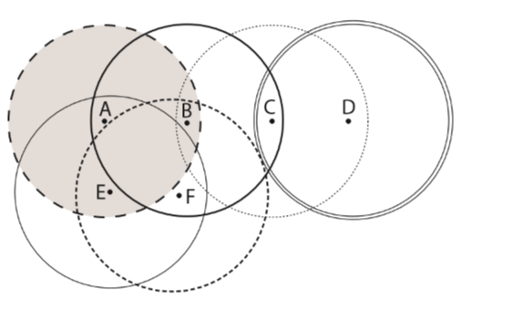
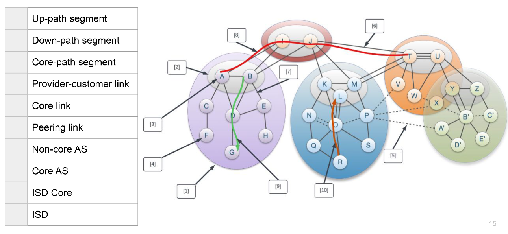
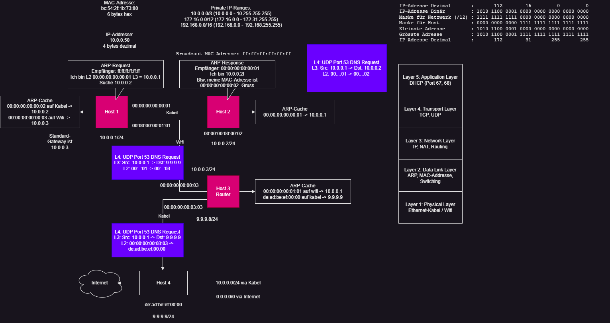

- [Internet](#internet)
- [Packet, circuit switching](#packet-circuit-switching)
- [Delays](#delays)
- [Layers](#layers)
- [Address Resolution Protocol (ARP)](#address-resolution-protocol-arp)
- [Ethernet](#ethernet)
- [ICMP](#icmp)
- [MAC](#mac)
- [IP](#ip)
- [DNS servers](#dns-servers)
  - [Resource Records (RRs)](#resource-records-rrs)
- [Congestion signals](#congestion-signals)
- [Reliable transport protocol:](#reliable-transport-protocol)
  - [Undesirable effects when sending packets:](#undesirable-effects-when-sending-packets)
  - [Goals of reliable transfer](#goals-of-reliable-transfer)
  - [Advantages of using unreliable transport protocol?](#advantages-of-using-unreliable-transport-protocol)
- [IPv4](#ipv4)
- [Link State Routing](#link-state-routing)
- [Distance Vector Routing](#distance-vector-routing)
- [Go-back-N](#go-back-n)
  - [ACK](#ack)
- [Modulation](#modulation)
  - [Baseband modulation](#baseband-modulation)
  - [Passband modulation](#passband-modulation)
  - [Why is it beneficial to use 4B5B encoding?](#why-is-it-beneficial-to-use-4b5b-encoding)
- [Timeout-Value](#timeout-value)
- [NAT](#nat)
- [TCP](#tcp)
- [TCP Congestion Control](#tcp-congestion-control)
  - [Slow Start](#slow-start)
  - [Congestion avoidance - additive increase](#congestion-avoidance---additive-increase)
  - [Fast retransmission and fast recovery](#fast-retransmission-and-fast-recovery)
  - [AIMD](#aimd)
- [Bloom Filter](#bloom-filter)
  - [Potential applications for Bloom filters on small platforms](#potential-applications-for-bloom-filters-on-small-platforms)
  - [Answers a Bloom filter gives](#answers-a-bloom-filter-gives)
  - [False Positive](#false-positive)
- [Wireless sending](#wireless-sending)
- [CDN](#cdn)
  - [Why distribute content](#why-distribute-content)
- [Anycast-based CDN](#anycast-based-cdn)
- [DNS-based CDN](#dns-based-cdn)
  - [Different ways to direct clients to the closest server](#different-ways-to-direct-clients-to-the-closest-server)
  - [Video streaming](#video-streaming)
    - [Available bit rate (ABR)](#available-bit-rate-abr)
    - [Buffer-based algorithm](#buffer-based-algorithm)
    - [Bit-rate algorithm](#bit-rate-algorithm)
    - [Differences](#differences)
  - [Video-On-Demand (VOD)](#video-on-demand-vod)
- [HTTP](#http)
- [Linear Programming](#linear-programming)
- [Byte Stuffing](#byte-stuffing)
- [Bit Stuffing](#bit-stuffing)
- [Hamming Distance](#hamming-distance)
- [Cyclic Redundancy Check (CRC)](#cyclic-redundancy-check-crc)
  - [Send Procedure](#send-procedure)
  - [Receive Procedure](#receive-procedure)
  - [Path Lookup](#path-lookup)
- [Recipe to get IP addressing:](#recipe-to-get-ip-addressing)
- [Mac vs IP-Address](#mac-vs-ip-address)
- [Quiz](#quiz)
- [Quic](#quic)


## Internet

- Internet connects End Systems/ Hosts by a system of communications links and package switches
- Packets: data segment and header
- IP (Internet Protocol): Specifies the format for packets sent among routers and end systems
    - unreliable service
    - best-effort delivery
    - modify before forwarding the packet to the next hop
        - destination MAC address
        - Time-to-live
        - IP checksum
- DSL (digital subscriber line): broadband residential access
    - downstream data channel: tens to few hundred Mbps
    - upstream data channel: few Mbps to few tens Mbps
- FDM (Frequency-division multiplexing): link dedicates a frequency band on the band to a communication for the duration of connection. The width of this band is called bandwidth.
- TDM (time-division multiplexing): time is divided into frames of fixes size, and each frame is split into a fixed amount of slots. These slots are dedicated to one connection

## Packet, circuit switching
- Packet switching relies on buffers to account for unexpected bursts
- Circuit switching is better applicable when the peak-to-average utilization ratio is low.
- large Peak / Average -> On-demand
- small peak /average -> circuit

## Delays
- **nodal processing delay:** 
    - Time used to decode the header, determine which output needs to be used, bit level checking etc.
    - negligible in comparison to other delays, little room for improvement here
    
- **queuing delay:** 
    - Time that the packet has to wait in the queue until the desired output will be free
    - better load balancing (i.e. via routing), reduce queue size

- **transmission delay:** 
    - Time after the packet gets out of queue until its on the output line; let L be the length of the packet, R the transmission rate from router A to B, then the transmission delay is L/R.
    - increase the link capacity
- **propagation delay:** 
    - Time, the package takes to propagate through the physical medium (e.g. at light speed with radio waves), i.e. it takes on the way from router A to B
    - if possible, use data replication to shorten the client-server distance. Improving routing or physical transmission media also helps

## Layers
|Layers|
|-|
|Application|
|Transport|
|Network|
|Link|
|Physical|

- **Application Layer:** Application protocols and layers reside here. The internet includes many protocols here, as HTTP (provides Web document requests and responses), SMTP (for e-mail transfer) and FTP (file transfer from host to host). The DNS is also an application layer protocol. Packet of information at this layer is called message

- **Transport Layer:** Transports application layer messages between application endpoints. In the internet, there’s TCP and UDP. E.g. longer messages are split into shorter segment. Packets in this layer are called segments.(TCP & UDP) or Datagram (UDP).

- **Network Layer:** The layer is responsible for moving datagrams from host to host. It receives a segment and an address. This layer includes the IP, which defines the fields in a datagram and how to work on those fields. Packets in this layer are called datagrams / packet. 
    - ARP: broadcast domain receives everyone until a router. 
    - goes through mac

- **Link Layer:** The network layer brings a datagram from one node to another, but to move a packet from one specific node to another, it relies on the link layer. 
    - It delivers the packet to the next node. E.g. Ethernet or WiFi. Link layer protocols are called frames.
    - error detection
- an ethernet switch can interconnect a 10 Mbps Ethernet network and a 1 Gbps Ethernet network
- The 802.11b wireless protocol incorporates a link-layer ACK not present in regular Ethernet

- **Physical layer:** The job of the link layer is to move whole frames from one node to another; however, the job of the physical layer is to move individual bits. Many protocols exist, depending on the physical medium; e.g. Ethernet has different protocols for different cable types.

## Address Resolution Protocol (ARP)
- It allows a host to get the MAC address associated with an IP address

## Ethernet
1. frame starts with destination address
    - if not destined to this device, it can be simply dropped
2.  source address
3. type / length field
    - tells receiver what payload this frame carries
4. data and pad
    - minimum length of an ethernet frame is 64 bytes in total
5. checksum
    - determines whether the bits of the frame have been received correctly. If error, frame is dropped
- Ethernet switches (or bridges) learn addresses by looking at the source address of packets as they pass by $\rightarrow$ backwards learning

## ICMP
- application that requires the use of ICMP:
    - ping works by sending ICMP echo requests
    - traceroute relies on ICMP answers in every implementation, but some implementations send UDP packets by default

## MAC 
- are assigned randomly by manufacturer
- we need both MAC and IP address:
    - Pro:
        - lower / no management overhead because MAC addresses are assigned by the manufacturer whereas IP addresses have to be assigned or there has to be an automatic assignment procedure like DHCP
        - mobility / persistent connections could be easier because the address doesn't change
        - better network utilization because of smaller headers (only one address)
    - Contra:
        - not possible to group them using prefixes, since MAC is randomly assigned. Routing tables grow to unmanageable sizes

## IP
- kind of like a phone number
- opens up communication

## DNS servers


- uses DNS
    - on port number 53 to serve requests
    - DNS queries consist of a single UDP request from the client followed by a single UDP reply from the server
    1. UDP is much faster
    2. DNS requests are generally very small and fit well within UDP segments
    3. UDP is not reliable, but reliability can be added to the application layer. An application can use UDP and can be reliable by using a timeout and resend at the application layer
- Between host and router, the headers are:
Ethernet - IP - UDP - DNS

### Resource Records (RRs)
- **Type=A:** Name refers to a hostname, Value refers to the corresponding IP address. Hence, this type provides a standard hostname to IP mapping.
- **Type=NS:** Name is a domain (e.g. foo.com) and Value is the hostname of an authoritative DNS server who can how to obtain the IP address of the query.
- **Type=CNAME:** Value is the canonical host name for the alias host name Name.
- **Type=MX:** Value is the canonical name of a mail server
with alias Name.



## Congestion signals
Signals that warn about congestion:
- **Packet loss**: 
    - Advantage: can be detected easily (doesn't require in-network feature support) by using timers. 
    - Disadvantage: only considers binary feedback (i.e., packet either arrives at sender or not)
    - Disadvantage: loss can also be caused by other factors (i.e. cosmic radiation in a satellite link), careful parametrization is needed

- **Packet latency**:
    - Advantage: can be detected easily (doesn't require interwork feature support). 
    - Advantage: relatively quick feedback of a continuous signal
    - Disadvantage: many factors in the network can affect latency, not only congestion, careful parametrization is needed.

- **In-network marking (i.e. ECN- Explicit Congestions Notification)**
    - Indicate congestion through setting a bit in packet
    - Advantage: early signal of congestion
    - Disadvantage: requires support in the network by i.e. the routers/switches

## Reliable transport protocol:
### Undesirable effects when sending packets:
- Packet loss
- Reordering
- Delay
- Duplication
- Corruption

### Goals of reliable transfer
- Correctness: ensure data is delivered, in order, and untouched
- Fairness: play well with concurrent communications
- Timeliness: minimize time until data is transferred
- Efficiency: optimal use of bandwidth
- Cannot guarantee 100% correct packet order and packet integrity but corruption can often be detected using checksums and the correct oder can be reconstructed through the sequence numbers in packet headers. Note that a packet, and thus its content, checksum, and sequence number, could be corrupted in such a way that it still looks like a valid packet. However, in practice and assuming that there is no malicious entity in the network, this is highly unlikely to happen.

### Advantages of using unreliable transport protocol?
- Better performance/less overhead
- Lightweight implementation
No connection setup $\rightarrow$ start sending data immediately

## IPv4
Built up by:
- checksum
- used transport protocol
- TTL
- (Sequence number is only contained inside of the transport header but not the IP header)
- (There is no checksum in the IPv6 header)
- hostname can map to multiple IP addresses for reasons of fallback and load distribution

## Link State Routing
1. Nodes flood topology in the form of link state packets and each node learns the full topology
2. Each node computes its own forwarding table by finding the shortest path to each other node (according to some cost metric). An algorithm that enables this shortest path calculation is Dijkstra.
- Knows all the distances
- More RAM/CPU
- Faster Convergence

## Distance Vector Routing
- Only know next hop
- Less RAM/CPU
- Slower Convergence


- A socket is a software abstraction by which an application process exchanges network messages with the (transport layer in the) operating system

- Transmission delay per segment: $\frac{packetSize}{bandwidth}$

## Go-back-N
- You have a window size with segments. When you send a packet, the ACK is sent after the propagation delay + transmission delay. If the packet gets lost, the ACK always sends the last valid ACK. E.G. packet 2 is lost and packets 0, 1, 3, 4 are successfully sent and received, you only get ACK for packet 0, 1. 1 is the highest number to receive 
- TCP uses Cumulative ACK and Go-back-N

### ACK
- With individual ACKs, missing packets (gaps) are implicitly inferred rather than explicitly conveyed by the receiver
- Cumulative ACKs indicate that packets up to a certain sequence number have arrived
- In cumulative acknowledgement, duplicate ACKs are a sign of losses or reordering
- Selective ACKs is a non-mandatory option that helps prevent unnecessary network congestion
- With individual ACKs, the los of an ACK packet causes an unnecessary retransmission
## Modulation
### Baseband modulation
- bit stream directly send onto wire

### Passband modulation
- bit stream send by modulating a carrier frequency and sending this signal which now encodes the bitstream in its modulation.

### Why is it beneficial to use 4B5B encoding?
There are more transitions in the 4B5B-encoded signal. This allows for clock recovery to prevent resynchronization after long runs of 0s or 1s



    a. NRZ Signal of Bits
    b. Amplitude Key Shifting
    c. Frequency Key Shifting
    d. Phase Key Shifting$

NRZ (Non-Return-to-Zero), Manchester, and Differential Manchester are three different line coding schemes used in digital communication to encode binary data for transmission over a communication channel. Each scheme has its own characteristics and advantages.

- NRZ (Non-Return-to-Zero):
    - In NRZ encoding, a '0' is represented by one signal level (e.g., low voltage), and a '1' is represented by the opposite signal level (e.g., high voltage).
    - There is no transition in the middle of a bit time, making it simple to implement.
    - However, a potential issue with NRZ is the possibility of long runs of the same signal level, which can lead to synchronization problems and baseline wander.
    - NRZ can be further divided into NRZ-L (NRZ-Level) and NRZ-I (NRZ-Inverted), where NRZ-I introduces a transition at the beginning of a '1' bit.

- Manchester:
    - In Manchester encoding, each bit is divided into two halves: the first half represents the high-to-low transition, and the second half represents the low-to-high transition.
    - A '0' is represented by a high-to-low transition in the middle of the bit time, and a '1' is represented by a low-to-high transition in the middle.
    - This encoding guarantees frequent transitions, making it well-suited for clock recovery and synchronization.
    - However, it requires twice the bandwidth compared to NRZ since transitions occur at the center of each bit.

## Timeout-Value
- Exponential averaging of RTT
- Estimated RTT is calculated by $$EstimatedRTT = \alpha * EstimatedRTT + (1 - \alpha) *Sample RTT$$
- $\alpha$ decides how much weight we want to give to new sample values. For small $\alpha$, we weigh our new samples stronger. If SampleRTT always stays the same, the EstimatedRTT will converge to SampleRTT.
- Sample RTT $$SampleRTT = AckRcvdTime - SendPacketTime$$

## NAT
- can modify outgoing packets traveling from an internal network to the internet
    - source IP address
    - source port
    - IP checksum
**Advantages of middleboxes**
- A possible rapid deployment path when there is no other option
- Control over many hosts

**Disadvantages of middleboxes**
- Breaking layering interferes with connectivity; strange side effects
- Poor vantage point for many tasks
- Cause Internet ossification: almost impossible to deploy new transport protocols
How to deploy publicly accessible services wih NAT?
- Manually configure entries in NAT table - "port forwarding"

**NAT Downsides**
- Connectivity has been broken
    - Can only receive incoming packets after an outgoing connection is set up
    - Difficult to run servers at home - requires explicit "port-forwarding" rules
-Additional issues when there are no connections (UDP apps)
    - often solved with regular "keep-alive" messages to keep table entries

**NAT Upsides**
- Relieves much IP address pressure 
    - Many (most) home hosts behind NATs
- Easy to deploy 
    - Rapidly, and by you alone – Very flexible in terms of address space
- Useful functionality – Firewall
    - Hides internal network structure and configuration ($\rightarrow$ privacy)

**How does client access server (get destination address)?**
- Contact server through its public IP address
- NAT translate source address to NAT's public address
- choose new port number from a pool of available ports and kep mapping between selected port number and internal host information.

**Stores**
- port from client
- address from client
- IP address of server
- port number from server

## TCP
- in-sequence delivery
- a connection-oriented service
- Full-duplex (simplex: data may only flow one way, half-duplex: data may flow both ways, but not simultaneously, full-duplex: data may flow both ways simultaneously)

## TCP Congestion Control
- slow start threshold (ssthresh):
    - function of congestion
    - timeout, we set ssthresh = cwnd/2
    - initially cwnd is infinity
    - slow start until a timeout occurs
    - slow start until timeout or we reach ssthresh -> we switch to AIMD
- The ideal congestion window size is the Bandwidth delay product. $$W = bandwidth * delay$$
- prevents a set of senders from overloading the network
    - solved using a "congestion" window

````Java
Initially: 
    cwnd = 1 
    ssthresh = infinite
New ACK received: 
    if (cwnd < ssthresh): 
        /* Slow Start*/ 
        cwnd = cwnd + 1
    else:
        /* Congestion Avoidance */ 
        cwnd = cwnd + 1/cwnd
Timeout:    
    /* Multiplicative decrease */ 
    ssthresh = cwnd/2
    cwnd = 1
````

### Slow Start
- Multiplicative increase of the congestion window
- Every packet is ACK'ed, the size of the congestion window grows by one packet.
- This leads to a doubling of the window size, every RTT. Slow start operates when the *cwnd* is lower than the *ssthresh*

### Congestion avoidance - additive increase
- For every RTT, the congestion window size grows with a single packet unless packet losses are inferred, in which case, the congestion window reduces by half. The connection has already experienced congestion before, and as such, it "knows" that exponential growth (slow start algorithm) will be too aggressive. Congestion avoidance is operating when the *cwnd* is higher than or equal to the *ssthresh*

### Fast retransmission and fast recovery
- When three duplicate ACKs are received by the sender, it will (fast) retransmit the apparent data packet that got lost. The fast recovery mechanism halves the *cwnd* and sets $ssthresh = cwnd$. It does not return to the slow start (by setting $cwnd = 1$) as would be done upon a timeout. The main intuition is that a timeout, and the resulting significant reduction in throughput, should only occur if no packets can be transmitted anymore (in the client-server direction, in the server-client direction, or in both directions). Three duplicate ACKs indicate less severe congestion (i.e., some packets sill arrive), which can be solved by halving the congestion window.

### AIMD
- converges to a fair state for two senders sharing the same single link at equal end-to-end RTT


## Bloom Filter
### Potential applications for Bloom filters on small platforms
- Pre-filtering
    - If there is a cache server, bloom filter can implemented on NIC to filter out requests for entries that are certainly not in cache and thus, reduce latency and the overall load on the server's CPU
- track specific information about network flows
    - instead of deploying a filter on a NIC, the filter can be installed on a switch that connects multiple cache servers. Thus, the same effect can be achieved as in the previous example, just at te switch, which further improves the latency.
- after insertion of $n$ independent elements, what is the probability that a particular bit is 1
    $$\left(1 - \frac{1}{m}\right)^{kn}$$

### Answers a Bloom filter gives
- Surely not present or possibly present
    - Could give false positive
    - Never give false negative
### False Positive
$$P[FP] = \left(1 - \left(1- \frac{1}{m}\right)^{nk}\right)^k$$

## Wireless sending
Assume A wants to send to B. Those terminals that are invisible to A but not to B: hidden. Those terminals that are exposed to A but not B: exposed


**RTS/CTS prevents hidden terminal from interfering with a sender**
- receiver sends its CTS, all terminals in range receive it
- they know that they should not start sending

**Terminal infers that it is exposed and can thus send to another destination**
- When the sender sends its RTS, the exposed terminal receives it too, but then it does not receive the CTS from the receiver, so it knows it can start transmitting. 
## CDN
A content delivery network (CDN) is a distributed network of servers that delivers web content to users based on their geographical location. The main purpose of a CDN is to improve the performance of websites and reduce latency by caching static content such as images, videos, and HTML files in multiple locations around the world.

When a user requests a webpage that has been cached on a CDN server, the server closest to the user's geographical location will serve up the content. This reduces latency and improves website performance.

CDNs can also be used to increase security and reliability by providing redundancy, in the case of an outage or cyberattack. 


|Caching|Replication|
|-|-|
|Reactive|Proactive|
|After fetching resource for a client, also store it in a cache|Place content that will likely be requested close to clients|
|Like caching DNS records and DNS resolvers|Can distribute load over multiple servers|
|Saves time for your browser and decreases network and server load|Optimize latency of requests|

### Why distribute content
- Fault tolerance
    - service remains available (at least partially) even if some datacenter or network fails
- Load balancing
    - Distribute requests over multiple servers
    - Could e solved with multiple servers in one location
- Optimize latency
    - Requests are directed to "close" server
- Network inefficiency
    - Don't need to transmit data all across the globe
- uses combination of pull caching and push cashing in order to speed-up Web content delivery

## Anycast-based CDN
- content is distributed and served though a network of servers that are spread across different geographical locations
- Servers are configured with the same IP address and are part of the same anycast group
- When user requests content, network routes the request o the nearest server based on network topology, typically using BGP
server that receives the request the serves the content directly to the user
- provide faster content delivery by minimizing the distance between the user and the nearest server. 
- Reducing latency and improving performance
- Anycast is a network addressing and routing technique that allows multiple servers or nodes to share the same IP address

## DNS-based CDN
- content is distributed through DNS
- when user requests content, their DNS resolver queries the CDN's DNS server to resolve the domain name
- CDN's DNS server respond with the IP address of the server that is best suited to serve the content based on various factors like the user's location, server load, and network conditions.
- Rely on intelligent DNS routing to direct the user's request to the appropriate server based on the DNs response
Allows dynamic load balancing ad content distribution based on real-time conditions
- actual content delivery is then handled by the selected server

### Different ways to direct clients to the closest server
|DNS-based|BGP-anycast-based|
|-|-|
|Return different IP addresses based on location and load|Always use same IP address (or small set of addresses)|
|resolver's geo-localization| Address are advertised via BGP from multiple locations|
|server load ($\rightarrow$ load balancing)| Closest location is found by BGP|
|Use short TTL of DNS records to prevent caching| Same approach as opn DNS resolvers (e.g., 9.9.9.9)|

|DNS-based|BGP-anycast-based|
|-|-|
|+ Very high control|+"Simple": optimization is done by BGP|
|+ Dynamic changes are possible| |
|- Complicated| - Less precise control|
|- Potential issues when clients do not use their local resolver| - Longer reconfiguration times|

DNS-based CDN overwrites URL (statically at the server for each client request) 
Each client is served the same HTML with URLs for CDN-hosted objects already rewritten

### Video streaming
- Adaptation algorithms may vary depending on users' devices
    - video buffer size can vary across devices. A device with a large buffer may benefit from a different algorithm (or at least a differently tuned algorithm) than one with a very small buffer
    - Different network patterns occur in different environments, for example a mobile environment is different from a home TV
    - Depending on the device, there might be different requirements in terms of the so called Quality of Experience (e.g. HDTV users might need a higher video quality in comparison to mobile users for the same QoE)

#### Available bit rate (ABR)
- Bitrate switching: ABR divides video content into multiple bitrate representations with varying quality levels. During playback, the client device switches between different representations to match the available network bandwidth.
- two videos encoded at the same resolution, do not have in general the same bitrate, in regard of the video content¨
- Goals:


    |Maximize|Minimise|
    |-|-|
    |Downloaded video quality|Rebuffering|
    |Stream stability|Startup delay|
    ||bandwidth wastage|

#### Buffer-based algorithm
- the higher the buffer health, the higher (typically) the quality downloaded

1. **Buffer Initialization:** When video playback starts, the buffer is initially empty. The algorithm sets a target buffer level to achieve optimal performance

2. **Video Bitrate Selection:** the algorithm selects an appropriative video bitrate representation to start playback. It may choose a conservative initial bitrate to avoid overfilling or underfilling the buffer.

3. **Buffer Management:**
    1. Buffer Filling: As video data is downloaded from the server, it is stored in the buffer. The algorithm continuously monitors the buffer level to ensure it stays above the target level.

    2. Buffer Draining: During playback, video frames are consumed from the buffer. The buffer level decreases over time as frames are displayed on the screen.

4. **Adaptation Decisions:** The algorithm periodically evaluates the network conditions and the buffer level to make adaptation decisions:

    1. Network Conditions: The algorithm estimates the available bandwidth and network stability. This information helps determine the bitrate representation that can be sustained without interruptions.

    2. Buffer Level: The algorithm assesses whether the buffer is too full or too empty. If the buffer is below the target level, it may increase the bitrate to fill it. If the buffer is approaching overflow, it may reduce the bitrate to avoid buffering delays.

5. **Bitrate Switching:** Based on the adaptation decisions, the algorithm selects the appropriate video bitrate representation to be fetched from the server. It can switch to a higher bitrate when network conditions are favorable and revert to a lower bitrate if bandwidth decreases.

6. **Smooth Playback:** The algorithm aims to maintain a smooth and uninterrupted video playback experience by dynamically adjusting the video quality to match the network conditions and buffer status.

7. **Handling Variability:** The buffer-based algorithm accounts for variations in network bandwidth, packet loss, and other factors that can affect video streaming performance. It is designed to handle fluctuations and ensure continuous video playback.

#### Bit-rate algorithm
1. **Initial Bitrate Selection:** When video playback starts, the algorithm chooses an initial bitrate representation to begin streaming. This initial selection is often based on the client's network conditions or pre-defined settings.

2. **Bandwidth Estimation:** During video playback, the algorithm periodically estimates the available network bandwidth. It measures the rate at which video data is being downloaded from the server.

3. **Bitrate Adaptation:** Based on the estimated network bandwidth, the algorithm continuously adjusts the video bitrate representation. It aims to match the selected bitrate with the available bandwidth, ensuring a smooth streaming experience.

4. **Bitrate Up-switching:** If the available network bandwidth is higher than the current video bitrate, the algorithm may switch to a higher quality representation to take advantage of the better network conditions. This results in improved video quality for the viewer.

5. **Bitrate Down-switching:** Conversely, if the available network bandwidth decreases, the algorithm may switch to a lower quality representation. Lower bitrates consume less bandwidth and help prevent buffering or interruptions when the network is congested or experiencing fluctuations.

6. **Rate Control:** To avoid abrupt or frequent bitrate switches, the rate-based algorithm typically includes a rate control mechanism. This control mechanism ensures that bitrate changes are gradual and not disruptive to the viewer's streaming experience.

7. **Adaptive Behavior:** The rate-based algorithm continuously monitors the network conditions and dynamically adapts the bitrate based on changes in bandwidth. This adaptive behavior allows the algorithm to respond quickly to fluctuations in network performance.

8. **Handling Packet Loss:** Rate-based algorithms may also consider packet loss as an indicator of network congestion. When packet loss occurs, the algorithm may react by reducing the bitrate to compensate for the network's instability.

#### Differences
Buffer-Based Algorithm:
- **Focus:** Buffer-based algorithms primarily concentrate on managing and optimizing the buffer at the client-side to ensure smooth and uninterrupted video playback.

- **Approach:** These algorithms monitor the buffer level, aiming to keep it above a target level to prevent buffering interruptions and maintain a consistent viewing experience.

- **Key Decision Metric:** Buffer-based algorithms make adaptation decisions based on the buffer level and its filling/draining rate. They may adjust the bitrate to fill or drain the buffer, aiming for a balanced buffer state.

Rate-Based Algorithm:
- **Focus:** Rate-based algorithms primarily focus on adjusting the video quality based on the estimated available network bandwidth.
- **Approach:** These algorithms continuously estimate the available network bandwidth and dynamically adapt the video bitrate to match the network conditions. They aim to deliver the best possible video quality given the available bandwidth.
- **Key Decision Metric:** Rate-based algorithms make adaptation decisions based on the estimated network bandwidth. They may switch to higher or lower bitrate representations to optimize video quality based on the available bandwidth.

In summary, the primary difference is in their focus: buffer-based algorithms prioritize buffer management to prevent buffering and maintain a consistent buffer state, while rate-based algorithms prioritize video bitrate adjustment to optimize video quality based on the available network bandwidth. Both types of algorithms are used in adaptive bitrate streaming to deliver smooth and high-quality video playback across varying network conditions. Some modern adaptive streaming solutions combine elements of both buffer-based and rate-based approaches to achieve more effective and efficient adaptive streaming behavior.

### Video-On-Demand (VOD)
Short:
- overload the server with tons of HTTP requests. 
- Increase frequency of key frames
- fine-grained decisions as the bandwidth fluctuates, being quicker in adapting its rate

Long:
- risk of frequent quality switches, ath the price of having less reactivity to bandwidth fluctuations and higher risk of rebuffering
- DASH architecture, a chunk is playable once it has been completely downloaded. We would have to wait until whole video is downloaded before playing

## HTTP
- stateless protocol

## Linear Programming
- all finite linear programs are solvable in polynomial time
- general space of integer linear programs is NP hard
    - This does not mean that ever problem that can be expressed an ILP is hard


## Byte Stuffing
- Replace each FLAG in data with ESC FLAG
- Replace each ESC in data with ESC ESC
- Only *byte* stuffing, between it is not visible (see bit stuffing)
- Any unescaped FLAG is the start/end of frame

## Bit Stuffing
- Can stuff at the bit level too
- Call a flag six consecutive 1s
- On transmit, after five 1s in the data, insert a 0
- On receive, a 0 after five 1s is deleted

## Hamming Distance
For data of length *n*, the length of the Hamming code is given by
$$n \leq 2^k - k - 1$$
where *k* is the number of check bits to detect and correct an error in one bit (minimum Hamming distance of 3).

## Cyclic Redundancy Check (CRC)
- Given *n* data bits, generate *k* check bits such that the $n + k$ bits are evenly divisible by a generator *C*.

### Send Procedure
1. Extend the *n* data bits with *k* zeros
2. Divide by the generator value *C*
3. Keep remainder, ignore quotient
4. Adjust *k* check bits by remainder

### Receive Procedure
1. Divide and check for zero remainder
### Path Lookup



## Recipe to get IP addressing:


| Column Name| Explanation|
|-|-|
| Prefix| The prefix notation (also known as CIDR notation) that represents the subnet's network size. It consists of the IP address followed by a slash and the number of significant bits in the subnet mask.|
| # of hosts           | The maximum number of usable hosts in the subnet. It's calculated as 2^(32 - prefix length) - 2, where the two subtracted values account for the network address and the broadcast address.                            |
| Prefix mask          | The subnet mask represented in dotted-decimal notation. Each segment of the subnet mask represents 8 bits in binary form. Look what the prefix is e.g. x.y.z.u/12 and look what number it is if you have 12 1's.|
| Network Address      | The network address is obtained by performing a bitwise AND operation between the IP address and the subnet mask. This results in the network portion of the IP address.                                         |
| Broadcast Address    | The broadcast address is the highest address in the subnet and is used to send a message to all hosts within that subnet. It's obtained by flipping all the host bits (those not covered by the subnet mask) to 1s in the network address. |
| Last Host Address    | The last host address is the highest usable IP address in the subnet. It's obtained by setting all the host bits to 1s in the network address, except for the last bit.                                        |


## Mac vs IP-Address

A huge thanks goes to 


## Quiz
- **The Maximum Segment Size(MSS) of TCP is equal to:**
MSS = MTU - header(IP) - header(TCP)

- UDP sockets type is SOCK_DGRAM while TCP sockets type is SOCK_STREAM
- For a SOCK_STREAM, an operating system stores both local and remote port
- Given a directed graph G(V, E) with |V| and |E| being the numbers of vertices and edges, how many variables do you need for the max-flow LP formulation discussed in class?
- There is no connection establishment in UDP
- The objective of flow control is not to overwhelm the hosts
- The objective of congestion control is to not overwhelm the network
- During congestion avoidance in TCP, the successful acknowledgement of a segment results in the sender congestion window growing by one segment per RTT.
- TCP (SOCK_STREAM) is a connection-based protocol. The connection is established and the two parties have a conversation until the connection is terminated by one of the parties or by a network error.
- UDP (SOCK_DGRAM) is a datagram-based protocol. You send one datagram and get one reply and then the connection terminates.
- Given a directed graph G(V,E), with |V| and |E| being the numbers of vertices and edges, how many variables do you need for the max-flow LP formulation discussed in
class?: O(|E|)
- QUIC can handle switching from WiFi to a cellular network without having to reestablish the connection:
    - uses connection IDs independent of the IP address instead of a 4-tuple like TCP to identify connections.
    - This way packets using the connection ID are still valid, even if the source IP address changes.

- If we create our simple query (dig @a.root-servers.net www.ethz.ch)
and send it to the first root-server, we don’t get an www.ethz.ch IP in
return. Why is this?
- Root server does not support recursive resolution
    - If we request the domain from a root server, we don't get back a result because of the hierarchical structure of the DNS system. The root server just refers us to the next lower level DNS server, the one for the ch TLD. Note that the "dig @server name" command just sends a query to this single stated server while the "dig name" command issues multiple requests down in the DNS hierarchy in order to iteratively resolve the domain name. This would be the first step of an iterative resolution.
    
- The minimum information one needs to resolve any DNS hostname is the IP address of a DNS root server

## Quic
- Operate in Application and Transport layer
- combines connection and TLS handshake $\rightarrow$ reducing the connection setup time by one RTT
- enables Zero-RTT communication if the hosts have communicated before (improved handshake)
- Connection hand-over is possible by identifying connection with a connection ID instead of the 5(/4)-tuple (even with changing IP addresses e.g. when changing networks with a mobile device)
- resoles head-of-line blocking by the logical abstraction of streams (contrary to TCP, which required you to open multiple parallel TCP connections)
- Middleboxes and NAT routers are known to drop unfamiliar transport layer protocols. Quic uses UDP to give inseparability with existing hardware.
