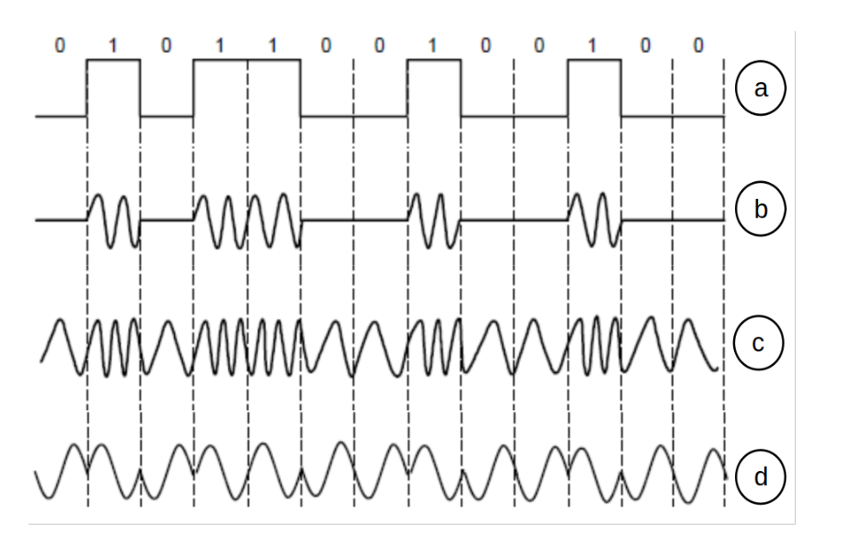
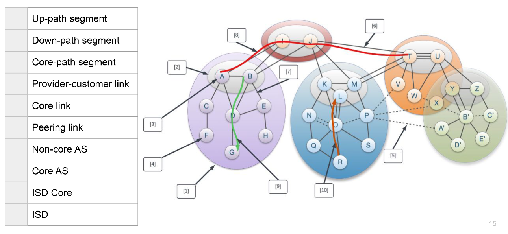

# Important stuff
## Internet

- Internet connects End Systems/ Hosts by a system of communications links and package switches
- Packets: data segment and header
- IP (Internet Protocol): Specifies the format for packets sent among routers and end systems
- DSL (digital subscriber line): broadband residential access
- FDM (Frequency-division multiplexing): link dedicates a frequency band on the band to a communication for the duration of connection. The width of this band is called bandwidth.
- TDM (time-division multiplexing): time is divided into frames of fixes size, and each frame is split into a fixed amount of slots. These slots are dedicated to one connection

## Delays
- **nodal processing delay:** 
    - Time used to decode the header, determine which output needs to be used, bit level checking etc.
    - negligible in comparison to other delays, little room for improvement here
    
- **queuing delay:** 
    - Time that the packet has to wait in the queue until the desired output will be free
    - better load balancing (i.e. via routing), reduce queue size

- **transmission delay:** 
    - Time after the packet gets out of queue until its on the output line; let L be the length of the packet, R the transmission rate from router A to B, then the transmission delay is L/R.
    - increase the link capacity
- **propagation delay:** 
    - Time, the package takes to propagate through the physical medium (e.g. at light speed with radio waves), i.e. it takes on the way from router A to B
    - if possible, use data replication to shorten the client-server distance. Improving routing or physical transmission media also helps

## Layers
|Layers|
|-|
|Application|
|Transport|
|Network|
|Link|
|Physical|

- **Application Layer:** Application protocols and layers reside here. The internet includes many protocols here, as HTTP (provides Web document requests and responses), SMTP (for e-mail transfer) and FTP (file transfer from host to host). The DNS is also an application layer protocol. Packet of information at this layer is called message

- **Transport Layer:** Transports application layer messages between application endpoints. In the internet, there’s TCP and UDP. E.g. longer messages are split into shorter segment. Packets in this layer are called segments.(TCP & UDP) or Datagram (UDP).

- **Network Layer:** The layer is responsible for moving datagrams from host to host. It receives a segment and an address. This layer includes the IP, which defines the fields in a datagram and how to work on those fields. Packets in this layer are called datagrams / packet. 

- **Link Layer:** The network layer brings a datagram from one node to another, but to move a packet from one specific node to another, it relies on the link layer. It delivers the packet to the next node. E.g. Ethernet or WiFi. Link layer protocols are called frames.

- **Physical layer:** The job of the link layer is to move whole frames from one node to another; however, the job of the physical layer is to move individual bits. Many protocols exist, depending on the physical medium; e.g. Ethernet has different protocols for different cable types.

## DNS servers
### Resource Records (RRs)
- **Type=A:** Name refers to a hostname, Value refers to the corresponding IP address. Hence, this type provides a standard hostname to IP mapping.
- **Type=NS:** Name is a domain (e.g. foo.com) and Value is the hostname of an authoritative DNS server who can how to obtain the IP address of the query.
- **Type=CNAME:** Value is the canonical host name for the alias host name Name.
- **Type=MX:** Value is the canonical name of a mail server
with alias Name.

## Congestion signals
Signals that warn about congestion:
- **Packet loss**: 
    - Advantage: can be detected easily (doesn't require in-network feature support) by using timers. 
    - Disadvantage: only considers binary feedback (i.e., packet either arrives at sender or not)
    - Disadvantage: loss can also be caused by other factors (i.e. cosmic radiation in a satellite link), careful parametrization is needed

- **Packet latency**:
    - Advantage: can be detected easily (doesn't require interwork feature support). 
    - Advantage: relatively quick feedback of a continuous signal
    - Disadvantage: many factors in the network can affect latency, not only congestion, careful parametrization is needed.

- **In-network marking (i.e. ECN- Explicit Congestions Notification)**
    - Indicate congestion through setting a bit in packet
    - Advantage: early signal of congestion
    - Disadvantage: requires support in the network by i.e. the routers/switches

## Reliable transport protocol:
### Undesirable effects when sending packets:
- Packet loss
- Reordering
- Delay
- Duplication
- Corruption

### Goals of reliable transfer
- Correctness: ensure data is delivered, in order, and untouched
- Fairness: play well with concurrent communications
- Timeliness: minimize time until data is transferred
- Efficiency: optimal use of bandwidth
- Cannot guarantee 100% correct packet order and packet integrity but corruption can often be detected using checksums and the correct oder can be reconstructed through the sequence numbers in packet headers. Note that a packet, and thus its content, checksum, and sequence number, could be corrupted in such a way that it still looks like a valid packet. However, in practice and assuming that there is no malicious entity in the network, this is highly unlikely to happen.

### Advantages of using unreliable transport protocol?
- Better performance/less overhead
- Lightweight implementation
No connection setup $\rightarrow$ start sending data immediately

## IPv4
Built up by:
- checksum
- used transport protocol
- TTL
- (Sequence number is only contained inside of the transport header but not the IP header)
- (There is no checksum in the IPv6 header)

## Link State Routing
1. Nodes flood topology in the form of link state packets and each node learns the full topology
2. Each node computes its own forwarding table by finding the shortest path to each other node (according to some cost metric). An algorithm that enables this shortest path calculation is Dijkstra.
- Knows all the distances
- More RAM/CPU
- Faster Convergence

## Distance Vector Routing
- Only know next hop
- Less RAM/CPU
- Slower Convergence

## Random
- slow start threshold (ssthresh):
    - function of congestion
    - timeout, we set ssthresh = cwnd/2
    - initially cwnd is infinity
    - slow start until a timeout occurs
    - slow start until timeout or we reach ssthresh -> we switch to AIMD

- A socket is a software abstraction by which an application process exchanges network messages with the (transport layer in the) operating system
- The ideal congestion window size is the Bandwidth delay product. $$W = bandwidth * delay$$
- The ideal congestion window size is the bandwidth delay product: $W = bandwidth * delay$
- Transmission delay per segment: $\frac{packet_size}{bandwidth}$

## Go-back-N
- You have a window size with segments. When you send a packet, the ACK is sent after the propagation delay + transmission delay. If the packet gets lost, the ACK always sends the last valid ACK. E.G. packet 2 is lost and packets 0, 1, 3, 4 are successfully sent and received, you only get ACK for packet 0, 1. 1 is the highest number to receive 

## Modulation
### Baseband modulation
- bit stream directly send onto wire

### Passband modulation
- bit stream send by modulating a carrier frequency and sending this signal which now encodes the bitstream in its modulation.

### Why is it beneficial to use 4B5B encoding?
There are more transitions in the 4B5B-encoded signal. This allows for clock recovery to prevent resynchronization after long runs of 0s or 1s

    a. NRZ Signal of Bits
    b. Amplitude Key Shifting
    c. Frequency Key Shifting
    d. Phase Key Shifting

## Timeout-Value
- Exponential averaging of RTT
- Estimated RTT is calculated by $$EstimatedRTT = \alpha * EstimatedRTT + (1 - \alpha) *Sample RTT$$
- $\alpha$ decides how much weight we want to give to new sample values. For small $\alpha$, we weigh our new samples stronger. If SampleRTT always stays the same, the EstimatedRTT will converge to SampleRTT.
- Sample RTT $$SampleRTT = AckRcvdTime - SendPacketTime$$

## NAT

**Advantages of middleboxes**
- A possible rapid deployment path when there is no other option
- Control over many hosts

**Disadvantages of middleboxes**
- Breaking layering interferes with connectivity; strange side effects
- Poor vantage point for many tasks
- Cause Internet ossification: almost impossible to deploy new transport protocols
How to deploy publicly accessible services wih NAT?
- Manually configure entries in NAT table - "port forwarding"

**NAT Downsides**
- Connectivity has been broken
    - Can only receive incoming packets after an outgoing connection is set up
    - Difficult to run servers at home - requires explicit "port-forwarding" rules
-Additional issues when there are no connections (UDP apps)
    - often solved with regular "keep-alive" messages to keep table entries

**NAT Upsides**
- Relieves much IP address pressure 
    - Many (most) home hosts behind NATs
- Easy to deploy 
    - Rapidly, and by you alone – Very flexible in terms of address space
- Useful functionality – Firewall
    - Hides internal network structure and configuration ($\rightarrow$ privacy)

**How does client access server (get destination address)?**
- Contact server through its public IP address
- NAT translate source address to NAT's public address
- choose new port number from a pool of available ports and kep mapping between selected port number and internal host information.

**Stores**
- port from client
- address from client
- IP address of server
- port number from server

## TCP Congestion Control
### Slow Start
- Multiplicative increase of the congestion window
- Every packet is ACK'ed, the size of the congestion window grows by one packet.
- This leads to a doubling of the window size, every RTT. Slow start operates when the *cwnd* is lower than the *ssthresh*

### Congestion avoidance - additive increase
- For every RTT, the congestion window size grows with a single packet unless packet losses are inferred, in which case, the congestion window reduces by half. The connection has already experienced congestion before, and as such, it "knows" that exponential growth (slow start algorithm) will be too aggressive. Congestion avoidance is operating when the *cwnd* is higher than or equal to the *ssthresh*

### Fast retransmission and fast recovery
- When three duplicate ACKs are received by the sender, it will (fast) retransmit the apparent data packet that got lost. The fast recovery mechanism halves the *cwnd* and sets $ssthresh = cwnd$. It does not return to the slow start (by setting $cwnd = 1$) as would be done upon a timeout. The main intuition is that a timeout, and the resulting significant reduction in throughput, should only occur if no packets can be transmitted anymore (in the client-server direction, in the server-client direction, or in both directions). Three duplicate ACKs indicate less severe congestion (i.e., some packets sill arrive), which can be solved by halving the congestion window.

## Bloom Filter
### Potential applications for Bloom filters on small platforms
- Pre-filtering
    - If there is a cache server, bloom filter can implemented on NIC to filter out requests for entries that are certainly not in cache and thus, reduce latency and the overall load on the server's CPU
- track specific information about network flows
    - instead of deploying a filter on a NIC, the filter can be installed on a switch that connects multiple cache servers. Thus, the same effect can be achieved as in the previous example, just at te switch, which further improves the latency.

### Answers a Bloom filter gives
- Surely not present or possibly present
    - Could give false positive
    - Never give false negative
### False Positive
$$P[FP] = (1 - (1- \frac{1}{m})^{nk})^k$$

## CDN
A content delivery network (CDN) is a distributed network of servers that delivers web content to users based on their geographical location. The main purpose of a CDN is to improve the performance of websites and reduce latency by caching static content such as images, videos, and HTML files in multiple locations around the world.

When a user requests a webpage that has been cached on a CDN server, the server closest to the user's geographical location will serve up the content. This reduces latency and improves website performance.

CDNs can also be used to increase security and reliability by providing redundancy, in the case of an outage or cyberattack. 

|Caching|Replication|
|-|-|
|Reactive|Proactive|
|After fetching resource for a client, also store it in a cache|Place content that will likely be requested close to clients|
|Like caching DNS records and DNS resolvers|Can distribute load over multiple servers|
|Saves time for your browser and decreases network and server load|Optimize latency of requests|

### Why distribute content
- Fault tolerance
    - service remains available (at least partially) even if some datacenter or network fails
- Load balancing
    - Distribute requests over multiple servers
    - Could e solved with multiple servers in one location
- Optimize latency
    - Requests are directed to "close" server
- Network inefficiency
    - Don't need to transmit data all across the globe

## Anycast-based CDN
- content is distributed and served though a network of servers that are spread across different geographical locations
- Servers are configured with the same IP address and are part of the same anycast group
- When user requests content, network routes the request o the nearest server based on network topology, typically using BGP
server that receives the request the serves the content directly to the user
- provide faster content delivery by minimizing the distance between the user and the nearest server. 
- Reducing latency and improving performance

## DNS-based CDN
- content is distributed through DNS
- when user requests content, theirDNS resolver queries the CDN's DNS server to resolve the domain name
- CDN's DNS server respond with the IP address of the server that is best suited to serve the content based on various factors like the user's location, server load, and network conditions.
- Rely on intelligent DNS routing to direct the user's request to the appropriate server based on the DNs response
Allows dynamic load balancing ad content distribution based on real-time conditions
- actual content delivery is then handled by the selected server

### Different ways to direct clients to the closest server
|DNS-based|BGP-anycast-based|
|-|-|
|Return different IP addresses based on |Always use same IP address (or small set of addresses)|
|resolver's geo-localization| Address are advertised via BGPfrom multiple locations|
|server load ($\rightarrow$ load balancing)| Closest location is found by BGP|
|Use short TTL of DNS records to prevent caching| Same approach as opn DNS resolvers (e.g., 9.9.9.9)|

|DNS-based|BGP-anycast-based|
|-|-|
|+ Very high control|+"Simple": optimization is done by BGP|
|+ Dynamic changes are possible| |
|- Complicated| - Less precise control|
|- Potential issues when clients do not use their local resolver| - Longer reconfiguration times|

DNS-based CDN overwrites URL (statically at the server for each client request) 
Each client is served the same HTML with URLs for CDN-hosted objects already rewritten

### Video streaming
- Adaptation algorithms may vary depending on users' devices
    - video buffer size can vary across devices. A device with a large buffer may benefit from a different algorithm (or at least a differently tuned algorithm) than one with a very small buffer
    - Different network patterns occur in different environments, for example a mobile environment is different from a home TV
    - Depending on the device, there might be different requirements in terms of the so called Quality of Experience (e.g. HDTV users might need a higher video quality in comparison to mobile users for the same QoE)

### Path Lookup

## Quiz
- **The Maximum Segment Size(MSS) of TCP is equal to:**
MSS = MTU - header(IP) - header(TCP)

- UDP sockets type is SOCK_DGRAM while TCP sockets type is SOCK_STREAM
- For a SOCK_STREAM, an operating system stores both local and remote port
- Given a directed graph G(V, E) with |V| and |E| being the numbers of vertices and edges, how many variables do you need for the max-flow LP formulation discussed in class?
- There is no connection establishment in UDP
- The objective of flow control is not to overwhelm the hosts
- The objective of congestion control is to not overwhelm the network
- During congestion avoidance in TCP, the successful acknowledgement of a segment results in the sender congestion window growing by one segment per RTT.
- TCP (SOCK_STREAM) is a connection-based protocol. The connection is established and the two parties have a conversation until the connection is terminated by one of the parties or by a network error.
- UDP (SOCK_DGRAM) is a datagram-based protocol. You send one datagram and get one reply and then the connection terminates.
- Given a directed graph G(V,E), with |V| and |E| being the numbers of vertices and edges, how many variables do you need for the max-flow LP formulation discussed in
class?: O(|E|)
- QUIC can handle switching from WiFi to a cellular network without having to reestablish the connection:
    - uses connection IDs independent of the IP address instead of a 4-tuple like TCP to identify connections.
    - This way packets using the connection ID are still valid, even if the source IP address changes.

- If we create our simple query (dig @a.root-servers.net www.ethz.ch)
and send it to the first root-server, we don’t get an www.ethz.ch IP in
return. Why is this?
- Root server does not support recursive resolution
    - If we request the domain from a root server, we don't get back a result because of the hierarchical structure of the DNS system. The root server just refers us to the next lower level DNS server, the one for the ch TLD. Note that the "dig @server name" command just sends a query to this single stated server while the "dig name" command issues multiple requests down in the DNS hierarchy in order to iteratively resolve the domain name. This would be the first step of an iterative resolution.
    

## Quic
- Operate in Application and Transport layer
- combines connection and TLS handshake $\rightarrow$ reducing the connection setup time by one RTT
- enables Zero-RTT communication if the hosts have communicated before (improved handshake)
- Connection hand-over is possible by identifying connection with a connection ID instead of the 5(/4)-tuple (even with changing IP addresses e.g. when changing networks with a mobile device)
- resoles head-of-line blocking by the logical abstraction of streams (contrary to TCP, which required you to open multiple parallel TCP connections)
- Middleboxes and NAT routers are known to drop unfamiliar transport layer protocols. Quic uses UDP to give inseparability with existing hardware.
