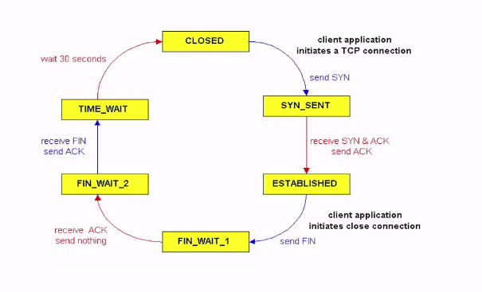

# Computer Systems
## Network Stack Functionality
- Encapsulation

## TCP State
- TCP has state in contrast to UDP
- Need to store this state per TCP connection
- State processing often performed in kernel

- reusing packet id -> we wait 30 seconds to avoid conflicts

## Data movement inside the network stack
- **Problem: while processing the data, we don't want to copy it over all the time**
- We need data to store it

## Hardware accelerated networking

|Performance issue|Hardware accelerated networking|
|-|-|
With Ethernet of 10Gb/s|Receive the String|

# Questions:
**Is the TCP protocol state processing done in userspace? Why or why not?**
- The protocol state processing is done in the kernel.
- If this was done in userspace, an unprivileged application could potentially abuse the protocol.

**The network stack in an OS only ever sends packets when explicitly requested by a user space application.**
- False the TCP protocol requires sending packets that the user will never see. (Think of acks, or retransmissions)

**What is the trouble this causes when implementing a TCP protocol in the top half?**
- This would require the application to be scheduled at all kind of events not scheduled by the user program.

**How is it solved in practice in Unix-like operating systems?**
- We run TCP in the bottom half. Remember DPCs!! (Kernel call to handle the packet)

