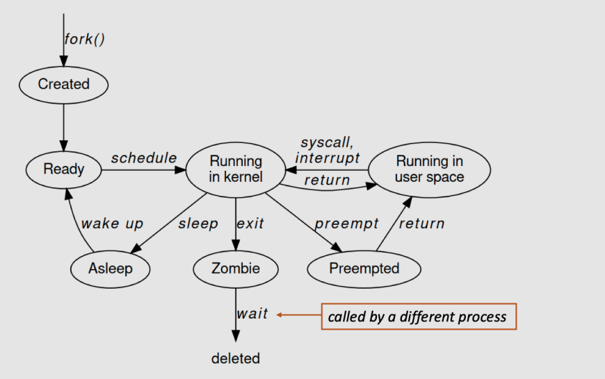
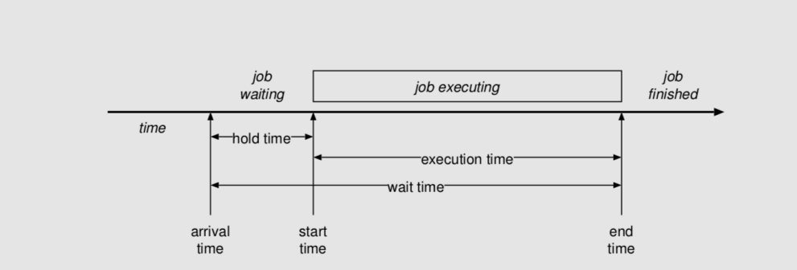
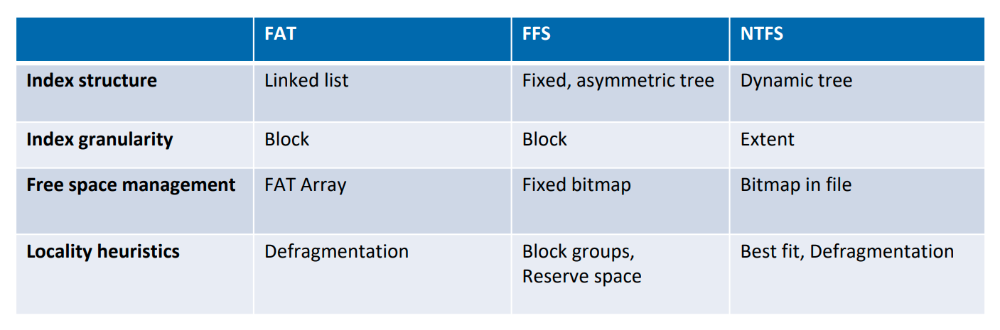
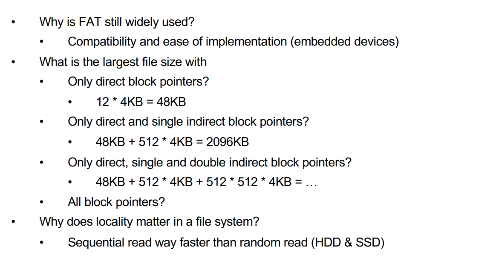
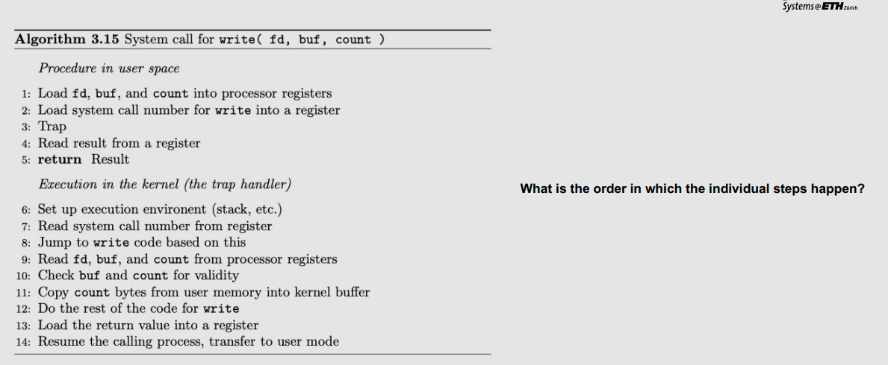

# Computer Systems
## Network Stack Functionality
- Encapsulation

## TCP State
- TCP has state in contrast to UDP
- Need to store this state per TCP connection
- State processing often performed in kernel

- reusing packet id -> we wait 30 seconds to avoid conflicts

## Data movement inside the network stack
- **Problem: while processing the data, we don't want to copy it over all the time**
- We need data to store it

## Hardware accelerated networking

|Performance issue|Hardware accelerated networking|
|-|-|
With Ethernet of 10Gb/s|Receive the String|

## Process Creation
### Spawn
1. Constructs a running process from scratch
2. In windows, CreateProcess() creates a new process to run a program
3. Spawn is complex
    1. Has to specify everything about the new environments including the command line
    2. All rights a program needs must be granted in one go

### Fork/Exec
1. Child is almost exact copy of calling parent
2. Return value from fork indicated which process we are in (0: Child, > 0 Parent)
3. Can use full kernel API
    1. fork(): system call to create a copy of the current process
    2. Exec(): system call to change the program beng run by the current process

Remote Procedure Call = RPC

## CPU Scheduling
### Scheduling
- work is assigned to resources that complete the work

### Dispatch
- gives control of the CPU to the process selected by the scheduler

### Preemptive
- processes dispatched without warning

### Non-preemptive
- process explicitly has to give up the resource

## Workloads
### Batch workload
- Run this job to completion and tell me when you are done
- Main goals: throughput (jobs per hour), wait time, turnaround time, utilization

### Interactive workloads
- Wait for external events and react before the user gets annoyed
- Main goals: Response time, proportionality

### Soft realtime workloads
- This task must complete in less than 50ms
- Main goals: deadlines, guarantees, predictability

### Hard realtime workloads
- Ensure the plane's control surface moves correctly in response to the pilot's actions
- Difficult, not covered

## Device
- Piece of hardware visible from software
- Occupies some location on a bus
- Set of registers
    - Memory mapped or I/O space
- Source of interrupts
- MAy initiate Direct Memory Access transfers

## Direct Memory Access
- Avoid programmed I/O for lots of data 
- Device needs to be able to do DMA
    - Generally built-in these days
- Bypasses CPU to transfer data directly between I/O device and memory
    - Doesn't take up CPU time
    - Only one interrupt per transfer

# Questions:

**Is the TCP protocol state processing done in userspace? Why or why not?**
- The protocol state processing is done in the kernel.
- If this was done in userspace, an unprivileged application could potentially abuse the protocol.

**The network stack in an OS only ever sends packets when explicitly requested by a user space application.**
- False the TCP protocol requires sending packets that the user will never see. (Think of acks, or retransmissions)

**What is the trouble this causes when implementing a TCP protocol in the top half?**
- This would require the application to be scheduled at all kind of events not scheduled by the user program.

**How is it solved in practice in Unix-like operating systems?**
- We run TCP in the bottom half. Remember DPCs!! (Kernel call to handle the packet)

**What is the difference between synonym and a homonym?**
- synonym: same object different names
- homonym: same name different objects

**Is an IP address a pure name?**
- no it gives information

**To what can a symbolic link point to?**
- to path sections
- to files

- a name
- another link

**What is the advantage of running a process in userspace?**
- safer, you cannot break anything

1. 
2. 
3. 
6. 
7. 
8. 
9. 
10. 
11. 
12. 
13. 
14. 
4. 
5. 

**What is the difference between a process and a program?**
- A process consists of threads which execute a program.
- A process is a running instance of a program

**How are processes identified?**
- PID

**In what state is a process after it exited?**
- zombie state 

**How does having only one kernel thread simplify the kernel?**
- no need for locks/synchronization

**What is the point of a name server?**
- To hold interface references for services

