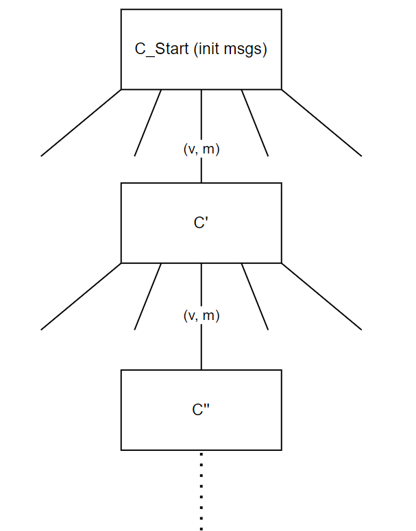

# Distributed Systems
## Lecture 1

1. Parallelism / Concurrency
2. Failures / Fault-tolerance 
    - Availability 
    - Reliability
3. Geography

### Problems witch Distributed Systems
- state replication!
    - C1, C2, C3, C4...

- 3 exactly once
- 1 correct order
- 2 exactly once

## Lecture 2
### Consensus (Model)
**Cannot be solved**
- n nodes (n at least 2), input value $v_i = \{0, 1\}$
- $f < n$ faulty (crash), $n-f$ correct
  - message passing
  - reliable
  - async
- $f \geq 1$

### Consensus (Problem)
- agreement: all correct nodes $\rightarrow$ some value
- termination: finite messages
- validity: decision is input of some node

### Async
- **init**: sen
- **event**: rcv msg (v, m) $\rightarrow$ send

### Configuration C
- = state of all nodes + msgs in transit
- C bivalent: both still possible
- C univalent: 0-valent, 1-valent
- C critical: bivalent, but all children univalent

#### $C_{start}$ (init msgs)

