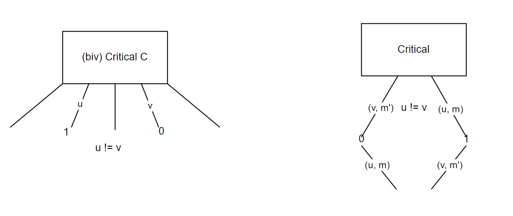
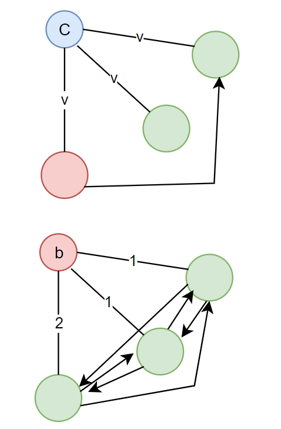
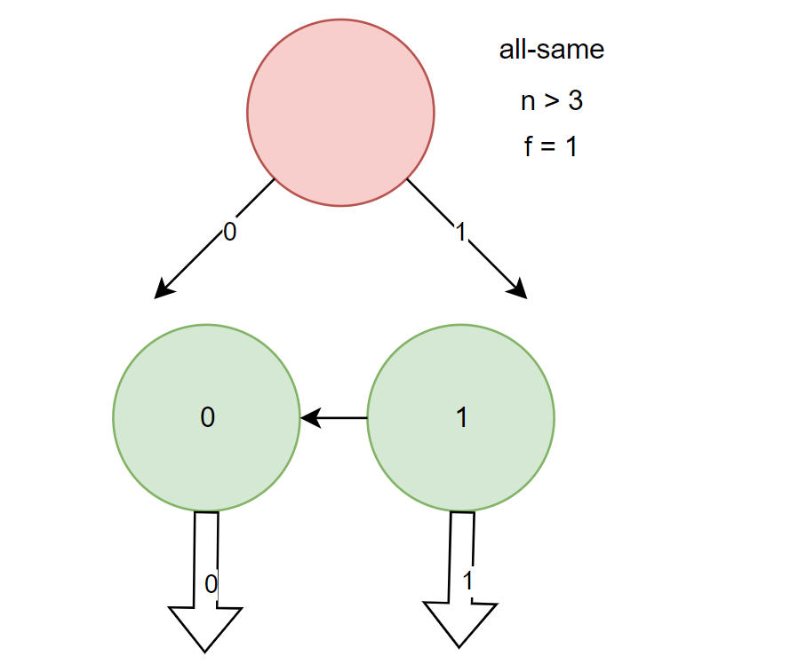
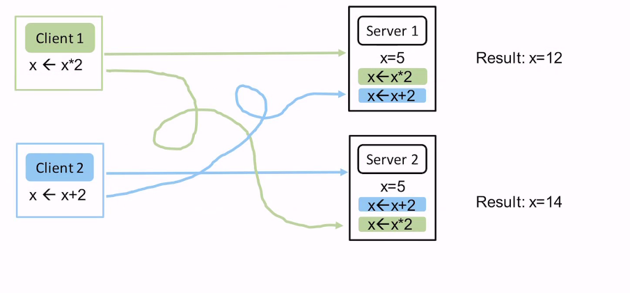
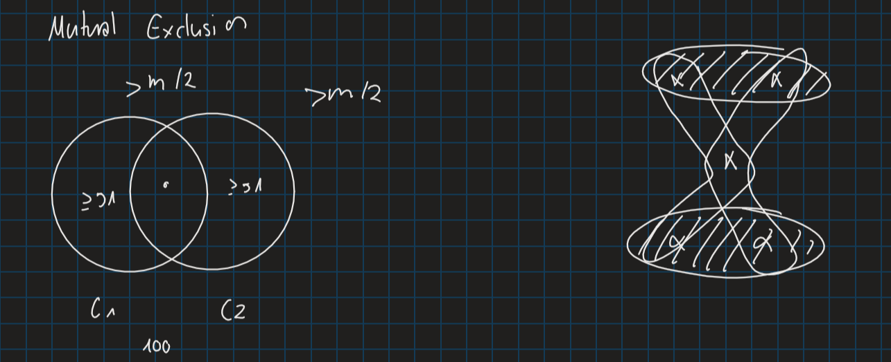
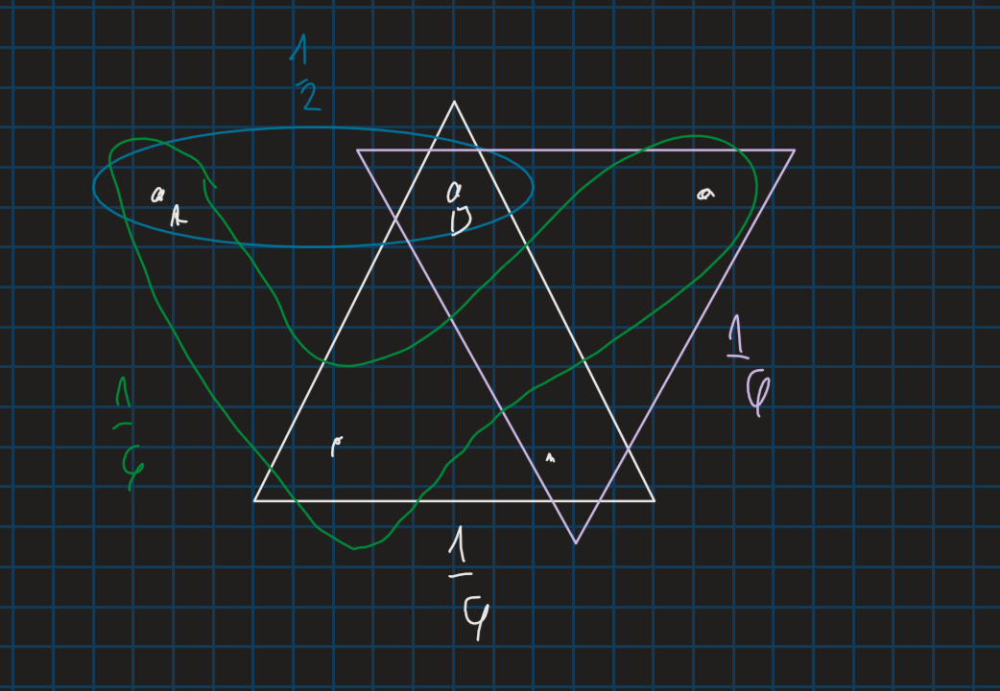
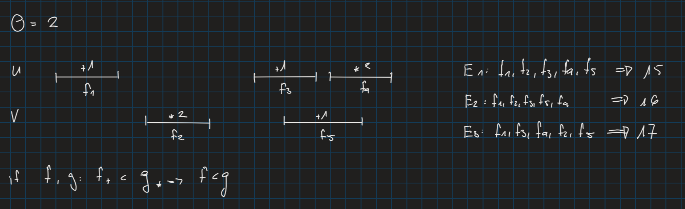
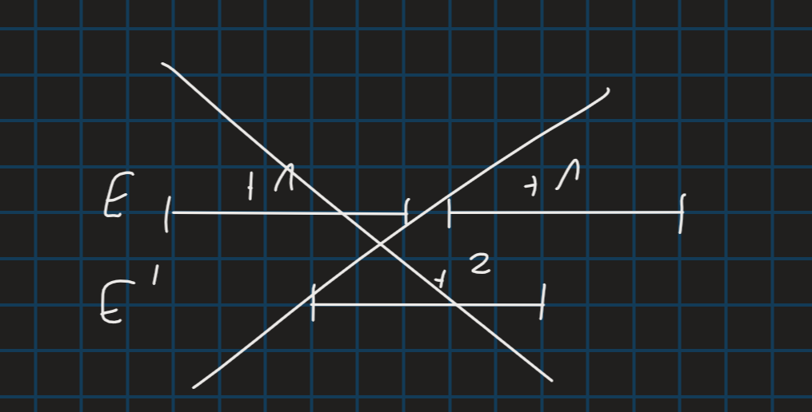

# Distributed Systems
# Lecture 1

1. Parallelism / Concurrency
2. Failures / Fault-tolerance 
    - Availability 
    - Reliability
3. Geography

## Problems witch Distributed Systems
- state replication!
    - C1, C2, C3, C4...

- 3 exactly once
- 1 correct order
- 2 exactly once

# Lecture 2
## Consensus (Model)
**Cannot be solved**
- n nodes (n at least 2), input value $v_i = \{0, 1\}$
- $f < n$ faulty (crash), $n-f$ correct
  - message passing
  - reliable
  - async
- $f \geq 1$

## Consensus (Problem)
- agreement: all correct nodes $\rightarrow$ some value
- termination: finite messages
- validity: decision is input of some node

## Async
- **init**: sen
- **event**: rcv msg (v, m) $\rightarrow$ send

## Configuration C
- = state of all nodes + msgs in transit
- C bivalent: both still possible
- C univalent: 0-valent, 1-valent
- C critical: bivalent, but all children univalent

### $C_{start}$ (init msgs)

# Lecture 3
- Consensus = byz. agreement
- f crash $\rightarrow$ "byzantine", $n - f$ correct
- agreement
- termination
- validity
- if one of them fails the others can still correct it
  - if something fails a plane wouldn't crash instantly
  - SBB, has redundancies

## Validity
- any - input?
- correct - input $\rightarrow$ $(f + 1)-"validity"$
  - very tricky to achieve. Which nodes are bad which are correct? Hard to decide
- all - same
  - all the correct nodes have the same input then we decide on that input. Impractical, hard to achieve $\rightarrow$ questionable
- median - validity 
  - no binary inputs but a range of inputs. 

### $f = 1$
#### async
"event"
#### sync:

|time|activity|
|-|-|
|1|send|
|2|rcv|
|3|comp|
|1|send|
|...|...|

### input
($n \geq 4$)
1. send input to all nodes
2. collect **set** of inputs
3. send **set** to all nodes
4. collect **set**

$$T = \text{set of (orig, value) seen at least twice}$$

you cannot really do $n = 3$ or smaller.

## Exercise Lecture 2

#### Challenges
- Messages can get lost
- Nodes may crash
- Messages can have varying delays

#### State replication
- if not the same, you could get different results

#### First Approaches
Server sends acknowledgment message
- Reasonable with one client
- Inconsistent state with multiple clients and servers

Serializer - all commands go through one node which orders them
- Single point of failure

Two-Phase Protocol - ask for locks, execute once acquired all locks
- Breaks down if we even have ust one node failure
- How to avoid deadlocks?

## Eventual Consistency & Bitcoins

### Paxos - Main Ideas
1. Tickets
   - "weak lock"
   - can be overwritten by later tickets
   - reissuable
   - expiration
2. Require majority
   - ensures only single command gets accepted
3. Servers inform clients about their stored command
   - client can switch to supporting this command

### Consensus
We want:
1. Agreement:
   - All (correct) nodes decide on the same value
2. Termination:
   - All (correct) nodes terminate 
   - violated by Paxos: could always update tickets at the same exact time $\rightarrow$ infinite loop
3. Validity:
  - The decision value is the input value of at least one node
  
#### Impossibility
Consensus cannot be solved **deterministically** in the asynchronous model!

### Randomized Consensus
Easy cases:
- All inputs are equal (all 0 or 1)
- Almost all input values are equal

Otherwise:
- Choose a **random** value locally $\rightarrow$ Expected time $O(2^n)$ until all agree (once)

## Lecture 4
### Quorum
When ever you do a request you ask server for a lock for a quorum

Majority QS:

$$S = \{X \subseteq \{v_1 ... v_m\} | |x| > \frac{m}{n}\}$$
$$S = \{\{v_n\}\}$$

Paxos: ask all of them for a lock
Better Strategy: ask subset for a lock and work with them. Minimize load and work with probability choosing

$$L_Z(A) =P_r(\text{A is part of the chosen quorum}) $$
$$ P_{Q~Z}(A \in Q) = \frac{1}{2} + \frac{1}{6}$$
$$L_Z(s) = max L_Z(v) = L_Z(B) = 1 - \frac{1}{6} = \frac{5}{6}$$

### Fault-Tolerance
- f-resilient if and only if for any nodes that fail there exists a quorum that survives (worst-case)
- Failure probability: Assume P that is the probability that one node survives s
  - $F_P(S) = P(\text{all quorums contains a failure node})$
  - asymptotic $m \rightarrow \infty F_P(S) \rightarrow ?$

## Lecture 6
### Sequential execution $S$:
$$\forall f, g \in S: \text{ either } f < g \text{ or } g < f$$

$E$ is semantically equivalent to $E'$ if:
- $E$ and $E'$ have *the same operation*
- every $f$ needs to have the same "effect" in $E$ and $E'$

$E$ is linearizable if:
- $\exist S$ sequential execution that
  - is semantically equivalent to $t$
  - is correct
  - if $f < g$ in $E \rightarrow f < g$ in $S$

$E$ is sequentially consistent if:
- $\exist S$ sequential execution s.t.
  - $S$ is sem. equivalent to $E$
  - $S$ is correct
  - if $f, g$ are on the same node and $f < g \text{ in } E \rightarrow f < g \text{ in } S$

$E$ is quiescent consistent if:
  - $\exist S$ seq exe that
    - is sem equivalent to $E$
    - is correct
    - $forall$ quisecent parent t:
      - if $f_t < t$ and $g_* > t$
      - $f < g$ in $S$

#### Logical clock
$$ C _u : \text{operations} \rightarrow \text{ "points in time" }$$
"happened before"?
- if $f < g$ on the same node: $f \rightarrow g$
- if $f$ is a send operation (by u) and $g$ is the corresponding receive operation (on v) $\rightarrow f \rightarrow g$
- $f \rightarrow g, g \rightarrow h \implies f \rightarrow h$

"happened-before consistent:"
- $\exist S$ ...
- $f \rightarrow g$ in $E \implies f < g$ in $S$
- $f !\rightarrow$ and $g !\rightarrow f$ then $f \approx g$

#### Lampot clock
$$c_u := 0$$
upon local op:
$$C_ := c_u + 1$$
upon sending
$$c_u := c_u + 1$$
send $j, c_u$  
upon receiving
$$c_u := c_u + 1$$
$$c_u = max (c_u, c_v) + 1$$

## Lecture 7
### Time
Second $\rightarrow$ International Atomic Time (TAI) $\rightarrow$Coordinated Universal Time (UTC) $\rightarrow$ Time

Physical time | logic
## Quiz
**How does a node in Paxos know if a majority answered with ok?**

Each node needs to know the number $n$ of servers in the system.

**Does the Paxos algorithm in the script achieve state replication?**

No, it only shows agreement on a single command, for several commands we would need to restart the system.
Would achieve state replication for single command.

**How many nodes could crash so the Paxos still works?**

Less than $\frac{n}{2}$

**Does Paxos solve Consensus?**
No termination is not guaranteed

**State replication is trivial for fewer than 3 nodes?** False, one node could crash. Both nodes are both clients and servers. Not a trivial problem.

**In Paxos, a new ticket can only be issued if all Previous tickets have been returned**
False, it can be overwritten, doesn't need to return.

**Which is not property of consensus?** 
Tolerance

**A configuration includes all received messages but not the messages in transit**
False (definition)

**In a synchronous system, a message has a delay of ___ time units**
1 (definition)

**Does a quorum system exist which can tolerate that all nodes of a specific quorum fail?**
No, every two quorums intervene

**Consider the *nearly all* quorum system, which is made up of n different quorums, each containing n - 1 servers. What is the resilience?**
$f = 1$, assume $f = 2$ then every quorum has a failed server

**Can you think of a quorum system that contains as many quorums as possible? Note: does not have to be minimal.**

