# Table of Contents

1. [Normal Forms](#normal-forms)
    - [First Normal Form](#first-normal-form)
    - [Second Normal Form](#second-normal-form)
    - [Third Normal Form](#third-normal-form)
    - [Boyce-Codd Normal Form](#boyce-codd-normal-form)
    - [Fourth Normal Form](#fourth-normal-form)
    - [Fifth Normal Form](#fifth-normal-form)
    - [Candidate Key](#candidate-key)
    - [Minimal Basis](#minimal-basis)
    - [Example](#example)
2. [SQL](#sql)
   - [Difference Between ON and WHERE](#difference-on-where)
   - [SQL WITH Clause](#sql-with)
   - [SQL OVER Clause](#sql-over)
   - [View](#view)
   - [Referential Constraints](#referential-constraints)
     - [Cascade](#cascade)
     - [Restrict](#restrict)
     - [No Action](#no-action)
     - [Set Default, Set Null](#set-default-set-null)
   - [Keys](#keys)
     - [Super Key](#super-key)
     - [Candidate Key](#candidate-key)
     - [Primary Key](#primary-key)
3. [Database Systems](#database-systems)
   - [Disk Manager](#disk-manager)
   - [Buffer Pool Manager](#buffer-pool-manager)
   - [Access Methods](#access-methods)
   - [Operator Execution](#operator-execution)
   - [Query Optimization](#query-optimization)
4. [Recoverability](#recoverability)
   - [Recoverable (RC)](#recoverable-rc)
   - [Avoids Cascading Aborts (ACA)](#avoids-cascading-aborts-aca)
   - [Strict (ST)](#strict-st)
   - [Serializable](#serializable)
   - [Conflict Serializable](#conflict-serializable)
   - [Snapshot Isolation](#snapshot-isolation)
   - [Two Phase Locking](#two-phase-locking)
   - [Strict Two Phase Locking](#strict-two-phase-locking)


## Normal Forms

### First Normal Form
1. Using row order to convey information is not permitted
2. Mixing data types within the same column is not permitted
3. Having a table without a primary key is not permitted
4. Repeating groups is not permitted

**The Key**

- values in each column should not be tables
- records in the table should be unique
- primary key
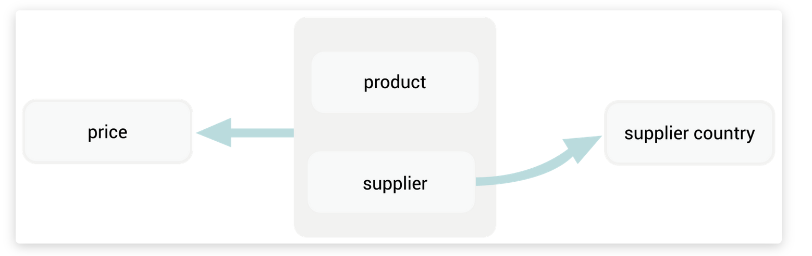

**Higher Form**
Find the dependencies and split them up
````
AB -> C     
B -> D
````

We see that AB is superkey, but B is a subset
````
R1 = {A, B, C}
R2 = {B, D}
````
Here’s the general algorithm for normalizing a table from 1NF to 2NF.

Suppose you have a table R with scheme S which is in 1NF but not in 2NF. Let A -> B be a functional dependency that violates the rules for 2NF, and suppose that the sets A and B are distinct (A ∩ B = ∅).

    Let C = S – (A U B). In other words:
        A = attributes on the left-hand side of the functional dependency.
        B = attributes on the right-hand side of the functional dependency.
        C = all other attributes.
    We can split R into two parts:
        R1, with scheme C U A.
        R2, with scheme A U B.
    The original relation can be recovered as the natural join of R1 and R2: R = R1 NATURAL JOIN R2

### Second Normal Form
- Each non-key attribute in the table must be dependent on the entire primary key.
- If you have a strict subset of the key, it is not in 2NF.
- If everything on the right side is a key then it is in 2NF

**The Whole Key**

- no partial dependencies on the candidate keys
- columns must be dependent on the whole key
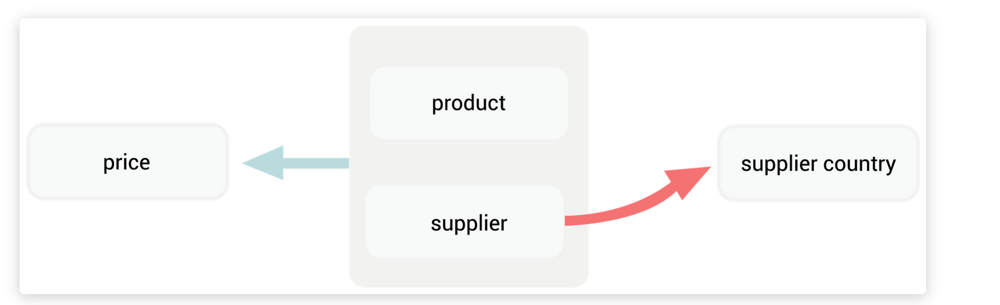
- the arrow from supplier to supplier country violates the 2NF rule. Rather than starting in the whole key (product, supplier), the arrow starts in part of the key, the supplier column
- no arrows that start inside a candidate key

**Higher Form - Synthesis Algorithm**
- Canonical set
- Merge same left hand sides together 
- Create a relation for every functional dependency
````
R1 = (A, B, C, D, E, F)
A -> D
B -> C
B -> D
D -> E

(ABF is minimal key)  
 
Merge

A -> D
B -> C, D
D -> E

Create a relation

R1 = (A, D)
R2 = (B, C, D)
R3 = (D, E)

Does one of these relations contains a key of R? NO so we add a relation with a minimal key of R:

R4 = (A, B, F)
````

### Third Normal Form
- Each non-key attribute in the table must depend on the key, the whole key, and nothing but the key.
- If everything on the right side is a key then it is in 3NF
- No transitive relations
- Left hand side either super key or right hand side prime attribute

**Nothing but the Key (Attribute)**

- every non-key attribute is non-transitively (directly) dependent on the candidate key. The columns can only be dependent on the key columns.
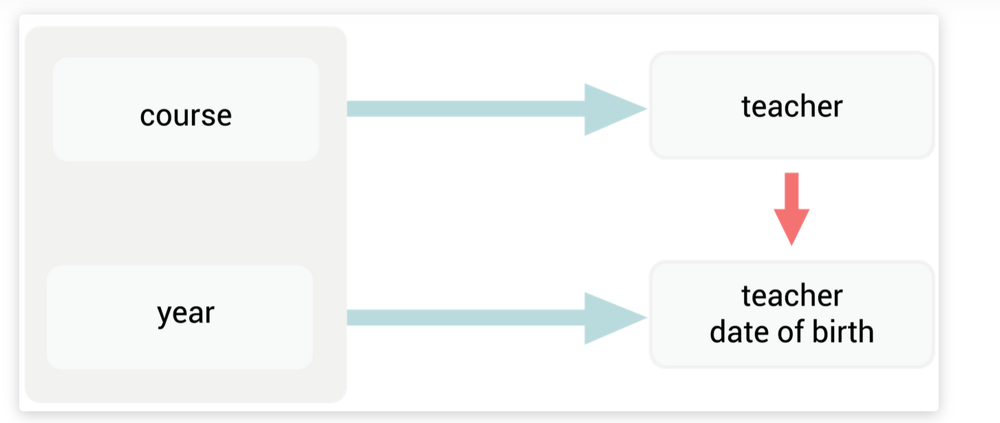
- arrow between teacher and teacher date of birth violates the 3NF rule. Both the teacher and teacher's date of birth are non-key attributes, so the dependency between them is not allowed

**Higher Form - Decomposition Algorithm**
1. Identify the dependencies which violates the BCNF definition and consider that as X->A

2. Decompose the relation R into XA & R-{A} (R minus A).
3. Validate if both the decomposition are in BCNF or not. If not re-apply the algorithm on the decomposition that is not in BCNF.

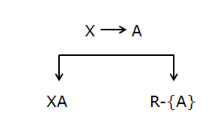
````
R1 = (A, B, C, D, E)

AB->CD 
D->E
A->C
B->D

Candidate Key: AB
Prime Attributes: A, B
Non Prime Attributes: C, D, E

AB -> CD (Full Dependency - CD is dependent o candidate key)

D -> E (Transitive Dependency: non prime derives non prime)

A -> C (Partial Dependency: Prime derives non prime)

B -> D (Partial Dependency: Prime derives non prime)

Hence the dependency which violates BCNF are D -> E, A -> C, B -> D.

so will take D -> E first as X -> ‘A’ {not the A listed in relation as attributes} So X = D & ‘A’ = E. X’A’ will be DE and R-{‘A’} will be ABCD
````
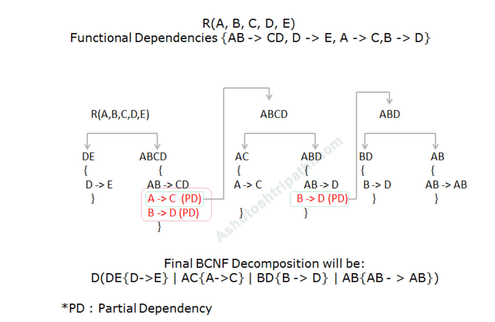

### Boyce-Codd Normal Form
- Each attribute in the table must depend on the key, the whole key, and nothing but the key.
- If everything ont the right is a full key it is fine (but check again)

**Nothing but the Key**

- all arrows must be out of candidate keys
- check if you have super key with transitivity for each key
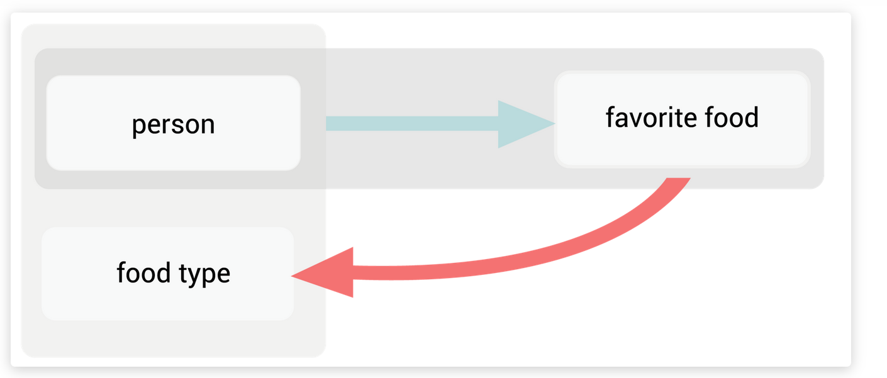

### Fourth Normal Form
The only kinds of multivalued dependency allowed in a table are multivalued dependencies on the key.

### Fifth Normal Form
It must not be possible to describe the table as being the logical result of joining some other tables together.


## Candidate Key
- You have a candidate key, if all its attributes appear only on the left side of the dependencies.
- To get the candidate key, look at the closure. If you can reach all the important values, it is a super key for sure. If it is the only one than it is even a candidate key.

## Minimal Basis
````
A -> BC
B -> C
A -> B
AB -> C
````
1. Convert right-hand-side attribute into singleton attribute
````
A -> B
A -> C
B -> C
A -> B
AB -> C
````
2. Remove the extra left-hand-side attribute

Find the closure of A

$A_+ = {A, B, C}$

So, `AB -> C` can be converted into `A -> C`
````
A -> B
A -> C
B -> C
A -> B
A -> C
````
3. Remove redundant functional dependencies
````
A -> B
B -> C
````
Now, we will convert the above set of FDs into canonical cover.

The canonical cover for the above set of FDs will be as follows −
````
A -> BC
B -> C
````


### Example

To get the minimal cover, you have to make two steps. To demonstrate, I'll first split the dependencies into multiple (only one attribute on the right side) to make it more clean:
````
A -> B
ABCD -> E
EF -> G
EF -> H
ACDF -> E
ACDF -> G
````
The following steps must be done in this order (#1 and then #2), otherwise you can get incorrect result.

1. get rid of redundant attributes (reduce left sides):

Take each left side and try to remove one each attribute one at a time, then try to deduce the right side (which is now only one attribute for all dependencies). If you succeed you can then remove that letter from the left side, then continue. Note that there might be more than one correct result, it depends on the order in which you do the reduction.

You will find out, that you can remove B from the dependency `ABCD -> E`, because `ACD -> ABCD` (use first dep.) and from `ABCD -> E`. You can use the full dep. you are currently reducing, this is sometimes confusing at first, but if you think about it, it will become clear that you can do that.

Similarly, you can remove `F` from `ACDF -> E`, because `ACD -> ABCD -> ABCDE -> E` (you can obviously deduce a single letter from the letter itself). After this step you get:
````
A -> B
ACD -> E
EF -> G
EF -> H
ACD -> E
ACDF -> G
````
These rules still represent the same dependencies as the original. Note that now we have a duplicate rule `ACD -> E`. If you look at the whole thing as a set (in the mathematical sense), then of course you can't have the same element twice in one set. For now, I'm just leaving it twice here, because the next step will get rid of it anyway.

2. get rid of redundant dependencies

Now for each rule, try to remove it, and see if you deduce the same rule by only using others. In this step you, of course, cannot use the dep. you're currently trying to remove (you could in the previous step).

If you take the left side of the first rule `A -> B`, hide it for now, you see you can't deduce anything from A alone. Therefore this rule is not redundant. Do the same for all others. You'll find out, that you can (obviously) remove one of the duplicate rules `ACD -> E`, but strictly speaking, you can use the algorithm also. Hide only one of the two same rules, then take the left side `(ACD)`, and use the other to deduce the right side. Therefore you can remove `ACD -> E` (only once of course).

You'll also see you can remove `ACDF -> G`, because `ACDF -> ACDFE -> G`. Now the result is:
````
A -> B
EF -> G
EF -> H
ACD -> E
````
Which is the minimal cover of the original set.


# SQL
## Difference On, Where

The information is from [here](https://stackoverflow.com/questions/354070/sql-join-where-clause-vs-on-clause).

- Does not matter for inner joins
- Matters for outer joins

a. WHERE clause: After joining. Records will be filtered after join has taken place.

b. ON clause - Before joining. Records (from right table) will be filtered before joining. This may end up as null in the result (since OUTER join).

## SQL `WITH`
- Referencing a temporary table multiple times in a single query
- Performing multi-level aggregations, such as finding the average of maximums
- Performing an identical calculation multiple times over within the context of a larger query
- Using it as an alternative to creating a view in the database

|OrderDetailID|	OrderID	|ProductID	|Quantity|
|-|-|-|-|
|1	|10248	|11	|12|
|2	|10248	|42	|10|
|3	|10248	|72	|5|
|4	|10249	|14	|9|
|5	|10249	|51	|40|

The objective is to return the average quantity ordered per ProductID:
````SQL
WITH cte_quantity
AS
(SELECT
    SUM(Quantity) as Total
FROM OrderDetails
GROUP BY ProductID)
 
SELECT
    AVG(Total) average_product_quantity
FROM cte_quantity;
````

|average_product_quantity|
|-|
|165.493|

If you didn't use `WITH`:

````SQL
SELECT
    AVG(Total) average_product_quantity
FROM
(SELECT
SUM(Quantity) as Total
FROM OrderDetails
GROUP BY ProductID)
````
The general sequence of steps to execute a WITH clause is:

1. Initiate the `WITH`
2. Specify the expression name for the to-be-defined query.
3. Optional: Specify column names separated by commas.
4. After assigning the name of the expression, enter the `AS` command. The expressions, in this case, are the named result sets that you will use later in the main query to refer to the CTE.
5. Write the query required to produce the desired temporary data set.
6. If working with more than one CTEs or WITH clauses, initiate each subsequent one separated by a comma and repeat steps 2-4. Such an arrangement is also called a nested WITH clause.
7. Reference the expressions defined above in a subsequent query using `SELECT`, `INSERT`, `UPDATE`, `DELETE`, or `MERGE`
````SQL
--CTE
WITH expression_name_1 (column_1, column_2,…,column_n)
AS
(CTE query definition 1),
expression_name_2 (column_1, column_2,…,column_n)
AS
(CTE query definition 2)
 
--Final query using CTE
SELECT expression_A, expression_B, ...
FROM expression_name_2
````
## SQL `OVER`
|sale_day   |sale_month |sale_time 	|branch 	|article 	|quantity 	|revenue|
|-|-|-|-|-|-|-|
|2021-08-11| 	AUG 	|11:00 |	New York 	|Rolex P1 	|   1 	     |   3000.00|
|2021-08-14| 	AUG 	|11:20 |	New York 	|Rolex P1 	|   2 	     |   6000.00|
|2021-08-17| 	AUG 	|10:00 |	Paris 	    |Omega 100 |	3 	     |   4000.00|
|2021-08-19| 	AUG 	|10:00 |	London 	    |Omega 100 |	1 	     |   1300.00|
|2021-07-17| 	JUL 	|09:30 |	Paris 	    |Cartier A1| 	1 	     |   2000.00|
|2021-07-11| 	JUL 	|10:10 |	New York 	|Cartier A1| 	1 	     |   2000.00|
|2021-07-10| 	JUL 	|11:40 |	London 	    |Omega 100 |	2 	     |   2600.00|
|2021-07-15| 	JUL 	|10:30 |	London 	    |Omega 100 |	3 	     |   4000.00|

The window frame is a set of rows that depends on the current row; thus, the set of rows could change for each row processed by the query. We define window frames using the `OVER` clause. The syntax is:
````SQL
OVER ([PARTITION BY columns] [ORDER BY columns])
````
The `PARTITION` BY subclause defines the criteria that the records must satisfy to be part of the window frame. In other words, `PARTITION` BY defines the groups into which the rows are divided; this will be clearer in our next example query. Finally, the ORDER BY clause defines the order of the records in the window frame.

Let’s see the SQL `OVER` clause in action. Here’s a simple query that returns the total quantity of units sold for each article. 


````SQL
SELECT sale_day, sale_time,
       branch, article, quantity, revenue,
       SUM(quantity) OVER (PARTITION BY article) AS total_units_sold
FROM   sales
````
This query will show all the records of the `sales` table with a new column displaying the total number of units sold for the relevant article. We can obtain the quantity of units sold using the `SUM` aggregation function, but then we couldn’t show the individual records.

In this query, the `OVER PARTITION BY` article subclause indicates that the window frame is determined by the values in the article column; all records with the same article value will be in one group. Below, we have the result of this query:

|sale_day   |sale_month |sale_time 	|branch 	|article 	|quantity 	|revenue| total units sold|
|-|-|-|-|-|-|-|-|
|2021-08-11| 	AUG 	|11:00 |	New York 	|Rolex P1 	|   1 	     |   3000.00|2|
|2021-08-14| 	AUG 	|11:20 |	New York 	|Rolex P1 	|   2 	     |   6000.00|2|
|2021-08-17| 	AUG 	|10:00 |	Paris 	    |Omega 100 |	3 	     |   4000.00|9|
|2021-08-19| 	AUG 	|10:00 |	London 	    |Omega 100 |	1 	     |   1300.00|9|
|2021-07-17| 	JUL 	|09:30 |	Paris 	    |Cartier A1| 	1 	     |   2000.00|9|
|2021-07-11| 	JUL 	|10:10 |	New York 	|Cartier A1| 	1 	     |   2000.00|9|
|2021-07-10| 	JUL 	|11:40 |	London 	    |Omega 100 |	2 	     |   2600.00|3|
|2021-07-15| 	JUL 	|10:30 |	London 	    |Omega 100 |	3 	     |   4000.00|3|


## View
1. An `UPDATE` statement against a View can only effect one target table at a time
2. Your `UPDATE` statement cannot update data in a derived column

## Referential Constraints
### Cascade
- Propagate update or delete

### Restrict
- Prevent deletion of the primary key before trying to do the change, cause an error
- Throw error immediately

### No Action
- Prevent modifications after attempting the change cause an error
- throw error after trying

### Set default, set null
- Set referenced to NULL or to a default value

## Keys
### Super key
- like superset
- uniquely identify the tuple
- ID, Name; ID, Phone; Name, Phone etc.
- May contain extraneous, attributes

### Candidate key
- Minimal super keys are called candidate keys

### Primary key
- Unique
- should not have null values (email, phone number is not that good)


# Database Systems
### Disk Manager
- allocates, deletes, fetches pages
- no other layer has to interact with disk directly

### Buffer Pool Manager
- Maintains an in-memory buffer
- upper layers have illusion that the entire data is in memory and not on disk
- provides functionality to fetch and update pages

### Access Methods
- Sequential Scan
- B-Tree Index
- Hash Table
- Sort
It provides a higher-level abstraction to access information in a table without interacting with the buffer or disk

### Operator Execution
Executes a relational algebra
- Join 
- Projection
- Select

### Query Optimization
- Generates a good execution plan

**Heap File** = an unordered collection of pages where tuples are stored in random order

**Record ID** = (Page ID, Slot ID)

**Pages**
 = A page is a fixed-size block of data:
    Contain tuples, meta-data, indexes, log records etc.

## Different Joins
### Sort Merge Join (equi-join)
- Efficient: Sorted attribute (e.g., clustered index)
- Inefficient: Unsorted attribute
### Nested Loop Join
- Efficient: Smaller relation fits into memory
- Inefficient: Both relations do not fit into memory
- $B(R) + |R| \cdot B(S)$

### Block Nested Loop Join (equi-join)

### Index Nested Loop Join (equi-join)
- Efficient: Low selectivity (few reads per disk)
- Inefficient: High selectivity (loads of reads per disk)

### Hash join (equi-join)
- If Hash table fits in DRAM: $B(S) + B(R)$
- Very efficient 
- Hash join algorithms are in general only applicable to equi joins and natural joins
- Efficient: Result of join fits into memory
- Inefficient: Result doesn't fit into memory
- Solution: Grace Hash Join

### Grace Hash Join
- $3(B(R) + B(S))$
- all data ends up in the same partition or all data ends up in the same hash bucket, then the Grace Hash algorithm performs worse. $\rightarrow$ all the join attributes have the same value

## Lossless
- $$S = S_1 \cup S_2$$
- $$S = S_1 \Join S_2$$

## Quiz Questions and Answers
**While adding tuples ot a page, both the slot array and the data of the tuples will grow from the beginning to the end:**
- The slot array will grow from the beginning to the end, whereas the data of the tuples will grow from the end to the beginning. When they meet, the page becomes full. 
- **Lecture 16, Slide 41**

**Sequential scan or B-Tree**
- When nearly *all* the tuples fulfil the requirement, *scan* is fast, B - Tree is slow
- When only a *few* or only one fulfils the requirement, *B - Tree* is fast, scan is slow

- $$T_{scan} = T_{access} + \frac{(pageSize *  m)}{Bandwidth}$$

- $$T_{index}(k) = (T_{access} \frac{page size} {/} ...)$$


# Recoverability
### Recoverable (RC)
- If $T_i$ reads from $T_j$ then $c_j < c_i$
- Each transaction commits only after each transaction from which it has read has committed.
    - No need to undo a committed transaction
    
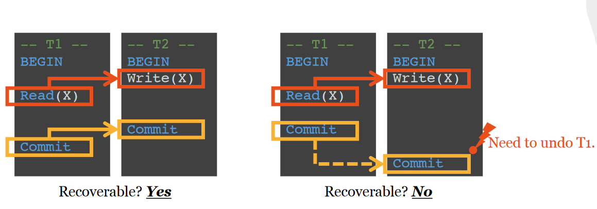


### Avoids Cascading Aborts (ACA)

- If $T_i$ reads $X$ from $T_j$ and commits then $c_j < r_i[x]$
- $ri[X]$ is the time $T_i$ reads $X$
- avoids cascading rollback if transactions may read only values written by committed transactions.
    - Aborting a transaction does not cause aborting others

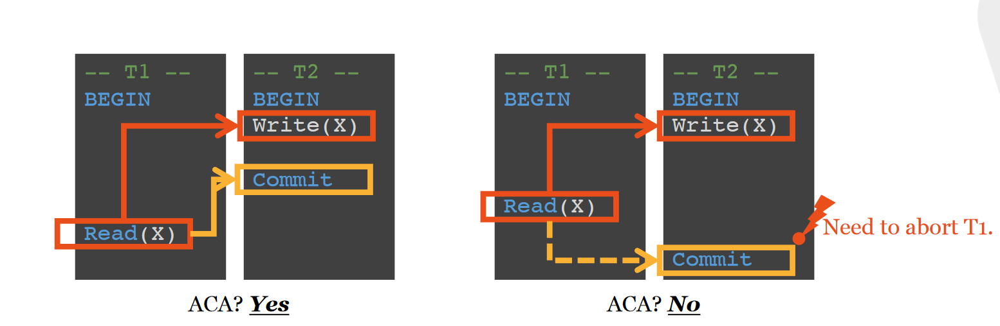


### Strict (ST)
- If $T_i$ reads from or overwrites a value written by $T_j$, then $(c_j < r_i[X]$ AND $c_j < w_i[X])$ or $(a_j < r_i[X]$ AND $a_j < w_i[X])$
- $a_j$ is the abort time of $T_j$
- transaction must not release any exclusive locks until the transaction has either committed or aborted, and the commit or abort log record has been flushed to disk.
    - a schedule of transactions that follow the strict-locking rule is called a strict schedule
    - undoing a transaction does not undo the changes of other transaction

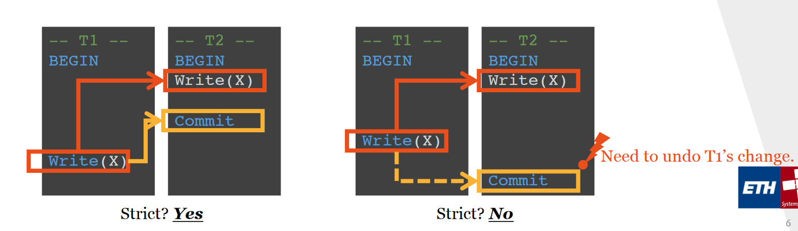

### Serializable
- Defined by the equivalence of result

### Conflict Serializable
- Defined by swap adjacent, non-conflicting, operations
- Conflict Serializable is a **subset** of Serializable
    
## How to decide Conflict-Serializability?
- Go from definition -- do the swap
- Dependency Graph 
    - You can ignore the aborts 
    - No reads, then it is automatically recoverable and ACA -> just need to check strict

## Snapshot Isolation
- When a transaction $T$ starts it receives a timestamp $TS(T)$
- All reads are carried out as of the DB version of $TS(T)$
- All writes are carried out in a separate buffer
- When a transaction commits, DBMS checks for conflicts - Abort $T_1$ if exists $T_2$ such that $T_2$ committed after $TS(T_1)$ and before $T_1$ commits, and $T_1$ and $T_2$ updated the same object.
- writes and readers do not block each other
- concurrency and availability
    - no read or write of a transaction is ever blocked
- overhead
    - need to keep write-set of a transaction only
    - very efficient way to implement aborts
- no deadlocks, but unnecessary rollbacks

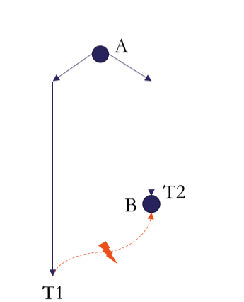

## Two Phase Locking
**Phase 1: Growing**
- each transaction requests the lock that it needs from the DBMS's lock manager
- it cannot release locks in phase 1.

**Phase 2: Shrinking**
- transaction is only allowed to release locks that it previously required. It cannot acquire new locks
- guarantees conflict serializability
    - only generates schedules whose dependency graph is acyclic

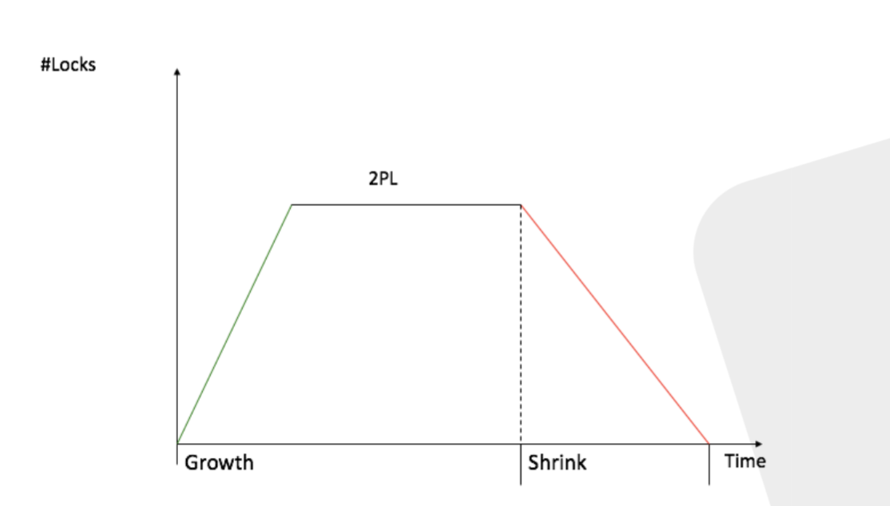

## Strict Two Phase Locking
At phase 2: all locks are kept until the end of transaction (commit or abort)

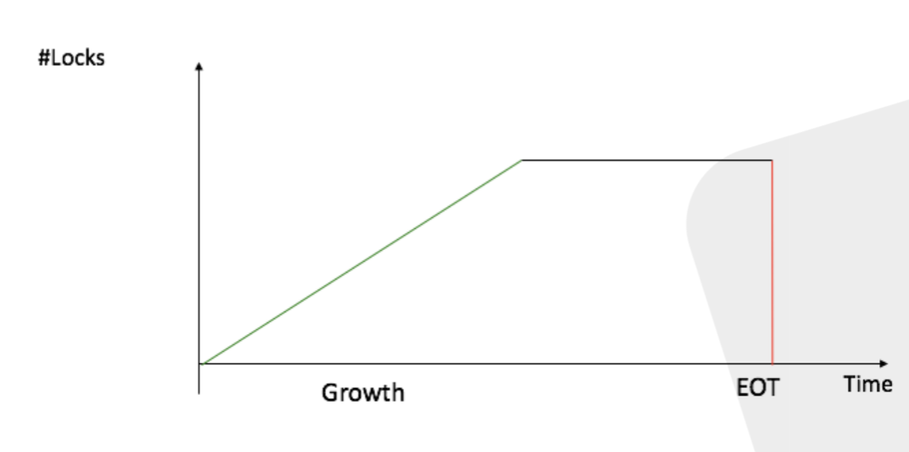
   
