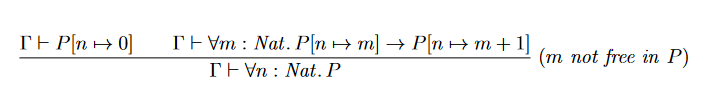
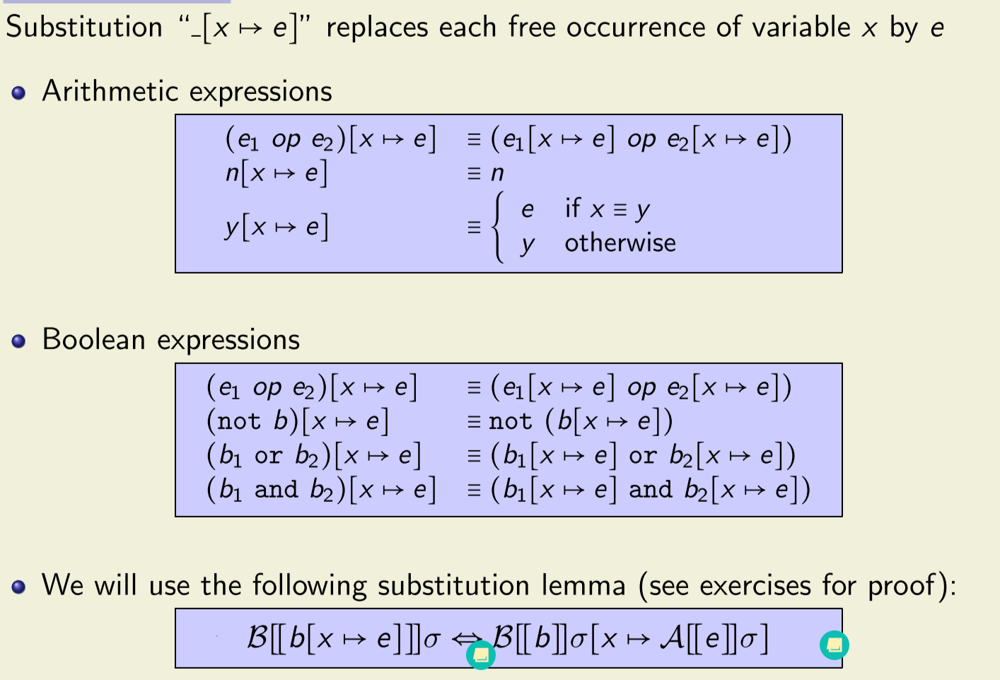
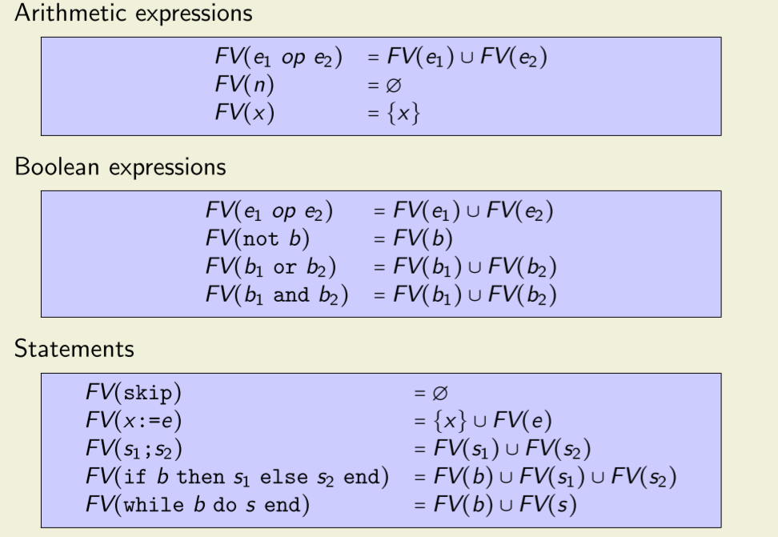

# Important Things to Remember
## Haskell
### Input/Output

````Java
void f(String out) {
String inp1 = Console.readLine();
String inp2 = Console.readLine();
if (inp2.equals(inp1)) System.out.println(out); }
```` 

## How to convert to Haskell?
````Haskell
f :: String -> IO ()
f out = do
    inp1 <- getLine
    inp2 <- getLine
    if inp2 == inp1
        then putStrLn out
        else return ()
````
## Syntax for IO type:
- do block sequences side effects
- <- extracts values from IO
- return wraps values in IO

- show converts values to Strings
- read converts Strings to values (Always specify the desired type!)
- for $\alpha$-equivalence, no variables can be free!

## Syntax Tree
- $\land$ binds stronger than $\lor$ stronger than $\rightarrow$.
- I $\rightarrow$ associates to the right; $\land$ and $\lor$ to the left.
- I Negation binds stronger than binary operators.
- I Quantifiers extend to the right as far as possible.

Proof Rule fore Induction Step:


## Foldr/Foldl
### Foldr:
The easiest way to understand foldr is to rewrite the list you're folding over without the sugar.
````Haskell
[1,2,3,4,5] => 1:(2:(3:(4:(5:[]))))
````
now what `foldr f x` does is that it replaces each `:` with `f` in infix form and `[]` with `x` and evaluates the result.

For example:
````Haskell
sum [1,2,3] = foldr (+) 0 [1,2,3]

[1,2,3] === 1:(2:(3:[]))
````
so
````Haskell
sum [1,2,3] === 1+(2+(3+0)) = 6
````
## Currying, uncurrying
- Currying is the process of transforming  function that takes multiple arguments in a tuple as its argument, into a function that takes just a single argument and returns another function which accepts further arguments, one y one, that the original function would receive in the rest of that tuple

````Haskell
f :: a -> (b > c) -- which can also be written as f :: a -> b-> c
````
is the curried form of
````Haskell
g :: (a, b) -> c
````
You can convert these two types in either directions wih the Prelude functions `curry` and `uncurry`

```Haskell
f = curry g
g = uncurry f
f x y = g (x, y)
`````

## CYP
```CYP
Proof by induction on List xs generalizing zs
Case []
    For fixed zs
    Show: rev [] ++ zs .=. qrev [] zs
    . . .
Case y:ys
    Fix y, ys
    Assume
        IH: forall zs: rev ys ++ zs .=. qrev ys zs
    Then for fixed zs
    Show: rev (y:ys) ++ zs .=. qrev (y:ys) zs
    . . .
QED
```


## $\eta$-conversion
- The following tow terms are equivalent under $\eta$-conversion:
$$\\x \rightarrow f x  \text{ and } f$$
- Converting from left to right isn $\eta$-contraction
- Converting from right to left is $\eta$-expansion
- $\eta$-conversion is sometimes useful to simplify expressions

Example:

Function parity takes a list of Integers and transforms it into a list of
0/1s.

`parity xs = map elemPar xs where elemPar x = mod x 2`

`parity' = map ('mod' 2)`

### General procedure of foldr, foldl
1. Identify recursive, dynamic, and static arguments.
````Haskell
foldl f z (x:xs) = foldl f (f z x) xs
````
2. Write an aux function that has the recursive, then the dynamic arguments. Static
arguments can still occur freely (and will come from the final context).
````Haskell
aux [] z = z
aux (x:xs) z = aux xs (f z x)
````
3. Write the dynamic arguments as lambdas.
````Haskell
aux [] = \z -> z
aux (x:xs) = \z -> aux xs (f z x)
````
4. Rewrite aux in terms of foldr. x and aux xs become arguments of the function for the
recursive case.
````Haskell
aux = foldr (\x rec -> \z -> rec (f z x)) (\z -> z)
````
5. Express the original function in terms of aux (reorder the dynamic and recursive
arguments, if needed).
````Haskell
foldl f z xs = aux xs z
````
6. Replace aux with its implementation.
````Haskell
foldl f z xs = foldr (\x rec z -> rec (f z x)) (\z -> z) xs z
````


## IMP
Remember the following:



### Proof Structure
#### Free Variables /Arithmetic Expression
Let $x, y$ be arbitrary... strong structural induction on... Thus we have to prove $P(e)$ for some arbitrary arithmetic expression $e$ and assume $\forall e'' \subset$ e \cdot P(e'') $ aso our induction hypothesis
- **Case** $e \equiv n$ for some numerical value $n$
- **Case** $e \equiv y$ for some variable $y$
- **Case** $e \equiv e_1 \text{ op } e_2$ for some arithmetic expression $e_1, e_2$ and some arithmetic operator $op$

#### Boolean Expression
- **Case** $b \equiv b_1 \text{ or } b_2 $ for some boolean expressions $b_1, b_2$
- **Case** $e \equiv b_1 \text{ and } b_2 $ for some boolean expressions $b_1, b_2$
- **Case** $e \equiv \text{ not } b'$ for some boolean expression $b'$
- **Case** $e \equiv e_1 \text{ op } e_2$ for some arithmetic expression $e_1, e_2$ and some arithmetic operator $op$

## Find invariants
### Min, Max
**$\{x = X \text{ and }  = Y\}$**

    while (x < y) {
        t := x; 
        x := y;
        y := t
    }  
**$\{\downarrow x = max(X, Y)\}$**

Invariant: $max(x, y) = max(X, Y)$

Variant = $y - x = Z$

### Swap
**$\{x \geq 0 \land x = X\}$**

    a := x;
    y := 0;
    while (a # 0) {
        y := y + 1;
        a := a - 1;
    }  
$\{\downarrow y = X\}$


Invariant: $\{a + y = X \land a \geq 0\}$

Variant = $a$


### $A^{2^N}$
$\{a = A \land 0 < A \land n = N \land 0 \leq N \}$  

    k := 0;
    r := a;
    while (k < n) do
        k := k + 1;
        r := r * r
    end

$\{r = A^{2^N}\}$

Invariant: $\{a = A \land 0 < A \land n = N \land 0 \leq N \land r = A^{2^k} \land k \leq N\}$

Variant: $n - k$

### $N^K$
$\{k \geq 1 \land k = K \land n \geq 1 \land n = N\}$

    i := 0;
    r := 1;
    while (i < k) {
        i := i + 1;
        r := r * n;
    }

$\{\downarrow r = N^K\}$


Invariant: $\{k = K \land n = N \land r = n^i \land i \leq k \}$

Variant: $k - i = V$

### $N = q \times D + r$
$\{N \geq 0 \land D > 0 \land d = D \land r = N \land q = 0\}$

    while (r >= 0) {
        r := r - d;
        q := q + 1;
    }
    r := r + d;
    q := q - 1;

## Liveness
- something good will happen eventually
- if the good thing has not happened yet, it could happen in the future
- a liveness property does not rule out any prefix
- every finite prefix can be extended to an infinite sequence that is in $P$
- liveness properties are violated in infinite time

## Safety 
- Something bad is never allowed to happen (and can't be fixed)
- safety properties are violated in finite time and cannot be repaired


