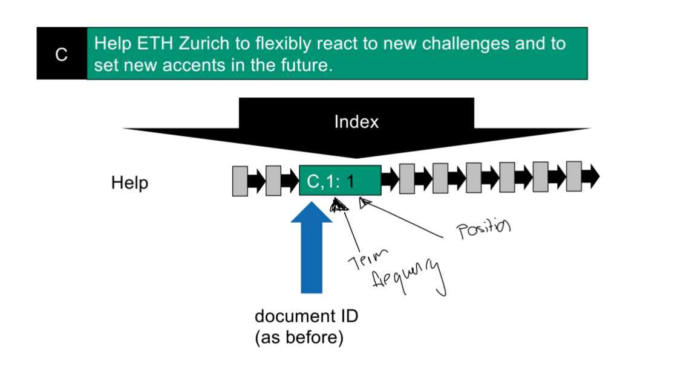
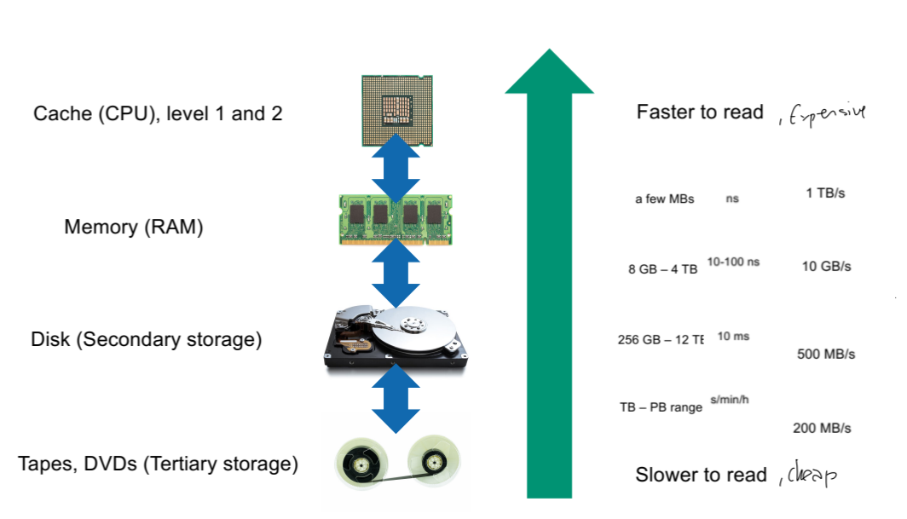

# Information Retrieval

## Introduction 1
### The Three Vs
Big Data 
- Volume
- Variety
- Velocity

### Data Shapes
- Tables
- Trees
- Graphs
- Cubes
- Text
#### Unstructured data
- is in a very raw form
- no explicit structure
- but implicit features (characters, grammar, pixels, waves)

#### Semantic gap

#### Three paramount factors
- Capacity (most progress since 1956)
  - How much data can we store?
- Throughput
  - How fast can we transmit data?
- Latency
  - When do I start receiving data? 

## Boolean Retrieval 2

- Documents (Harry Potter book)
  - Terms (run, paper, watch)

A term is included in a document $Hölzli \in D$

#### Document as list of terms
- [x] Inclusion
- [x] Occurrence 
- [x] Order

#### Document as bag of terms
- [x] Inclusion 
- [x] Occurrence
- [ ] Order

#### Document as set of terms
- [x] Inclusion 
- [ ] Occurrence
- [ ] Order

#### Incidence Matrix - Space waste

#### Metrics

#### Inverted index

## Term vocabulary 03

#### Conversion

#### Index construction
- Collect documents
- Tokenizing
- Linguistic preprocessing
- Build the index (posting list)
- 

#### Encoding

#### Building an inverted index
- Throw away punctuation
  - not trivial, isn't => punctuation? website vs website

#### Positional token
- grouped sequence of characters, My *HOUR* is almost come

#### Non-positional token
- *HOUR*

#### Non-normalized type
- it is what it is in the document, *is*

#### Normalized type
- *be*

#### Stop words
a 
an 
and 
are 
as
at 
be 
by
for 
from 
has
he 
in
is 
it
its 
of
on 
that 
the
to 
was 
were 
will
with

#### Equivalence Classes of tokens (types)
- USA, U.S.A
- window, windows, Windows
- Zürich, Züri, Zurich

#### Stemming
- Chop letters of the work
  - analysis => analysi
  - feature => featur
- Porter Stemmer
  - Enci => Ence
  - Anci => Ance

#### Lemmatization
- Building equivalence classes or expanding with Natural Language Processing

- computer, compute, computes, computed...
- Lemmitization does not help and can even degrade performance for English documents
- Lemmitization can help with languages that have more morphology

#### Skip list
Too short skips:
    - many comparisons, waste of space
Too long skips
    - few comparisons, not many real opportunities to skip
- In practive $\sqrt{NumberOfPostings}$

#### Phrase search
"ETH Zürich"

- Size of the vocabulary increases exponentially 0> $(\# Terms)^n$
- Positional index

When they have only one difference in the position, but the same document and frequency, then you know that those are together

## Tolerant retrieval 04
- Hash tables to look up faster Terms
- Limitations of hash tables
  - No support for range queries
  - Hash function not perfect in real life
  - Space requirements for collision avoidance

#### Trees
- The depth of a node is the number of edges from the node to the tree's root node.
  - A root node will have a depth of 0.
- The height of a node is the number of edges on the longest path from the node to a leaf.
  - A leaf node will have a height of 0.
- Transform Binary tree to posting lists
  

- Binary search tree => postings list only at leaves
- Complexity: $O(log(n))$

#### B+ Tree
- Allow more children
- Better for block access for the disk
- All leaves at same depth
- All non-leaf nodes have between 3 and 5 children
- It's fine if root has less
- Actual terms (and posting lists) only at the leaves
- Often have extra leaf pointers
- General case: #children between d + 1 and 2d+ 1
    - Means #keys between d and 2dS
- n trees => n- 1 intervals

#### Wild cards
\* matches any sequence 
Math* is easier, you can just cut it off
\*ac, invert the tree => write it backwards and search for ca\*

#### Permuterm index for two wildcard queries

Then check after the star. If you have pl\*t, then you need to check for the word that starts with a t. Then yo would have t$pl\*

#### k-grams

#### Approaches to spelling errors
- Always query also for corrected terms
- Only query for corrected terms, if not in the dictionary
- Only query for corrected terms if not in the dictionary and not enough results
- Making a spelling suggestion for corrected terms if not in the dictionary and not enough results

#### Minimum Edit Distance

- Problem with "raw" edit distance => cmputer <=> 500'000 terms
- This is not feasible in practice
- Solution: Pre-select a few terms
- Assumption: Two terms within a small edit distance have many k-grams in common

#### Jaccard coefficient

#### Updated method
1. Get k-grams from the query term
2. Look them up in the k-gram index
3. Compute Jaccard coefficients / Compute edit distance
4. Keep terms within large Jaccard coefficients / Keep terms within small edit distances

- Resource issue
  - We would need to extract k-grams from every term found in the k-gram index, compute the intersection and union, and then the Jaccard coefficients
  - Shortcut: We already know the k-grams that the query term and the found term have in common.

#### Soundex algorithm
- vocals have same class
- D, T
- similar sounds grouping
- Remove duplicates

## Information Retrieval 05
#### Memory hierarch

#### Term/TermID mapping 
- saves space
- 