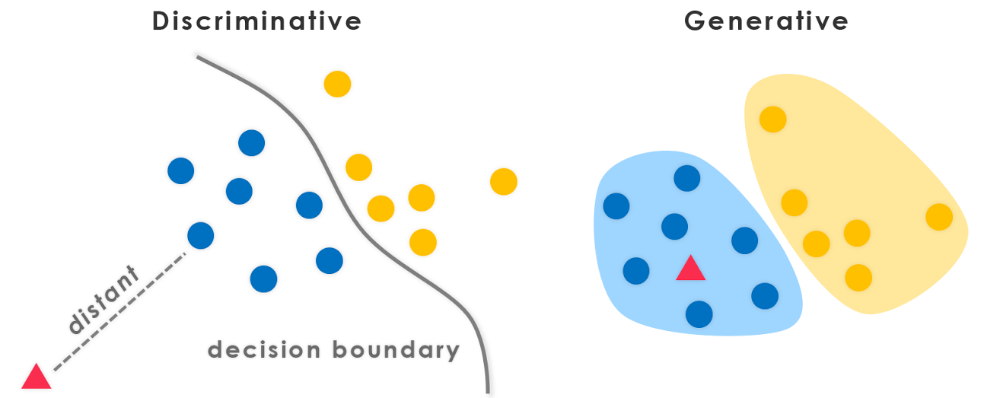
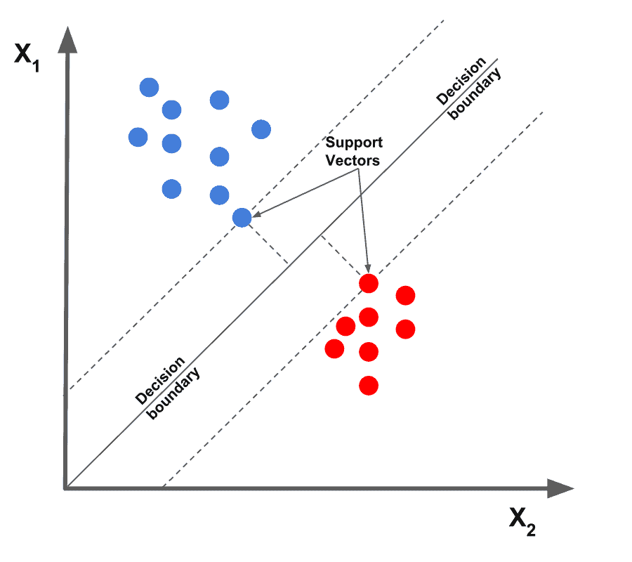

# Discriminative vs Generative Models

Description | Discriminative | Generative
---|---|---
What is modeled | $P(y \| x)$ | $P(x, y) $
What is learned | decision boundary | Probability distribution of data
Example | SVM, logistic regression | Gaussian Bayes classifier, GANS
Advantage | cheaper (just probability), less prone to overfitting | good at detecting outliers, generate new data

## Gaussian Bayes Classifier (GBC)
**How is $P(x, y)$ modeled?**

$$P(x, y) = P(y) * P(x | y) $$
$$ P(Y = y) = categoricalDistribution $$
$$P(X = x | Y = y) = XI(x; M_y \sum_y )$$

## Convolutional neural network (CNN)
- A convolutional neural network consists of an input layer, hidden layers and an output layer. In a convolutional neural network, the hidden layers include one or more layers that perform convolutions.
- In a CNN, the input is a tensor with shape: (number of inputs) × (input height) × (input width) × (input channels). After passing through a convolutional layer, the image becomes abstracted to a feature map, also called an activation map, with shape: (number of inputs) × (feature map height) × (feature map width) × (feature map channels). 

- A higher threshold leads to less positive predictions. Therefore the false positive rate is lower for higher thresholds. 

## Ridge Regression
- Has increased bias for decreased variance

## Ordinary Least Squares
- Augmenting the set of features used for the regression will never increase the least squares loss
- Subtracting the empirical mean from the data before performing regression on the centered samples

## SVM
- support vectors are the closest to the boundary

