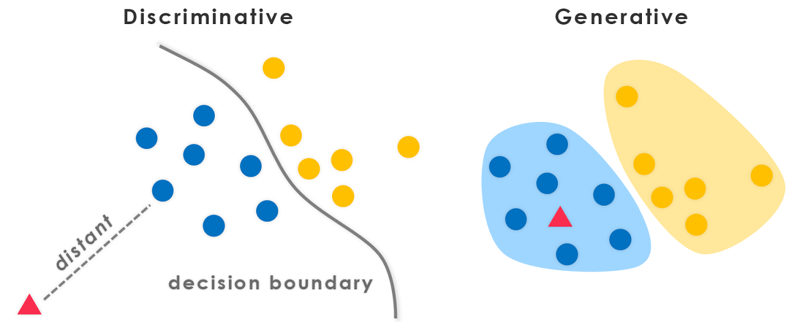
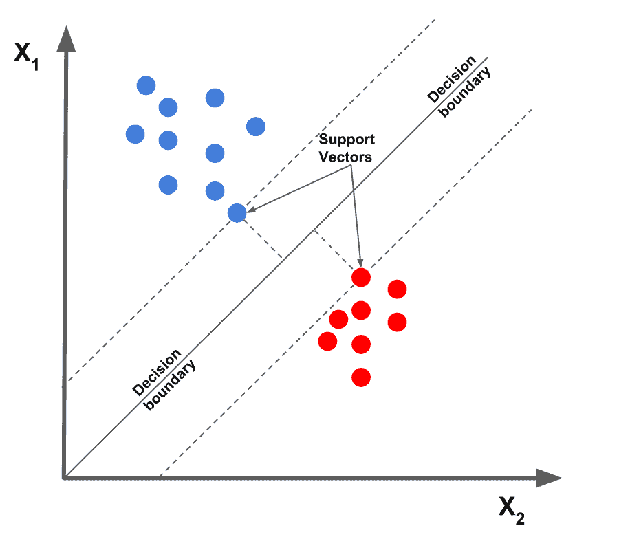

# Discriminative vs Generative Models

Description | Discriminative | Generative
---|---|---
What is modeled | $P(y \| x)$ | $P(x, y) $
What is learned | decision boundary | Probability distribution of data
Example | SVM, logistic regression | Gaussian Bayes classifier, GANS
Advantage | cheaper (just probability), less prone to overfitting | good at detecting outliers, generate new data

## Gaussian Bayes Classifier (GBC)
**How is $P(x, y)$ modeled?**

$$P(x, y) = P(y) * P(x | y) $$
$$ P(Y = y) = categoricalDistribution $$
$$P(X = x | Y = y) = XI(x; M_y \sum_y )$$

## Convolutional neural network (CNN)
- A convolutional neural network consists of an input layer, hidden layers and an output layer. In a convolutional neural network, the hidden layers include one or more layers that perform convolutions.
- In a CNN, the input is a tensor with shape: (number of inputs) × (input height) × (input width) × (input channels). After passing through a convolutional layer, the image becomes abstracted to a feature map, also called an activation map, with shape: (number of inputs) × (feature map height) × (feature map width) × (feature map channels). 
- $$parameters = K * K * K * C * F$$ 

- A higher threshold leads to less positive predictions. Therefore the false positive rate is lower for higher thresholds. 

## Ridge Regression
- Has increased bias for decreased variance
- closed form:
    - $$w^{ridge}(\lambda) = (X^TX + \lambda I^d)^-1X^Ty
- has very low weighted values
- regularization tries to keep weights small

## Lasso Regression
- has no closed form solution
- has zero values

## Ordinary Least Squares
- Augmenting the set of features used for the regression will never increase the least squares loss
- Subtracting the empirical mean from the data before performing regression on the centered samples

## SVM
- support vectors are the closest to the boundary
- unconstrained soft-margin SVM is a $l_2$-penalized hinge loss

## EM algorithm
- EM algorithm converges to a local maximum/saddle point, not only with careful initialization
- every iteration of the EM algorithm increases the marginal likelihood (of the data)
- instead of EM algorithm, it is possible to adapt gradient descent for learning the parameters of the GMM and its latent assignments
- doesn't have step size
- iterative optimization algorithm used to estimate the parameters of probabilistic models when some data is missing or unobserved
- E-step
    - algorithm computes expected value of the unobserved or missing data, given the current estimate of the model parameters
- M-step
    - maximizes the likelihood function by updating the model parameters based on the expected values computed in the E-step

## Gaussian Mixture Model
- probabilistic model used for representing complex data distributions
- works well when data is believed to be generated from a mixture of Gaussian distributions
- parameters of GMM
    - means
        - represent the center of each component
    - covariance
        - controls the shape and orientation of the component
    - mixing coefficients
        - relative contribution of each component to the overall distribution
- trained using Expectation-Maximization (EM) algorithm

## Bootstrap
### Advantage of using bootstrap parameter estimates in comparison with distribution-dependent parameter estimates
- there is no closed-form solution for bootstrap parameter estimates
- bootstrap sampling is a way of artificially creating more datasets. Basically you take random samples from the dataset with replacement
- Sampling with replacements makes it computationally expensive
- bootstrapping is possible for any ML technique, since it can be computed for any black-box predictor
- bootstrap estimates are not asymptotically stable

## Generative Adversarial Networks
$D$: discriminator
$G$: neural network generator 
- If $D$ and $G$ both have enough capacity, i.e., if they can model arbitrary functions, the optimal $G$ will be such that $G(z) \sim p_{data}$
- the objective can be interpreted as a two-player game between $G$ and $D$
- output of discriminator is the probability of classifying $x$ as being real:
$$1 - D_G(x)$$

## Naive Bayes classifiers
- every pair of features being classified is independent of each other
- Bayes' Theorem:
    - $$P(A|B = \frac{P(B|A)P(A)}{P(B)})
- 
## Error

**Logistic**: minimum is at $\infty$
**Square**: well-defined minimum, the points is that this minimum (at 1) seems a bit random and does not make a lot of sense
**Exponential**: penalizes wrong labels very much and very quickly, this means that even one error could heavily penalize your model

**Hinge** for SVM
**Logistic** for cross entropy

## Asymmetric 0-1 loss with abstention
We shall define a new loss named 0-1 loss with abstention with an *extended action space*:
$$f(x) \in \{-1, +1, r\}$$
where $r$ indicates **abstaining from a prediction**. This method is sometimes called **selective classification**. We also introduce a cost $c \in[0, 0.5]$ for abstaining. The loss becomes:
$$l(f(x), y) = \mathbf {1}_{f(x)\neq y} \mathbf{1}_{f(x) \neq r} + c \mathbf{1}_{f(x) = r}$$

We should abstain if 
$$c < min \{p(x), 1 - p(x)\}$$

## Quiz
**K-means clustering**
- It seeks cluster centres and assignments to minimise the within-cluster sum of squares
- it is appropriate if the underlying cluster are sparable, spherical and approximately of same size
- k-means clustering can be kernelised

**Find k**
- By using a heuristic like the elbow method that identifies the diminishing returns from increasing k
- By using an information criterion that regularizes solution to favour simpler models with lower k

**Lloyd's algorithm**
- It cannot cycle; i.e. it does never return to a particular solution after having previously changed to a different solution
- Using specialized initialization schemes (e.g. k-means++) can improve the quality of solutions found by the algorithm and reduce its runtime
- center of clusters should be at the center of gravity
- So after choosing centers and clustering, move centers to new centers
- repeat until done
- converges, local or global minimum

**PCA**
- PCA can be kernelised
- unsupervised learning algorithm
- It is orthogonal to all other principal components found by PCA
- if we use the Gaussian kernel for kernel PCA, we implicitly perform PCA on an infinite-dimensional feature space.
- Gaussian kernel has infinite dimensions
- Autoencoders and PCA are the same thing if we choose the activation function $\varphi(\cdot)$ 

**PCA first principal component**
- Captures the maximum amount of variance in the data among all possible linear combinations of the original features
- represents the direction in the data space along which the data exhibits the highest variability or spread
- orthogonal to all other subsequent principal components, meaning it is uncorrelated with them. This orthogonality property allows PCA to create uncorrelated features
- first principal component is given by the eigenvector of th data covariance matrix with the largest eigenvalue
