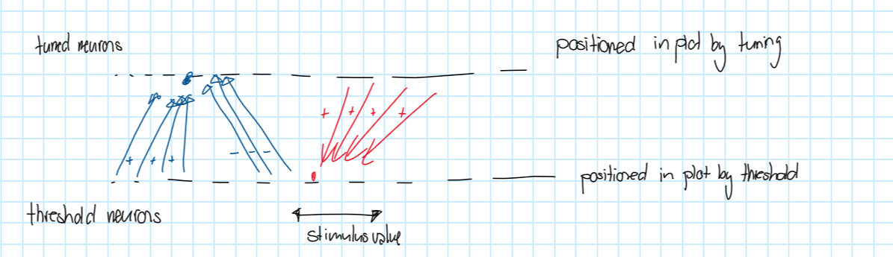
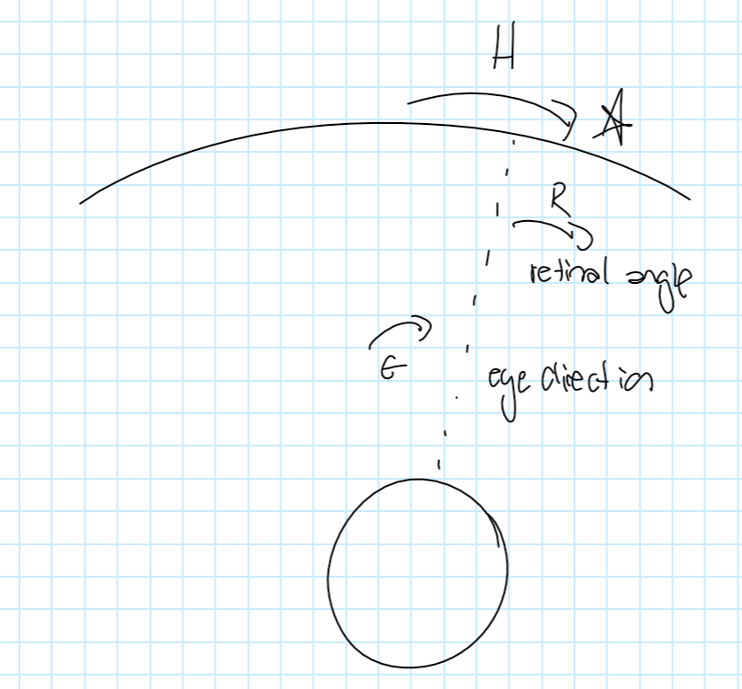
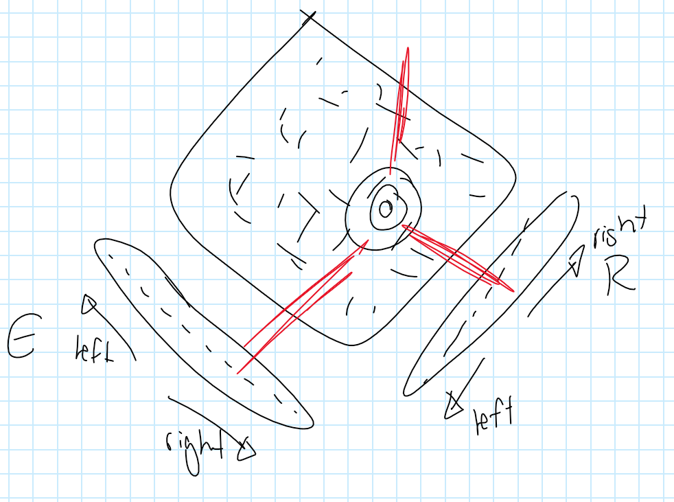

## 30. November 2023
**A hopfield network has symmetric weights and 0 self-weights**

we update the state by updating a units output

|A|B|C|D|E|
|-|-|-|-|-|
|1|1|0|0|0|
|1|1|0|1|0|
|1|1|0|1|1|
The state doesn't change after this (because every unit stays the same when updated) $\rightarrow$ the network has *converged*

We move a unit to the top (bottom) if the sum of weights to *upper* units is positive (negative)

Let's consider the sum of all weights between active units. This has to increase at every step. $\rightarrow$ every time we change the state of a unit.

Biased Graph:

Even considering bias terms and cases where the threshold is reached exactly, the network has to converge to a stable state.

## Hopfield Network
A hopfield network is an *associative memory*  
An associative memory restores a full memory from a partial or noisy version of the memory.

## Representations
We can also use +- 1 as the two states of a unit.

So people don't worry about using one type vs the other - they use which ever they prefer.

**Asynchronous updates**: Updating units one at a time.

**Synchronous updates**: Updating all units simultaneously.

We can use our theorem about asynchronous networks to analyze synchronous ones. How?

|A|B|C|D|E|
|-|-|-|-|-|
|1|-1|1|1|-1|
|-1|1|1|1|-1|

# Lecture
## Population Codes
- Neurons work together to encode a value or multiple values
- Each neuron is "tuned" to a particular value of the stimulus
- By looking at the activity of the population, the value is easy to read out.

### Example
Neurons tuned to possible angles of a line at a certain location in the visual field

To read out a value, we look ath the activities oin the population

We plot each neuron at the position it is tuned to. The green neuron activity is always shown positioned at 170° because that is the angle it is tuned to.

Why are curves of a similar shape? Think of a 3D picture

Other neurons can reliably and accurately read out the value.
Some neurons are tuned to values, with high firing rates at those values.  
Some neurons have a threshold, and as the stimulus passes, the threshold, the rate goes up.

Again, easy for other neurons to read out robustly and accurately

Is it easy to convert between these formats?

How can we compte something with this sort of data encoding? We'll use tuning-based units, because threshold-based untis only "work well" with scalars. In one dimension, the relationship is simple: $H = E + R$

- Neurons tuned to the **combination** of
  - eye angle
  - retina 1 position
  - head centered angle
- Weights are excitatory between central units "lined up" with the variable value.

This is like a big look-up table to compute the answer.
- Uses a lot of neurons
- Very flexible, can represent any function in any # dimensions
- Robust to noise and dropout

# Lecture 1, Synapsis
## Soup vs Spark
- is synaptic transmission mediated chemically or by direct electrical transfer of charge
- NMJ accepted that it was chemical $\rightarrow$ certain aspects too fast to be mediated chemically
## Frog experiment
- to support neurotransmitter hypothesis
- first frogs heartbeat slowed, second frog inhibitory effect of vagus transferred
- building connection of synapsis not rebuilding brain
- 