## 30. November 2023
**A hopfield network has symmetric weights and 0 self-weights**
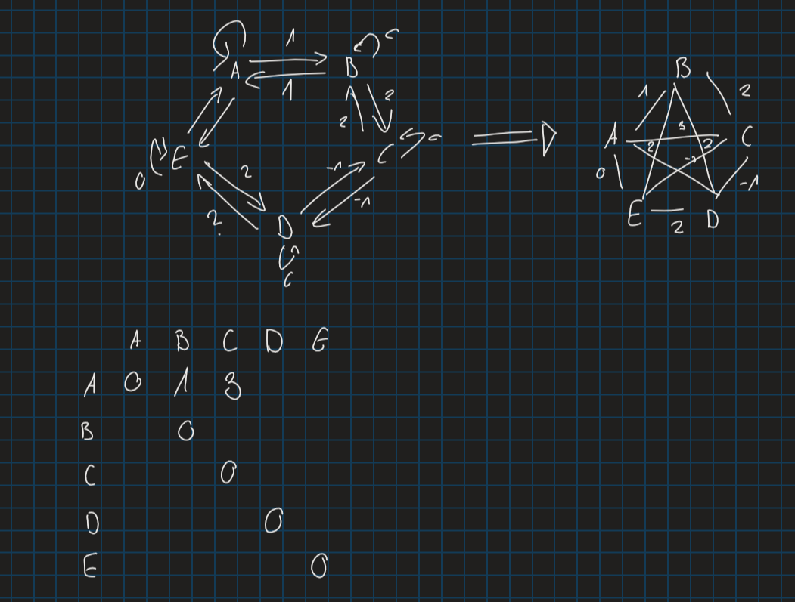
we update the state by updating a units output

|A|B|C|D|E|
|-|-|-|-|-|
|1|1|0|0|0|
|1|1|0|1|0|
|1|1|0|1|1|
The state doesn't change after this (because every unit stays the same when updated) $\rightarrow$ the network has *converged*

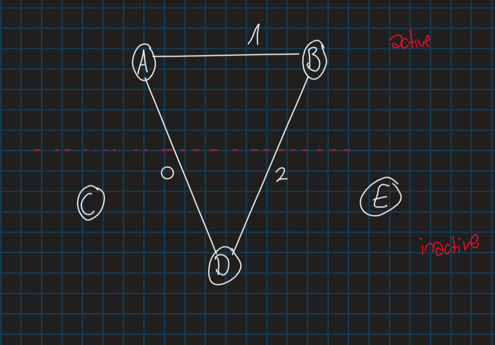

We move a unit to the top (bottom) if the sum of weights to *upper* units is positive (negative)

Let's consider the sum of all weights between active units. This has to increase at every step. $\rightarrow$ every time we change the state of a unit.

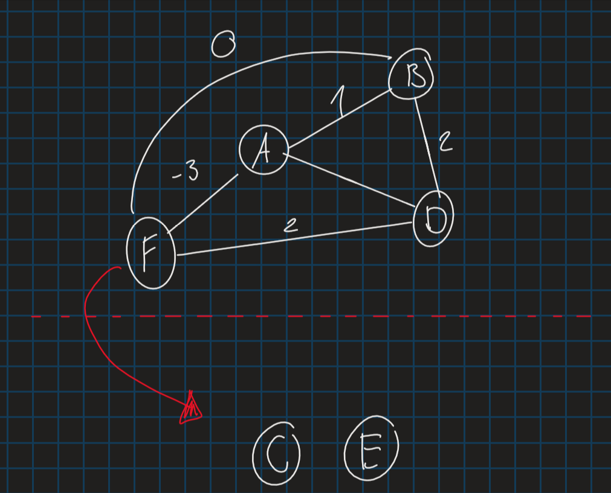

Biased Graph:
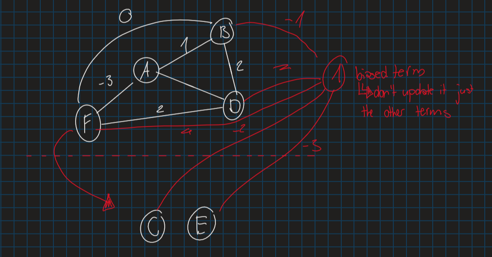
Even considering bias terms and cases where the threshold is reached exactly, the network has to converge to a stable state.

## Hopfield Network
A hopfield network is an *associative memory*  
An associative memory restores a full memory from a partial or noisy version of the memory.

## Representations
We can also use +- 1 as the two states of a unit.

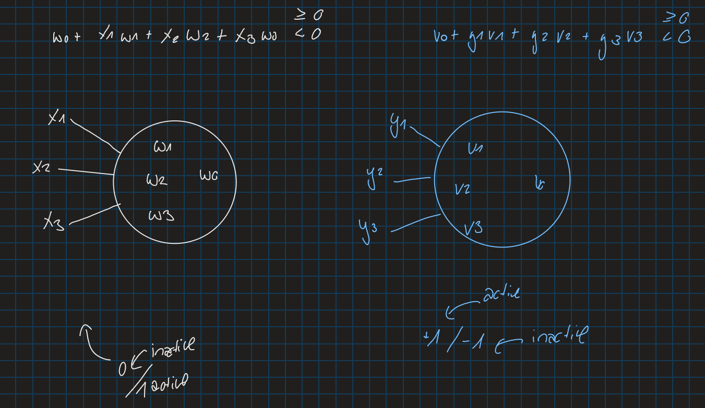

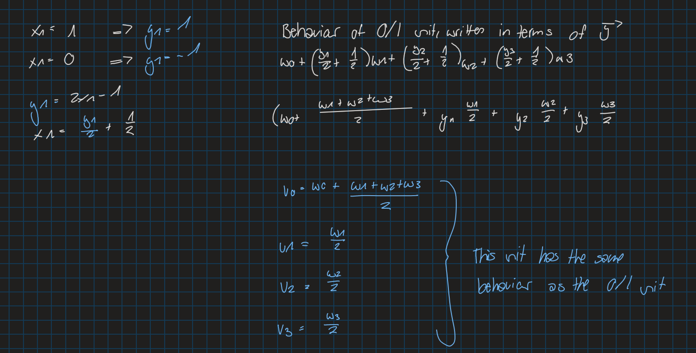

So people don't worry about using one type vs the other - they use which ever they prefer.

**Asynchronous updates**: Updating units one at a time.

**Synchronous updates**: Updating all units simultaneously.

We can use our theorem about asynchronous networks to analyze synchronous ones. How?

|A|B|C|D|E|
|-|-|-|-|-|
|1|-1|1|1|-1|
|-1|1|1|1|-1|

# Lecture
## Population Codes
- Neurons work together to encode a value or multiple values
- Each neuron is "tuned" to a particular value of the stimulus
- By looking at the activity of the population, the value is easy to read out.

### Example
Neurons tuned to possible angles of a line at a certain location in the visual field
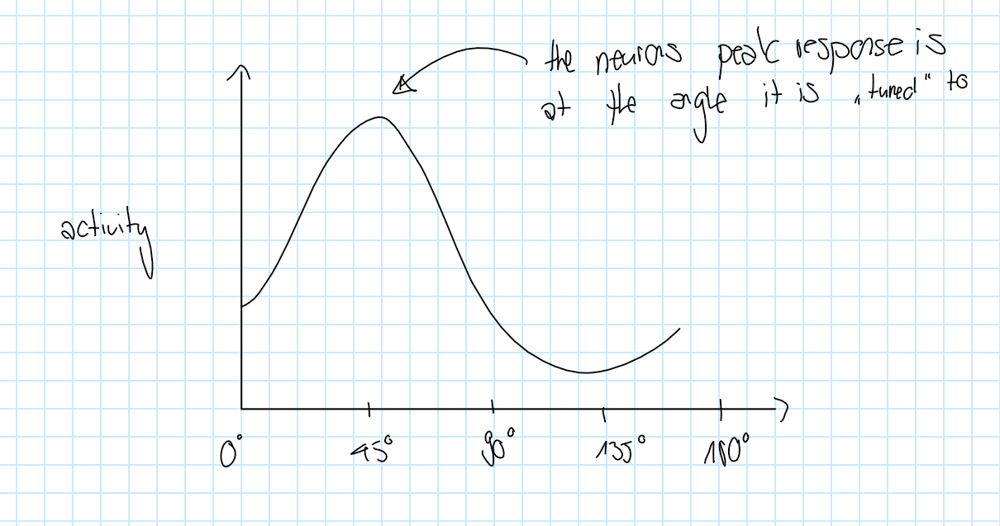

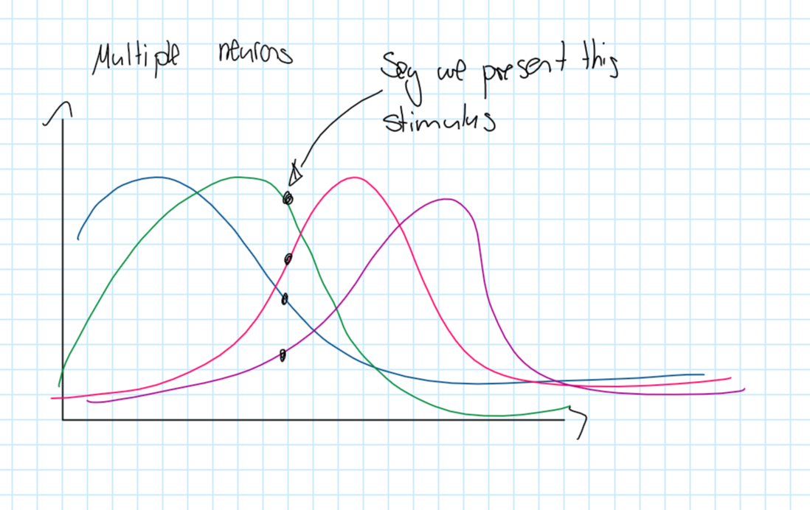

To read out a value, we look ath the activities oin the population
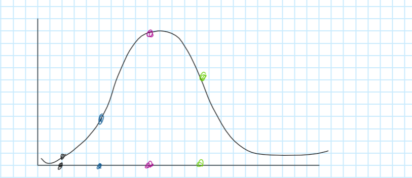
We plot each neuron at the position it is tuned to. The green neuron activity is always shown positioned at 170° because that is the angle it is tuned to.

Why are curves of a similar shape? Think of a 3D picture
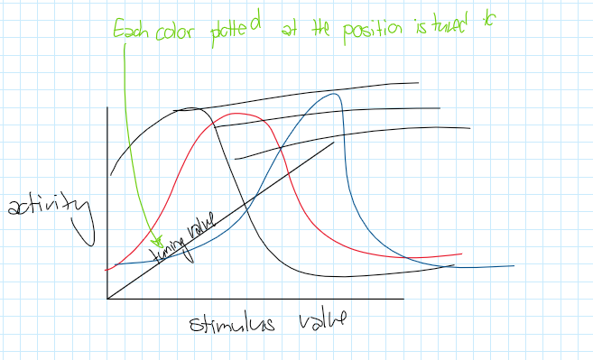

Other neurons can reliably and accurately read out the value.
Some neurons are tuned to values, with high firing rates at those values.  
Some neurons have a threshold, and as the stimulus passes, the threshold, the rate goes up.

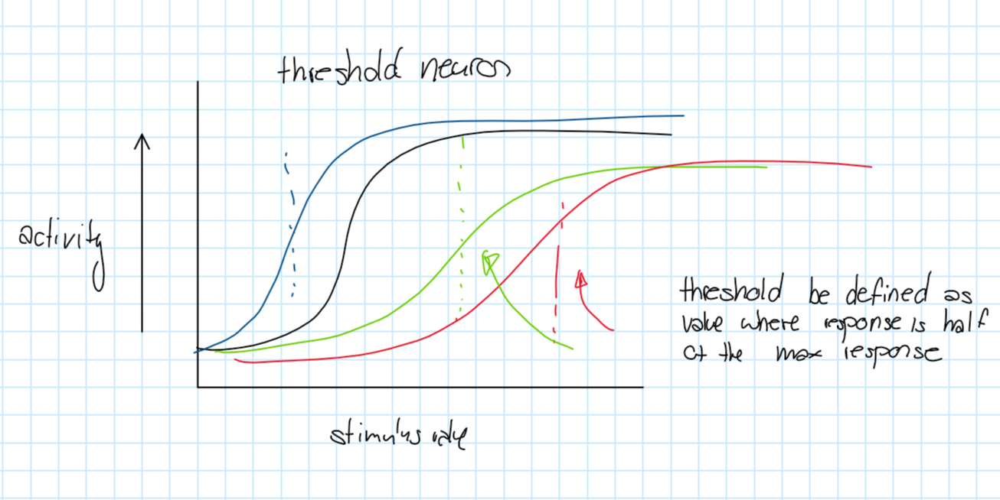

Again, easy for other neurons to read out robustly and accurately
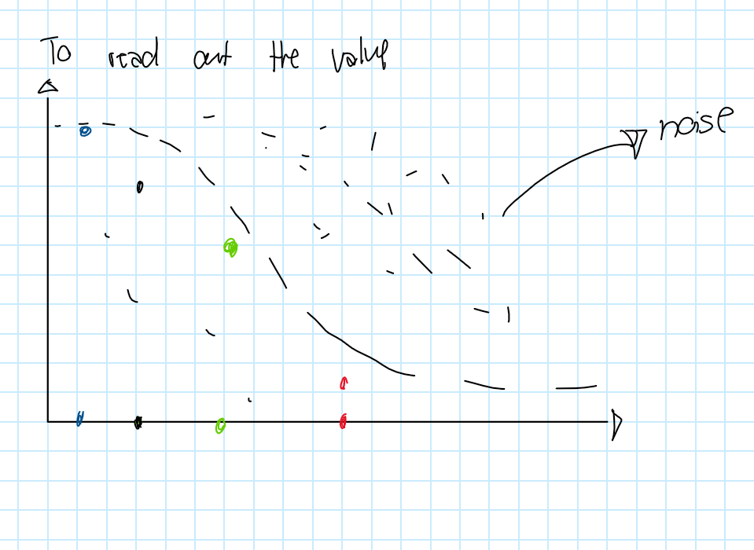

Is it easy to convert between these formats?

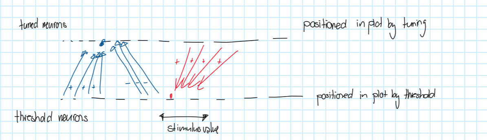

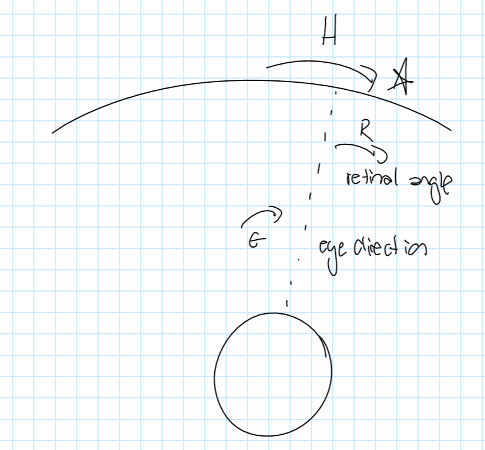

How can we compte something with this sort of data encoding? We'll use tuning-based units, because threshold-based units only "work well" with scalars. In one dimension, the relationship is simple: $H = E + R$

- Neurons tuned to the **combination** of
  - eye angle
  - retina 1 position
  - head centered angle
- Weights are excitatory between central units "lined up" with the variable value.

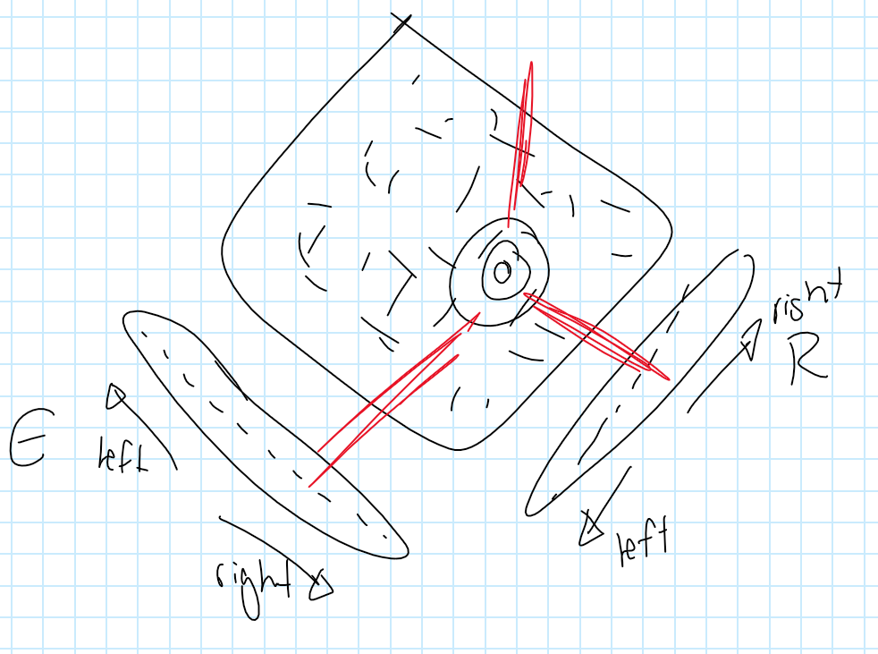

This is like a big look-up table to compute the answer.
- Uses a lot of neurons
- Very flexible, can represent any function in any # dimensions
- Robust to noise and dropout

# Lecture 1, Brain
## Brain
- Average human brain: 1.5kg, 1.1-1.2l volume
**Why do we have a brain**, input output art, we need to interact with our environment
### Encoding
1. Stimuli in the environment 
2. Encoding
3. Neuronal Representation Perception Sensory Integration, Memory / maintenance
4. Decoding
5. Movement, Actions Decisions Behavior
1. Stimuli in the Environment

The cells (neurons) that make up brains are very similar between species
- usually cell body
- axon

### Brain, Computer similarity, differences
|Similar|Different|
|-|-|
|Process information|Massive parallelism|
|Logical operations|Separation of memory and processing|
|Memory|Constantly adapting|
|Use electrical(digital) signaling|Chemical signaling|
|Can learn from inputs|Unreliable units|
|Consume energy|Analog computation|
||Robust to damage|
||Very energy efficient|

1. **Brain vs. Computer**:
   - Similarities: Processing information, logical operations, memory, electrical signaling, learning from inputs, energy consumption.
   - Differences: Massive parallelism, separation of memory and processing, adaptation, chemical signaling, unreliable units, damage robustness, energy efficiency

3. **AI Research Insights**:
   - AI excels in structured tasks like intelligence tests and checkers but struggles with simple perceptual and mobility skills of a one-year-old

4. **Artificial vs. Real Neural Networks**:
   - Artificial neural networks simulate abstract computing on digital processors, independent of the computing substrate.
   - Biological neural networks use their physical substrate for computation, involving real-time dynamics and structural adaptation【10†source】

5. **Deep Network Revolution**:
   - ANNs began outperforming traditional methods around 2009.
   - In 2011, CNNs trained on GPUs surpassed human performance in visual pattern recognition
6. **Computing Power Demands**:
   - Training GPT-3 required over $4.6 million, highlighting the increasing energy demands of deep neural networks

7. **AI Limitations**:
   - AI is energy-intensive, with high data movement costs and limitations to a predetermined range of tasks

8. **Neuromorphic Engineering**:
   - Focuses on emulating neural function using subthreshold analog and asynchronous digital technologies.
   - Involves memristive devices, in-memory computing, and high-density arrays for neural network simulation and application-driven tasks

9. **Emulating Natural Intelligence**:
   - Utilizes the time evolution of physical systems for computation.
   - Demonstrates efficiency in sensory processing tasks with lower speed and power

10. **Brain-Inspired Principles**:
    - Emphasizes exploiting physical space, parallel arrays of neurons, fine-grain parallelism, co-localized memory and computation, and dynamic synapse circuits【18†source】.
    - Prioritizes real-time interaction with the environment and efficient sensory signal processing

11. **Neuromorphic Computing Approach**:
    - Interdisciplinary research combining neuroscience, physics, and microelectronics.
    - Aims to design spiking neural network chips and build real-time, autonomous robotic agents with cognitive abilities

12. **Applications and Research**:
    - Neuromorphic intelligence applications include health monitoring, environmental sensing, and machine vision.
    - Ongoing research focuses on refining the interplay of mind, brain, and body, and developing neuromorphic systems that interact intelligently with the environment

# Lecture 2, Brain
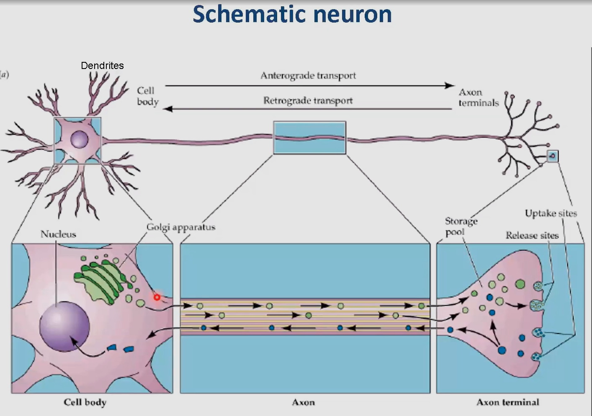

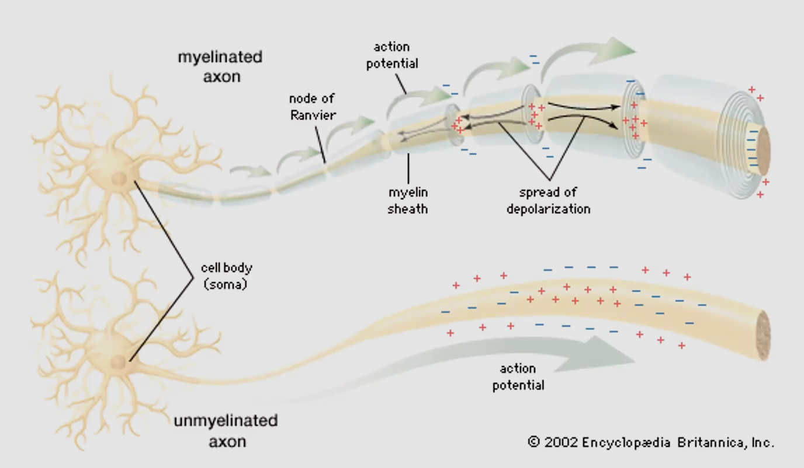

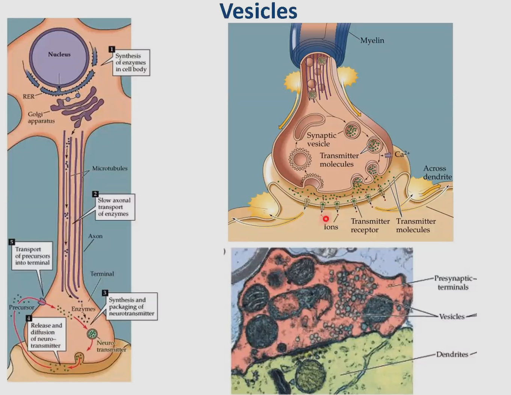

## Sequence of events
1. Neurotasnmitter release
2. Receptor binding
3. Ion channels open or close
4. Conductance change causes current flow
5. Postsynaptic potential changes
6. Postsynaptic cells
7. Summation determines whether not an action potential occurs

### Gross Anatomy

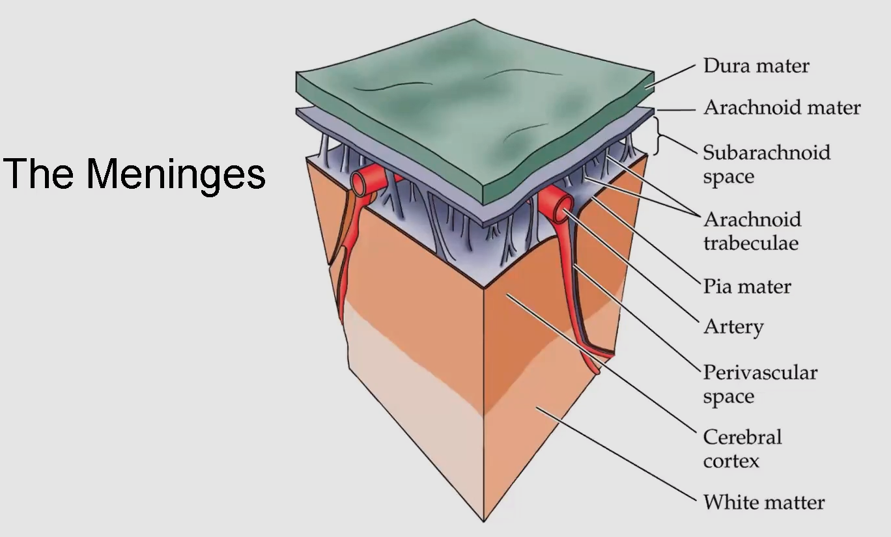
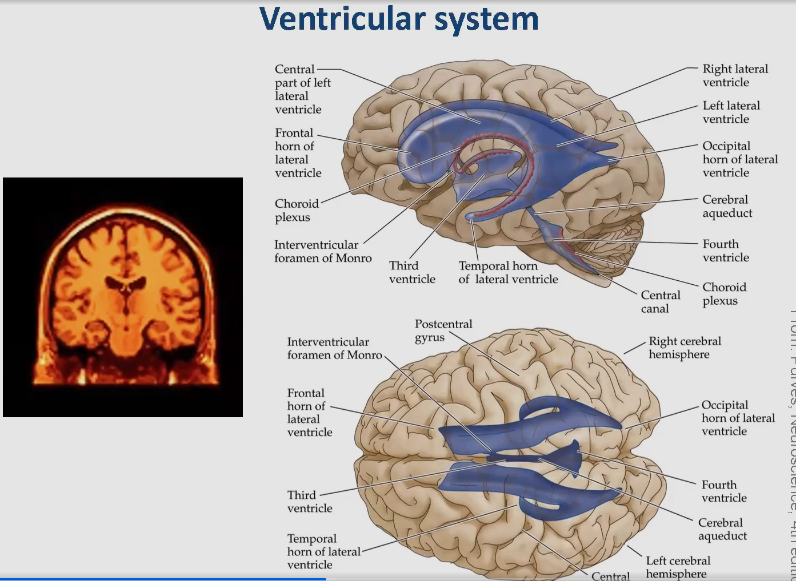
### Directions of Orientation in the CNS:
- Anterior: Toward the front.
- Posterior: Toward the back.
- Inferior: Toward the bottom.
- Superior: Toward the top of the head/body.
- Medial: Toward the middle/midline.
- Lateral: Away from the middle/midline.
- Rostral: Toward the nose.
- Caudal: Toward the tail/rear.
- Proximal: Near the trunk/center.
- Distal: Away from the center.
- Dorsal: Toward the back.
- Ventral: Toward the belly.
- Ipsilateral: On the same side.
- Contralateral: On the opposite side.
- Bilateral: On both sides.
- Unilateral: On one side【30†source】【36†source】

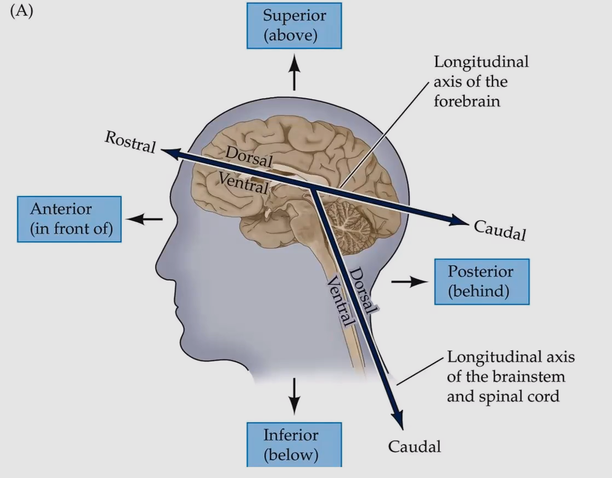

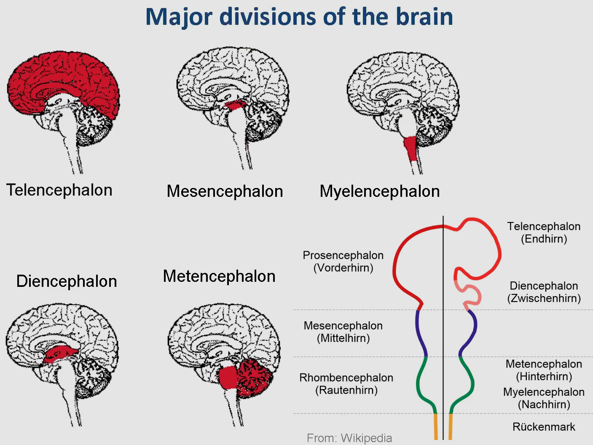

### Hypothalamus
**Upper Brain Stem: Diencephalon**
- Hypothalamus
  - Structure
    - Very small
    - Contains an important collection of nuclei
  - Function
    - Controls autonomic mechanisms
    - Link to endocrine system

### Limbic System
- Structure
  - Structures on medial and basal surfaces of cerebral hemispheres
  - Cingulate gyrus + parahippocampal gyrus + ...
  Anatomic circuits include basolateral circuit and the Papez circuit
- Function
  - Emotional expression
  Memory acquisition
  Fear conditioning
  Violence and aggression

### Basal Ganglia
- Structure
  - Collection of nuclei embedded deep within cortex
  - Partially surround the thalamus
  - Sensory projections to cerebrum
  - Efferents to other nervous system structures
- Function
  - Regulate voluntary movement
  - Integrative or just a relay station?
- Pathology
  - Movement disorders (Parkinson's)

# Lecture 6, Synapsis
## Soup vs Spark
- is synaptic transmission mediated chemically or by direct electrical transfer of charge
- NMJ accepted that it was chemical $\rightarrow$ certain aspects too fast to be mediated chemically
## Frog experiment
- to support neurotransmitter hypothesis
- first frogs heartbeat slowed, second frog inhibitory effect of vagus transferred
- building connection of synapsis not rebuilding brain

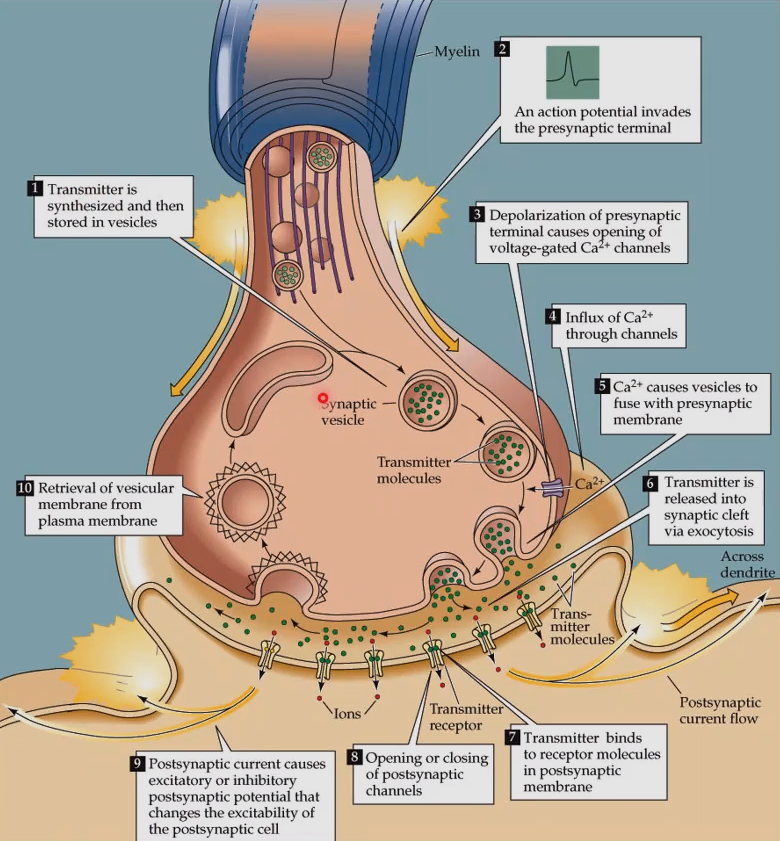

## Chemical transmission
- Contrary to electrical transmission multiple steps are required to release transmitter chemicals and for them to act on postsynaptic receptors, resulting in a time delay
- Directional, select localization of release machinery to presynaptic terminals and receptors to postsynaptic specializations
- can change sign by release of inhibitory transmitter
- highly modulatable as it has many steps presynaptic terminal and at the postsynaptic sites

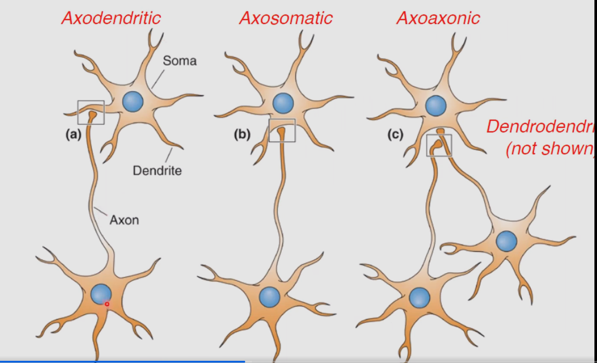

## Steps to chemical synaptic transmission
- First need to bring the presynaptic neuron to threshold at axon hillock
- Conduction down axon length $R * C$ dependent
- Opening of voltage gated Ca channels
- Diffusion and action of Ca at release machinery
- Exocytosis and diffusion of transmitter in cleft
- Activation of postsynaptic receptors

## Criteria that define a neurotransmitter
1. must be present at presynaptic terminal
2. must be released by depolarization, $Ca^{++}$-dependent
3. specific receptors must be present
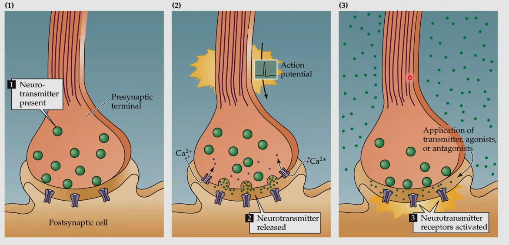

## Standard Katz (Quantal) Model of Synaptic Transmission
- One packet of neurotransmitter = 1 quantum
- AP transiently increases in the probability of releasing NX quanta
- Several quanta are available to be released
- Each quantum gives approximately the same postsynaptic response called the Quantal Amplitude
- The average number of quanta released, $m = np$
  - where $n$ = number of quanta available for release
  - $p$ = their average release probability

## CNS synapses and quanta
- at CNS synapses with only a single release site, changing the probability of release (i.e. changing calcium concentration) does not effect the amplitude of the response (as only zer or one vesicle is released in theory)
- at CNS synapses with multiple release sites, changing release probability can change the postsynaptic response amplitude as more transmitter is released (graded quantal levels)
- ath the NMJ a single nerve can elicit a postsynaptic AP given multiquantal release, while at the CNS synapse (with low number of release sites) multiple synapses must cooperate, forces a network

## Docked Synaptic Vesicles
Define the number of readily releasable vesicles a synapse has available. A consequence of having of limited number is depletion at high stimulus frequency, CNS synapses may have only a small number of docked vesicles on the order of 5-10 vesicles for a hippocampal CA1 synapse

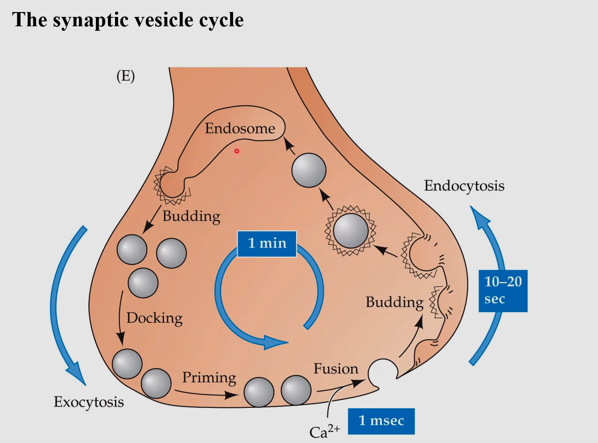

