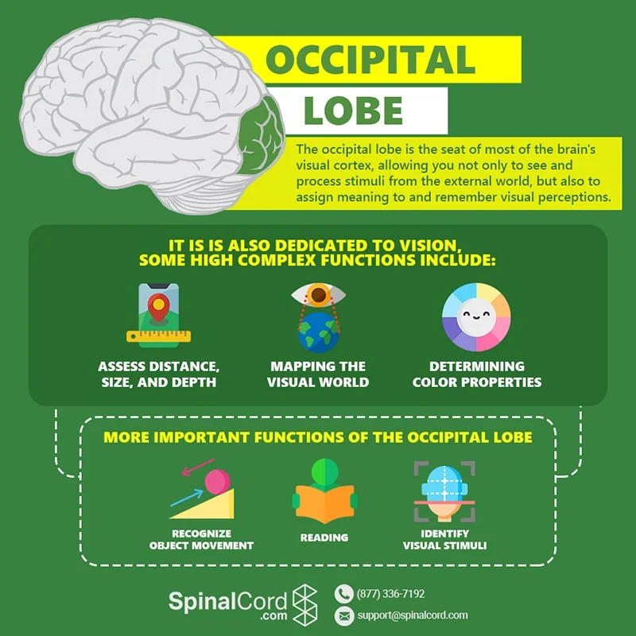

## 30. November 2023
**A hopfield network has symmetric weights and 0 self-weights**

we update the state by updating a units output

|A|B|C|D|E|
|-|-|-|-|-|
|1|1|0|0|0|
|1|1|0|1|0|
|1|1|0|1|1|
The state doesn't change after this (because every unit stays the same when updated) $\rightarrow$ the network has *converged*

We move a unit to the top (bottom) if the sum of weights to *upper* units is positive (negative)

Let's consider the sum of all weights between active units. This has to increase at every step. $\rightarrow$ every time we change the state of a unit.

Biased Graph:

Even considering bias terms and cases where the threshold is reached exactly, the network has to converge to a stable state.

## Hopfield Network
A hopfield network is an *associative memory*  
An associative memory restores a full memory from a partial or noisy version of the memory.

## Representations
We can also use +- 1 as the two states of a unit.

So people don't worry about using one type vs the other - they use which ever they prefer.

**Asynchronous updates**: Updating units one at a time.

**Synchronous updates**: Updating all units simultaneously.

We can use our theorem about asynchronous networks to analyze synchronous ones. How?

|A|B|C|D|E|
|-|-|-|-|-|
|1|-1|1|1|-1|
|-1|1|1|1|-1|

# Lecture
## Population Codes
- Neurons work together to encode a value or multiple values
- Each neuron is "tuned" to a particular value of the stimulus
- By looking at the activity of the population, the value is easy to read out.

### Example
Neurons tuned to possible angles of a line at a certain location in the visual field

To read out a value, we look ath the activities oin the population

We plot each neuron at the position it is tuned to. The green neuron activity is always shown positioned at 170° because that is the angle it is tuned to.

Why are curves of a similar shape? Think of a 3D picture

Other neurons can reliably and accurately read out the value.
Some neurons are tuned to values, with high firing rates at those values.  
Some neurons have a threshold, and as the stimulus passes, the threshold, the rate goes up.

Again, easy for other neurons to read out robustly and accurately

Is it easy to convert between these formats?

How can we compte something with this sort of data encoding? We'll use tuning-based units, because threshold-based untis only "work well" with scalars. In one dimension, the relationship is simple: $H = E + R$

- Neurons tuned to the **combination** of
  - eye angle
  - retina 1 position
  - head centered angle
- Weights are excitatory between central units "lined up" with the variable value.

This is like a big look-up table to compute the answer.
- Uses a lot of neurons
- Very flexible, can represent any function in any # dimensions
- Robust to noise and dropout

# Lecture 1, Synapsis
## Soup vs Spark
- is synaptic transmission mediated chemically or by direct electrical transfer of charge
- NMJ accepted that it was chemical $\rightarrow$ certain aspects too fast to be mediated chemically
## Frog experiment
- to support neurotransmitter hypothesis
- first frogs heartbeat slowed, second frog inhibitory effect of vagus transferred
- building connection of synapsis not rebuilding brain

# Lecture 7

# Brain Structure

**Telencephalon Regions**

The cerebral cortex (neocortex) is anatomically divided into 4 lobes

separated from the frontal lobe by the **central sulcus**. Primary lobe for somatosensory processing (afferent inputs from receptors in the skin). Additionally, subserves other sensori-motor functions.

separated from the frontal and parietal lobe by the **lateral fissure (Sylvian fissure)**. Involved in auditory processing and language comprehension **(Wernickes area)**. Additionally, responsible for visual object recognition. The medial portion of the temporal lobe includes a **portion of the hippocampal formation which is involved in formation of new memories**

sub-cortical structure significantly involved in motor learning and control. Degeneration of a subset of dopaminergic neurons in the basal ganglia results in Parkinsons disease.

centre for emotional processing and is strongly linked to the olfactory senses (sense of smell).

composed of several nuclei which act as relay stations to transmit information to and from neocortex.

The brain and spinal cord are protected by three layers collectively known as meninges:

dura-mater: A thick leather-like inelastic layer present directly below the bone.

arachnoid-mater: A thin, delicate, middle layer present directly below the dura-mater. Has spider web like filamentous extensions into the sub-arachnoid space which reach the pia-mater

pia-mater: A thin, delicate, translucent layer that directly lines the gyri/sulci of the brain, and the spinal cord. Rich in blood-vessels that supply oxygen and nutrients to the brain. Functionally, it forms the blood brain barrier (BBB).

**Diencephalon Regions**

Thalamus: composed of several nuclei which act as relay stations to transmit information to and from neocortex.

Hypothalamus: required for regulation of autonomic bodily functions

Pituitary Gland: regulation of the endocrine (hormonal) system

Forebrain (Prosencephalon) which can be further sub-divided into:
- Telencephalon: develops into the cerebral cortex, basal ganglia, hippocampal formation, amygdala
- Diencephalon: gives rise to structures like the thalamus, hypothalamus and the pituitary gland.

Midbrain (Mesencephalon) tectum and tegmentum, which exist in all vertebrate brains. The tectum in the mammalian brain consists of the superior colliculus and the inferior colliculus.

Hindbrain (Rhombencephalon) consists of the Metencephalon (develops into the pons, cerebellum) and the Myelencephalon (develops into the medulla oblongata)

Neurons are hyperpolarized which means they have a resting potential of -70 mV within and 0 mV outside of them. Hyperpolarization refers to an increase in membrane potential whereas depolarization refers to a decrease in membrane potential

Action potentials are all or nothing operations which have four components which take place over the course of 1-2 ms:
Depolarization: Depolarization is when a change occurs inside a cell that causes the distribution of electric charges to alter, leaving the cell with a less negative charge than the outside. Numerous cell functions, cell-cell communication, and the general physiology of an organism all depend on depolarization

# Exam Questions

1. **Grid Cells**: Grid cells are types of neurons found in the brains of many animals, including humans, that allow for spatial navigation and are thought to form part of the brain's positioning system. These cells are located in the entorhinal cortex and exhibit a unique pattern of activity that corresponds to multiple, evenly spaced locations in an environment, forming a grid-like structure. This pattern helps in self-positioning and navigation by providing a metric for spatial coding. Understanding grid cells involves knowing how their firing patterns contribute to the neural code for representing space in the brain.

2. **Brain Size Scaling with Species Size**: The relationship between brain size and the size of a species, also known as allometric scaling, is an important area of study in comparative neuroscience. Generally, brain size increases with body size, but not in a simple linear way; instead, it follows a power law where the exponent is less than one, indicating that larger animals have larger brains but not proportionally to their body size. This is sometimes expressed as the encephalization quotient (EQ), which measures brain mass relative to an expected value for a given body mass.

3. **Perceptrons and XOR Function**: A perceptron is a simple linear classifier that can only solve linearly separable problems. The XOR function is not linearly separable, which means a single perceptron cannot compute an XOR function. However, a multi-layer network with at least one hidden layer (also known as a multi-layer perceptron) can solve the XOR problem by creating a non-linear decision boundary.

4. **Convergence in Hopfield Networks**: A given state in a Hopfield network will converge to a stable state if it's close to one of the stored patterns (memories) or local minima of the energy function. To determine which of the four states will converge to a stable state, you would analyze the energy function of the Hopfield network and determine which states are local minima.

5. **Output from an Integrate-and-Fire Circuit**: An integrate-and-fire neuron model is a simplified representation of a neuron that accumulates input signals until it reaches a threshold, at which point it 'fires' (generates an action potential) and then resets. The output of such a circuit is typically a series of spikes or action potentials over time.

6. **Short-Term Plasticity vs Long-Term Potentiation**: Short-term plasticity refers to transient changes in synaptic strength that occur over a short period, such as facilitation or depression due to recent activity. Long-term potentiation (LTP), on the other hand, is a long-lasting increase in synaptic strength following high-frequency stimulation, which is a mechanism underlying learning and memory.

7. **Tuning Curves (Population Codes)**: A tuning curve represents the response of a neuron to a range of stimuli, showing how the firing rate of the neuron changes with different stimulus values. It's an essential concept in understanding population coding, where the combined activity of multiple neurons with different tuning properties can encode complex information, such as sensory inputs.

8. **Activation Levels from a 2D Stimuli Input**: The question likely refers to interpreting a heatmap or graph showing how a neuron's activation level varies with two-dimensional stimulus input. Areas of highest activation would correspond to the preferred stimulus of the neuron, while areas of lowest activation would correspond to non-preferred stimuli.

9. **Action Potential Annihilation Due to Refractory Period**: The refractory period is the time immediately following an action potential during which a neuron is unable to fire another action potential. This refractory period prevents the backward propagation of the action potential and ensures unidirectional travel along an axon.

10. **Cable Equation and EPSP Potential**: The cable equation describes how electrical signals decay as they travel through the dendrites and axons of neurons. An excitatory postsynaptic potential (EPSP) is a temporary increase in postsynaptic membrane potential due to the flow of positively charged ions into the cell. The potential is highest at the site of the synapse and decreases with distance from the point of synaptic contact due to the cable properties of the neuron.

- **Graph of LTP Changes**: Long-term potentiation (LTP) is typically visualized by plotting the post-synaptic response strength over time. A normal graph of LTP would show a stable baseline of synaptic response followed by a sudden and sustained increase in response following a high-frequency stimulus. A modified graph might show a diminished LTP response, possibly due to pharmacological intervention, genetic modification, or pathology. Analyzing such graphs would involve noting differences in the magnitude, onset, and duration of LTP.

- **Injecting Two Currents at Both Ends**: When injecting two currents into the ends of a neuron, the interaction of the currents will depend on the neuron's properties, such as membrane resistance and capacitance. The currents will spread passively inside the neuron and decay over distance. The actual effect also depends on whether the currents are excitatory or inhibitory and their relative strengths and timings.

- **Reversal Potential of a Single Ion**: The reversal potential (also known as equilibrium potential) for a single ion can be calculated using the Nernst equation:

  $$ E_{\text{ion}} = \frac{RT}{zF} \ln\left(\frac{[\text{ion}]_{\text{outside}}}{[\text{ion}]_{\text{inside}}}\right) $$

  where  $R$ is the gas constant, $T$ is the temperature in Kelvin,$z$ is the valence of the ion, $F$ is the Faraday constant, and $[\text{ion}]_{\text{outside}}$ and $[\text{ion}]_{\text{inside}}$ are the external and internal concentrations of the ion, respectively.

- **Property About Brains**: Humans do not have the largest brains in absolute size—that distinction goes to larger animals like whales or elephants. However, humans do have a high encephalization quotient (EQ), which is a measure of brain size relative to what would be expected for an animal of our body size. Humans also do not have the most neurons; for instance, some species of whales have more neurons due to their larger brains. Brain size generally scales with body size, but not in a simple linear relationship.

- **Resting Potential and Reversal Potential**: The resting potential of a cell is closest to the reversal potential of the ion that has the highest permeability across the cell membrane, which is typically potassium (K+). This is due to the fact that the resting membrane is most permeable to K+, and the movement of K+ ions out of the cell has the most significant effect on the resting potential.

- **Ion Flow During Resting/Polarization/Depolarization**: During the resting state, K+ ions flow out of the cell, and Na+ ions flow into the cell, but the K+ flow is dominant, keeping the membrane potential close to the K+ reversal potential. During depolarization, Na+ ions flow rapidly into the cell, making the inside more positive. During repolarization, K+ ions flow out of the cell, restoring the negative internal environment.

- **Electrical Synapses vs. Chemical Synapses**: Electrical synapses are direct connections between cells that allow for the rapid transfer of electrical signals via gap junctions. They are bidirectional and can synchronize the activity of connected neurons. Chemical synapses, on the other hand, use neurotransmitters to transfer signals from one neuron to another, are unidirectional, and have a synaptic delay. They are also modifiable, meaning they can be strengthened or weakened over time, which is the basis for learning and memory.

- **Loewi's Experiment**: Otto Loewi demonstrated chemical neurotransmission by showing that stimulating one frog's heart could release a substance (later identified as acetylcholine) that, when transferred to another frog's heart, slowed its rate. This experiment provided evidence that nerve impulses could affect heart rate through chemical means.

- **Properties of the PLA (Perceptron Learning Algorithm)**: The PLA is an algorithm used to train perceptrons. It iteratively adjusts the weights and bias of the perceptron based on its output errors, moving the decision boundary towards the optimal position that separates the classes in linearly separable data sets.

- **Hopfield Networks**: Hopfield networks have discrete-time dynamics with binary threshold units, are fully connected, and have symmetric weight matrices. They serve as associative memories by converging to stable states, which represent the memorized patterns.

- **Perceptrons vs. Logic Gates**: Perceptrons are a simple model of a neuron that can learn to make decisions by adjusting its weights in response to training data. Logic gates, however, are fixed-function devices that perform basic logical operations like AND, OR, and NOT without the ability to learn. Perceptrons can implement certain logic gates (like AND and OR for linearly separable patterns) but not others

**Since this is a linear system, which of the following will always be true?**
1. The weighting coefficients always lie on a straight line
  - False
2. If you scale the input by a constant, the output will be scaled by the same constant
    - True
3. The output of a sum of different inputs is equal to the sum of the outputs of each of the individual inputs
    - True
4. The filter is a linear function of the input
    - False
  
**Which of the following inputs might cause a linear system with a positive filter to predict a negative rate?**
1. An input that slowly varies between a large positive value and a large negative value
 - true
2. A positive input that decays to zero over time
3. A positive input with a discontinuity
4. None of these
