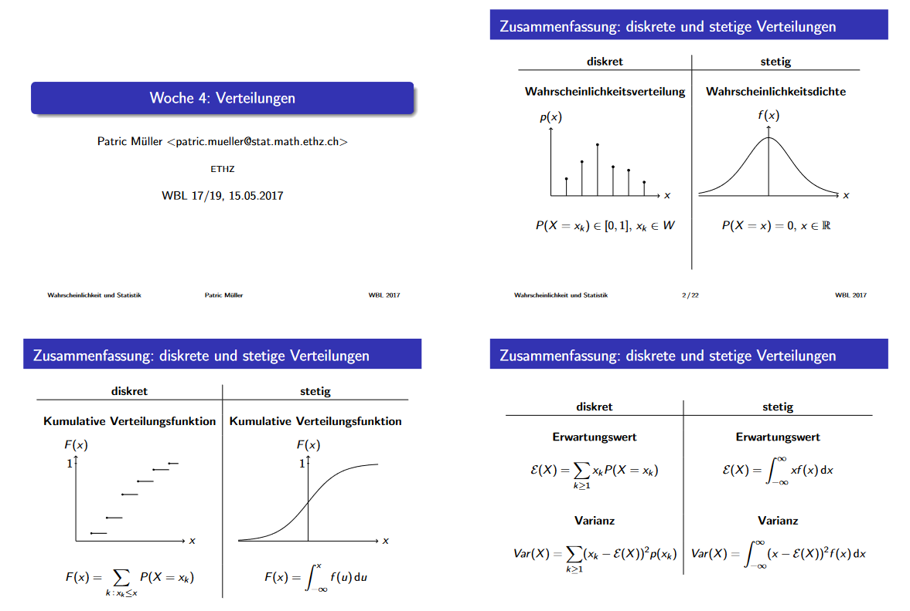

# Wichtig zu merken
Wir haben eine $\sigma-Algebra$ auf $\Omega$. Dann muss die leere, die volle und immer das jeweilige Komplement in der Algebra vorhanden sein.

## Dichte
- Eine Wahrscheinlichkeitsdichte muss integriert über den gesamten Definitionsbereich 1 ergeben 
- Nichtnegativität: Die Dichte $f(x, y)$ muss für alle $x$ und $y$ grösser oder gleich 0 sein
- Seien $X$ und $Y$ zwei stetige Zufallsvariablen mit Dichte $f_X$ resp $f_Y$
    - Nicht notwendigerweise gemeinsame Dichte
    - Wenn $X$, $Y$ unabhängig dann gemeinsame Dichte
    $$f_{X, Y}(x, y) = f_X(x)*f_Y(y)$$

## Wahrscheinlichkeiten
### Approximationen
- Wenn $Bin()$ Wahrscheinlichkeit $p = \sim \frac{1}{2}$ hat, dann ist es wie eine Normalverteilung:
$$X \stackrel{approx.}\sim \mathcal{N}(\frac{n}{2}, \frac{n}{4})$$
- Wenn $Bin()$ Wahrscheinlichkeit $p$ sehr klein hat und $n$ sehr gross, dann ist es wie eine Poissonverteilung:
$$X \stackrel{approx.}\sim Poi(\lambda = np)$$

## Quiz
Sei $(\Omega, F, P)$ ein Wahrscheinlichkeitsraum und $A \in F$. Was ist korrekt:
- $A$ ist unabhängigvon sich selbst genau dann, wenn $P[A] = 1$.
- Nach Definition ist $A$ unabhängig von sich selbst genau dann, wenn $P [A ∩ A] = P [A] * P [A]$ also genau für $P [A] = (P [A])^2$ wegen $A \cap A = A$. Wegen $P [A] \geq 0$ ist die letzte Bedingung aber äquivalent zu $P [A] ∈ {0, 1}$

Sei $p \in [0, 1]$, sei $X$ eine $Ber(p)$-verteilte Zufallsvariable und definiere $Z := (2X − 1)^2$. Was ist der Erwartungswert $E[Z]$?
- Da $X$ Werte in ${0, 1}$ annimmt, nimmt $Z$ Werte in ${1}$ an. Somit gilt $E[Z] = 1 · P[Z = 1] = 1$

Es gilt: $P[X \geq 1|X \leq 1] = P[X = 1] P[X = 0] + P[X = 1] = \frac{\lambda * e^{−\lambda}}{e^{−\lambda} + λ * e^{−\lambda}} = \frac{\lambda}{1 + \lambda}$

Seien $X$ und $Y$ zwei diskrete Zufallsvariablen mit gemeinsamer Gewichtsfunktion $p_{X,Y}$ 
- $E[XY] = \sum_{x \in W_X} \sum_{y \in W_Y} x*y*p_{X, Y}(x, y)$ 

Stetige Zufallsvariable
- Die Verteilungsfunktion ist stetig
- Dichtefunktion kann auch einmal (strikt) grösser als 1 sein

Seien $X$ und $Y$ zwei Zufallsvariablen mit gemeinsamer Dichte $f_{X, Y}$.
- Die Zufallsvariablen $X$ und $Y$ sind immer stetig. 