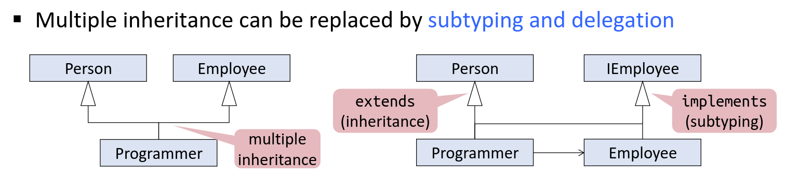

# Rigorous Software engineering

## Coupling 

Coupling is the measure of the degree of interdependence between the modules. A good software will have low coupling. 


1. Data coupling - Modules exchanging elements, and the receiving end use all of them.
2. Procedural coupling
3. Class coupling


### Data coupling
dependency between modules: communicate y passing only data => data coupled. Components are independent of each other and communicate through date. 

Problems:
- CHanges in data representation
- Unexpected side effects
- Concurrency

E.g. customer billing system
- access on public variables
- hide implementation details behind the interface (make private)
- don't give links, copy references
- 
#### Facade Pattern
- restricting and simplifying access
- provide single, simplified interface
- web browser API


#### Flyweight Pattern
- maximizes sharing of immutable objects
- Invariant: if two objects are structurally equal, they are the same object
### Procedural Coupling
- Modules are coupled to other modules whose methods they call
Problems:
- Changing a signature in the callee requires changing the caller
- Callers cannot be reused without callee modules
Approach:
- Moving code, may reduce procedural coupling
- duplicating functionality
#### Observer Pattern


“Observer Pattern defines one-to-many dependency between objects so that when one object changes state, all of its dependents are notified and updated automatically.”

Aside from formal definition, Observer Pattern helps us to listen (subscribe) to a subject and be up-to-date whenever a change occurs.

Subjects are open for the Observers to subscribe, and does not know (nor care about) how they are implemented and vice versa.


### Class Coupling
Inheritance couples the subclass to the superclass
Solution:
- Delegation can be used to avoid coupling through inheritance
- Type Declaration, make as generic as possible
- Using interfaces (Instead of TreeMap, jut use Map, most general Supertype)


#### Abstract Factory Pattern
Situation: Construction of families of objects


```java
interface MealFactory {
    Pizza createPizza();      // no inheritance needed
    Burger createBurger();    // no inheritance needed
}
```java
Vegan Meal Factory Implementation
public class VeganMealFactory implements MealFactory {
    @Override
    public Pizza createPizza() {
        return new VeganPizza();
    }

    @Override
    public Burger createBurger() {
        return new VeganBurger();
    }
}
```
##### Non-Vegan Meal Factory Implementation
```java
public class NonVeganMealFactory implements MealFactory {
    @Override
    public Pizza createPizza() {
        return new NonVeganPizza();
    }

    @Override
    public Burger createBurger() {
        return new NonVeganBurger();
    }
}
```

##### Now it’s a factory of factories.
- In the Factory Method pattern, a single method was responsible for creating a pizza. Here, we have separate methods for different types of pizzas and burgers, so the whole class is responsible.
- In the Factory Method pattern, Pizza and Burger needed to be of type Meal. Here, it’s not compulsory.

##### Client code
```java
MealFactory veganMealFactory = new VeganMealFactory();
MealFactory nonVeganMealFactory = new NonVeganMealFactory();

Pizza veganPizza = veganMealFactory.createPizza();
Burger veganBurger = veganMealFactory.createBurger();

Pizza nonVeganPizza = nonVeganMealFactory.createPizza();
Burger nonVeganBurger = nonVeganMealFactory.createBurger();
```

Since both VeganMealFactory and NonVeganMealFactory are of type MealFactory, can’t we just decide between them using a simple decider?

##### Meal Factory Decider

```java
public class MealFactoryDecider {
    private MealFactoryDecider(){}

    public static MealFactory decide(MealType mealType) {
        switch (mealType) {
            case VEGAN:
                return new VeganMealFactory();
            case NONVEGAN:
                return new NonVeganMealFactory();
            default:
                throw new RuntimeException("Invalid type.");
        }
    }
}
```

##### Final Client Code
```java
MealFactory veganMealFactory = MealFactoryDecider.decide(MealType.VEGAN);
MealFactory nonVeganMealFactory = MealFactoryDecider.decide(MealType.NONVEGAN);

Pizza veganPizza = veganMealFactory.createPizza();
Burger veganBurger = veganMealFactory.createBurger();

Pizza nonVeganPizza = nonVeganMealFactory.createPizza();
Burger nonVeganBurger = nonVeganMealFactory.createBurger();
```


##### Summary

The Abstract Factory Pattern is used to create families of related or dependent objects without specifying their concrete classes. In this example, we implement a `MealFactory` interface with methods to create different types of pizzas and burgers. We then create two factory classes, `VeganMealFactory` and `NonVeganMealFactory`, each responsible for creating vegan and non-vegan versions of these meals.

In contrast to the Factory Method pattern, which uses inheritance and a single method for object creation, the Abstract Factory pattern uses composition with multiple methods in the factory interface. This approach allows more flexibility, as you can decide between different factory implementations using a `MealFactoryDecider`.

This pattern is useful when you want to ensure your code is flexible and scalable, allowing you to easily add new types of meals without changing existing code.

### Adaption
#### Strategy

The Strategy Pattern is a design pattern used in software engineering that allows you to define a family of algorithms, encapsulate each one, and make them interchangeable. This pattern lets the algorithm vary independently from clients that use them, making it a flexible way to change the behavior of a class by switching out its algorithm or strategy.

Strategy Pattern = Dynamic Method Binding (in OOP)
#### Key Concepts of Strategy Pattern

- **Encapsulation**: Each strategy (algorithm) is encapsulated in its own class.
- **Interchangeability**: Strategies can be changed at runtime, allowing the behavior of an object to be modified without altering its code.
- **Separation of Concerns**: The pattern separates the algorithm from the host class, adhering to the Single Responsibility Principle.

#### Simple Example: A Cat Game

Consider a game where a `Cat` class needs to switch its diet strategy. Initially, the cat follows a normal diet, but if it gains too much weight, it needs to switch to a weight-loss diet. The Strategy Pattern allows this change without altering the `Cat` class code.

##### Code Implementation

1. **Define the Strategy Interface**:

```java
interface EatBehavior {
    public void eat();
}
    Implement Different Strategies:

public class NormalDiet implements EatBehavior {
    @Override
    public void eat() {
        // normal food
    }
}

public class LosingWeightDiet implements EatBehavior {
    @Override
    public void eat() {
        // healthy food
    }
}
```

##### Cat Class with Strategy:

```java
public abstract class Cat {
    EatBehavior eatBehavior;

    public Cat() {}

    public void eat() {
        eatBehavior.eat();
    }

    public void setEatBehavior(EatBehavior eb) {
        eatBehavior = eb;
    }
}
```
##### Client Code:

```java
Cat cat = new Cat();
cat.eat(); // Cat eats as usual.

cat.setEatBehavior(new LosingWeightDiet());
cat.eat(); // Cat eats with a healthier diet.
```
#### Visitor Pattern
The Visitor pattern is a behavioral design pattern that lets you separate algorithms from the objects on which they operate. By using the Visitor pattern, you can add new operations to existing object structures without modifying their classes. Here's a summary of the key concepts and components of the Visitor pattern:
##### Key Concepts
- Separation of Algorithms and Objects: The Visitor pattern allows you to place new behavior into a separate class called a visitor, instead of modifying existing object structures. This makes it easy to introduce new operations without altering existing code.
- Double Dispatch: The pattern uses a technique called double dispatch to determine the appropriate method to execute. This means that a method call is determined by both the visitor and the element that is being visited.

##### Components
- Visitor Interface: Declares a set of visit methods for each type of element in the object structure.
- Concrete Visitor: Implements the visitor interface and defines specific behavior for each type of element.
- Element Interface: Declares an accept method that takes a visitor as an argument.
- Concrete Elements: Implement the element interface and the accept method, which calls the visitor’s method corresponding to the element class.
- Object Structure: A collection of elements that can be visited by the visitor.

##### Benefits
- Ease of Adding New Operations: Adding new operations is straightforward since you only need to create new visitor classes without modifying existing element classes.

- Single Responsibility Principle: The pattern encourages the separation of concerns by allowing related behaviors to be grouped together in a visitor class.

##### Drawbacks
- Adding New Element Types: Adding new element types becomes challenging, as you need to update all existing visitors to handle the new element.

- Complexity: The pattern can introduce complexity, especially if the object structure is large or frequently changes.

##### Example Use Cases

- Compilers and Interpreters: Used to traverse and apply operations to abstract syntax trees.
    Document Processing: Used to apply operations to elements within a document, such as formatting or converting.

##### Conclusion

The Visitor pattern is particularly useful when you need to perform operations on objects of different classes that make up a structure. It allows you to define new operations without changing the classes of the elements on which it operates, making it a powerful tool for maintaining open/closed principle and facilitating future extensions of the codebase.

## Documentation
### Why?
#### Essential vs Incidental Properties
##### Stable vs. Unstable Properties
- Stable Properties: These are aspects of the software that should not change during evolution because they are considered essential for the software's correct functionality. Stability indicates a commitment to maintaining these properties to ensure consistent behavior across different versions or implementations.

- Unstable (or Incidental) Properties: These are aspects that can change without affecting the core functionality of the software. They are not essential to the core purpose of the program and might be modified to improve performance, readability, or adaptability to new requirements.

##### Essential vs. Incidental Properties

- Essential Properties: These are the critical features or behaviors that must be preserved for the software to function correctly. In the context of the example, an essential property might be that the function returns the index of a found element in the array.

- Incidental Properties: These are details that do not affect the main function of the software. They may include the method of implementation or specific optimizations, such as whether a search is done sequentially or in parallel, as long as the essential properties are maintained.
#### Invariants
- What is given at the start? Can something ever be negative? 
#### Overriding methods
- Initialize the fields of an object when
the object is created or when the
fields are accessed for the first time?

#### Aliasing
- several pointer point to the same object


### What?
- How to use the code => document the interface
- How does the code work => document the implementation
#### Client
- Constructor
- Methods
- Public fields
- Supertypes

How to call a method?
- cbuf is non-null
- offset is non-negative

What does a method return?
- method returns -1 if not valid
- return between 0, len

How does it affect the state
- Heap effects 
- other effects, like exceptions, does it block?
- time, space

Global properties
- list is sorted
- clint-visible invariants
- list is immutable

#### Backend
- Data structure documentation is more prominent
  - Implementation invariants
- Documentation of the algorithms inside the code
  - justification of assumptions
  
#### Summary
- Methods and constructors
  - Arguments and input state
  - Results and output state
  - Effects
- Data structures
  - Value and structural invariants
  - One-state and temporal invariants
- Algorithms
  - Behavior or code snippets
  - Explanation of control flow
  - Justification of assumptions

### How?
- Comments
- Types and Modifiers
- Effect systems (throw, try catch)
- Metadata (@NonNull)
- Assertions
- Contracts (invariants)
## Testing
### Test Stages
Parameterized Unit Tests:
- avoid boiler-plate code
- useful, when test data is generated automatically
- generic test oracles can be difficult
- still several test methods needed
### Test Strategies
#### Exhaustive Testing
- Check everything
- sometimes not possible

#### Random Testing
- can maybe miss an important bug, probability just too low

#### Functional Testing
- Test each case of the specification
- Black box

#### Structural Testing
- White box
- Goal, Cover all the code, achieve high coverage

#### Summary
 

### Functional Testing
#### Partition Testing

#### Selecting Promising Values


#### Combinatorial Testing
- Semantic constraints potentially reduce the number of test cases
  - Often without reducing coverage
  - Identifying semantic constraints between inputs can help refine equivalence classes
and increase coverage
- Still, often too many combinations remain
  - Especially when there are many input values, e.g. for the fields of deep object
  structures
  ##### Pairwise-Combinations Testing
  


### Structural Testing


- Complete branch coverage implies complete statement coverage, but not th other way around


- Complete path coverage implies complete statement coverage, branch coverage, but not th other way around
- Complete path coverage is not feasible for loops


## Analysis
- Join is their (least upper bound)

## Analysis Math
- Partial order: binary relation on a set with properties
  - Reflexive
  - Transitive
  - Anti-symmetric
- Poset fulfills this


- fixed point iff $f(x) = x$
- post-fixedpoint iff $f(x) \sqsubseteq x$
# Questions
- when are properties in a code stable